---
tags:
  - "kanban/done"
  - "type/task"
  - "domain/CSS"
  - "priority/P2"
parent: "[[desarrollo]]"
children: []
depends_on:
  - "[[CSS-003]]"
  - "[[CSS-004]]"
blocks:
  - "[[CSS-034]]"
status: "done"
assignee: "@dev"
created: "2026-08-04"
updated: "2026-08-05"
---

# [[CSS-025]] Utilidades de Tipografía: Font Family, Size, Weight, Color, Alignment, Truncate, Decoration

## Descripción
Generar utilidades tipográficas: font family, size, weight, color, alignment, truncate, decoration. Responsive.

## Código de Ejemplo
```css
/* resources/css/utilities/_typography.css */

/* Font Family */
.font-sans { font-family: var(--tgp-font-family-sans); }
.font-mono { font-family: var(--tgp-font-family-mono); }

/* Font Size */
.text-xs { font-size: var(--tgp-font-size-xs); }
.text-sm { font-size: var(--tgp-font-size-sm); }
.text-base { font-size: var(--tgp-font-size-base); }
.text-lg { font-size: var(--tgp-font-size-lg); }
.text-xl { font-size: var(--tgp-font-size-xl); }
.text-2xl { font-size: var(--tgp-font-size-2xl); }
.text-3xl { font-size: var(--tgp-font-size-3xl); }
.text-4xl { font-size: var(--tgp-font-size-4xl); }
.text-5xl { font-size: var(--tgp-font-size-5xl); }

/* Font Weight */
.font-normal { font-weight: var(--tgp-font-weight-normal); }
.font-medium { font-weight: var(--tgp-font-weight-medium); }
.font-semibold { font-weight: var(--tgp-font-weight-semibold); }
.font-bold { font-weight: var(--tgp-font-weight-bold); }

/* Text Color */
.text-primary { color: var(--tgp-color-text-primary); }
.text-secondary { color: var(--tgp-color-text-secondary); }
.text-muted { color: var(--tgp-color-text-muted); }
.text-accent { color: var(--tgp-color-accent-primary); }
.text-success { color: var(--tgp-color-success); }
.text-error { color: var(--tgp-color-error); }
.text-warning { color: var(--tgp-color-warning); }
.text-info { color: var(--tgp-color-info); }
.text-inherit { color: inherit; }
.text-current { color: currentColor; }

/* Text Alignment */
.text-left { text-align: left; }
.text-center { text-align: center; }
.text-right { text-align: right; }
.text-justify { text-align: justify; }
.text-start { text-align: start; }
.text-end { text-align: end; }

/* Text Decoration */
.underline { text-decoration: underline; }
.overline { text-decoration: overline; }
.line-through { text-decoration: line-through; }
.no-underline { text-decoration: none; }

/* Text Transform */
.uppercase { text-transform: uppercase; }
.lowercase { text-transform: lowercase; }
.capitalize { text-transform: capitalize; }
.normal-case { text-transform: none; }

/* Truncate */
.truncate {
  overflow: hidden;
  text-overflow: ellipsis;
  white-space: nowrap;
}

.text-ellipsis { text-overflow: ellipsis; }
.text-clip { text-overflow: clip; }

/* Whitespace */
.whitespace-normal { white-space: normal; }
.whitespace-nowrap { white-space: nowrap; }
.whitespace-pre { white-space: pre; }
.whitespace-pre-line { white-space: pre-line; }
.whitespace-pre-wrap { white-space: pre-wrap; }
.whitespace-break-spaces { white-space: break-spaces; }

/* Word Break */
.break-normal { word-break: normal; }
.break-words { word-break: break-word; }
.break-all { word-break: break-all; }
.break-keep { word-break: keep-all; }

/* Overflow Wrap */
.overflow-wrap-normal { overflow-wrap: normal; }
.overflow-wrap-anywhere { overflow-wrap: anywhere; }
.overflow-wrap-break-word { overflow-wrap: break-word; }

/* Line Height */
.leading-tight { line-height: var(--tgp-line-height-tight); }
.leading-snug { line-height: var(--tgp-line-height-snug); }
.leading-normal { line-height: var(--tgp-line-height-normal); }
.leading-relaxed { line-height: var(--tgp-line-height-relaxed); }
.leading-loose { line-height: var(--tgp-line-height-loose); }

/* Font Smoothing */
.antialiased { -webkit-font-smoothing: antialiased; -moz-osx-font-smoothing: grayscale; }
.subpixel-antialiased { -webkit-font-smoothing: subpixel-antialiased; -moz-osx-font-smoothing: auto; }

/* Responsive */
@media (min-width: 640px) {
  .sm\:text-sm { font-size: var(--tgp-font-size-sm); }
  .sm\:text-base { font-size: var(--tgp-font-size-base); }
  .sm\:text-lg { font-size: var(--tgp-font-size-lg); }
  .sm\:text-xl { font-size: var(--tgp-font-size-xl); }
  .sm\:text-2xl { font-size: var(--tgp-font-size-2xl); }
  .sm\:font-bold { font-weight: var(--tgp-font-weight-bold); }
  .sm\:text-center { text-align: center; }
}

@media (min-width: 768px) {
  .md\:text-base { font-size: var(--tgp-font-size-base); }
  .md\:text-lg { font-size: var(--tgp-font-size-lg); }
  .md\:text-xl { font-size: var(--tgp-font-size-xl); }
  .md\:text-2xl { font-size: var(--tgp-font-size-2xl); }
  .md\:text-3xl { font-size: var(--tgp-font-size-3xl); }
  .md\:font-semibold { font-weight: var(--tgp-font-weight-semibold); }
}

@media (min-width: 1024px) {
  .lg\:text-lg { font-size: var(--tgp-font-size-lg); }
  .lg\:text-xl { font-size: var(--tgp-font-size-xl); }
  .lg\:text-2xl { font-size: var(--tgp-font-size-2xl); }
  .lg\:text-3xl { font-size: var(--tgp-font-size-3xl); }
  .lg\:text-4xl { font-size: var(--tgp-font-size-4xl); }
}

@media (min-width: 1280px) {
  .xl\:text-xl { font-size: var(--tgp-font-size-xl); }
  .xl\:text-2xl { font-size: var(--tgp-font-size-2xl); }
  .xl\:text-3xl { font-size: var(--tgp-font-size-3xl); }
  .xl\:text-4xl { font-size: var(--tgp-font-size-4xl); }
  .xl\:text-5xl { font-size: var(--tgp-font-size-5xl); }
}
```

## Diagramas Mermaid

```mermaid
graph TD
    A[Typography Utilities] --> B[Font Family]
    A --> C[Font Size]
    A --> D[Font Weight]
    A --> E[Text Color]
    A --> F[Alignment]
    A --> G[Decoration]
    A --> H[Transform]
    A --> I[Truncate]
    A --> J[Whitespace]
    A --> K[Word Break]
    A --> L[Line Height]
    A --> M[Font Smoothing]
    A --> N[Responsive]
    
    B --> B1[sans, mono]
    C --> C1[xs-5xl]
    D --> D1[normal, medium, semibold, bold]
    E --> E1[primary, secondary, muted, accent, success, error, warning, info]
    F --> F1[left, center, right, justify, start, end]
    G --> G1[underline, overline, line-through, none]
    H --> H1[uppercase, lowercase, capitalize]
    I --> I1[truncate, ellipsis, clip]
    J --> J1[normal, nowrap, pre, pre-line, pre-wrap]
    K --> K1[normal, words, all, keep]
    L --> L1[tight, snug, normal, relaxed, loose]
    M --> M1[antialiased, subpixel]
    N --> N1[sm:, md:, lg:, xl:]
```


## Criterios de Aceptación
- [ ] Font Family: sans, mono
- [ ] Font Size: xs-5xl (12 tamaños)
- [ ] Font Weight: normal, medium, semibold, bold
- [ ] Text Color: primary, secondary, muted, accent, success, error, warning, info, inherit, current
- [ ] Alignment: left, center, right, justify, start, end
- [ ] Decoration: underline, overline, line-through, none
- [ ] Transform: uppercase, lowercase, capitalize, none
- [ ] Truncate: truncate, ellipsis, clip
- [ ] Whitespace: normal, nowrap, pre, pre-line, pre-wrap, break-spaces
- [ ] Word Break: normal, words, all, keep
- [ ] Line Height: tight, snug, normal, relaxed, loose
- [ ] Font Smoothing: antialiased, subpixel-antialiased
- [ ] Responsive: sm:, md:, lg:, xl: prefixes
- [ ] Documentado en `docu/especificaciones/css-typography-utilities.md`

## Notas Técnicas
- Generadas via PostCSS loop
- Colores usan tokens semánticos
- Responsive mobile-first

## Enlaces
- [[CSS-003]] Typography System (tokens)
- [[CSS-004]] Custom Properties
- [[CSS-034]] Build System