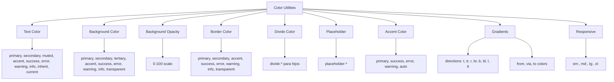

---
tags:
  - "kanban/done"
  - "type/task"
  - "domain/CSS"
  - "priority/P2"
parent: "[[desarrollo]]"
children: []
depends_on:
  - "[[CSS-004]]"
blocks:
  - "[[CSS-034]]"
status: "done"
assignee: "@dev"
created: "2026-08-04"
updated: "2026-08-05"
---

# [[CSS-026]] Utilidades de Color: Text, Bg, Border, Placeholder, Accent, Gradient

## Descripción
Generar utilidades de color: text, background, border, placeholder, accent, gradient. Usan tokens semánticos. Responsive.

## Código de Ejemplo
```css
/* resources/css/utilities/_color.css */

/* Text Color */
.text-primary { color: var(--tgp-color-text-primary); }
.text-secondary { color: var(--tgp-color-text-secondary); }
.text-muted { color: var(--tgp-color-text-muted); }
.text-accent { color: var(--tgp-color-accent-primary); }
.text-success { color: var(--tgp-color-success); }
.text-error { color: var(--tgp-color-error); }
.text-warning { color: var(--tgp-color-warning); }
.text-info { color: var(--tgp-color-info); }
.text-inherit { color: inherit; }
.text-current { color: currentColor; }

/* Background Color */
.bg-primary { background-color: var(--tgp-color-bg-primary); }
.bg-secondary { background-color: var(--tgp-color-bg-secondary); }
.bg-tertiary { background-color: var(--tgp-color-bg-tertiary); }
.bg-accent { background-color: var(--tgp-color-accent-primary); }
.bg-success { background-color: var(--tgp-color-success); }
.bg-error { background-color: var(--tgp-color-error); }
.bg-warning { background-color: var(--tgp-color-warning); }
.bg-info { background-color: var(--tgp-color-info); }
.bg-transparent { background-color: transparent; }

/* Background Opacity */
.bg-opacity-0 { --bg-opacity: 0; }
.bg-opacity-5 { --bg-opacity: 0.05; }
.bg-opacity-10 { --bg-opacity: 0.1; }
.bg-opacity-20 { --bg-opacity: 0.2; }
.bg-opacity-30 { --bg-opacity: 0.3; }
.bg-opacity-40 { --bg-opacity: 0.4; }
.bg-opacity-50 { --bg-opacity: 0.5; }
.bg-opacity-60 { --bg-opacity: 0.6; }
.bg-opacity-70 { --bg-opacity: 0.7; }
.bg-opacity-80 { --bg-opacity: 0.8; }
.bg-opacity-90 { --bg-opacity: 0.9; }
.bg-opacity-100 { --bg-opacity: 1; }

/* Border Color */
.border-primary { border-color: var(--tgp-color-border-primary); }
.border-secondary { border-color: var(--tgp-color-border-secondary); }
.border-accent { border-color: var(--tgp-color-border-focus); }
.border-success { border-color: var(--tgp-color-success); }
.border-error { border-color: var(--tgp-color-error); }
.border-warning { border-color: var(--tgp-color-warning); }
.border-info { border-color: var(--tgp-color-info); }
.border-transparent { border-color: transparent; }

/* Divide Color (para hijos) */
.divide-primary > * + * { border-color: var(--tgp-color-border-primary); }
.divide-secondary > * + * { border-color: var(--tgp-color-border-secondary); }
.divide-accent > * + * { border-color: var(--tgp-color-border-focus); }

/* Placeholder Color */
.placeholder-primary::placeholder { color: var(--tgp-color-text-muted); }
.placeholder-secondary::placeholder { color: var(--tgp-color-text-muted); }
.placeholder-muted::placeholder { color: var(--tgp-color-text-muted); }

/* Accent Color (para accent-color CSS) */
.accent-primary { accent-color: var(--tgp-color-accent-primary); }
.accent-success { accent-color: var(--tgp-color-success); }
.accent-error { accent-color: var(--tgp-color-error); }
.accent-warning { accent-color: var(--tgp-color-warning); }
.accent-auto { accent-color: auto; }

/* Gradients */
.bg-gradient-to-t { background-image: linear-gradient(to top, var(--tw-gradient-stops)); }
.bg-gradient-to-tr { background-image: linear-gradient(to top right, var(--tw-gradient-stops)); }
.bg-gradient-to-r { background-image: linear-gradient(to right, var(--tw-gradient-stops)); }
.bg-gradient-to-br { background-image: linear-gradient(to bottom right, var(--tw-gradient-stops)); }
.bg-gradient-to-b { background-image: linear-gradient(to bottom, var(--tw-gradient-stops)); }
.bg-gradient-to-bl { background-image: linear-gradient(to bottom left, var(--tw-gradient-stops)); }
.bg-gradient-to-l { background-image: linear-gradient(to left, var(--tw-gradient-stops)); }
.bg-gradient-to-tl { background-image: linear-gradient(to top left, var(--tw-gradient-stops)); }

.from-primary { --tw-gradient-from: var(--tgp-color-accent-primary); --tw-gradient-stops: var(--tw-gradient-from), var(--tw-gradient-to); }
.to-primary { --tw-gradient-to: var(--tgp-color-accent-primary); }

.from-secondary { --tw-gradient-from: var(--tgp-color-accent-300); --tw-gradient-stops: var(--tw-gradient-from), var(--tw-gradient-to); }
.to-secondary { --tw-gradient-to: var(--tgp-color-accent-300); }

.from-transparent { --tw-gradient-from: transparent; --tw-gradient-stops: var(--tw-gradient-from), var(--tw-gradient-to); }
.to-transparent { --tw-gradient-to: transparent; }

/* Gradient stops */
.via-primary { --tw-gradient-via: var(--tgp-color-accent-primary); --tw-gradient-stops: var(--tw-gradient-from), var(--tw-gradient-via), var(--tw-gradient-to); }

/* Responsive */
@media (min-width: 640px) {
  .sm\:text-primary { color: var(--tgp-color-text-primary); }
  .sm\:bg-primary { background-color: var(--tgp-color-bg-primary); }
  .sm\:border-primary { border-color: var(--tgp-color-border-primary); }
}
@media (min-width: 768px) {
  .md\:text-primary { color: var(--tgp-color-text-primary); }
  .md\:bg-primary { background-color: var(--tgp-color-bg-primary); }
  .md\:border-primary { border-color: var(--tgp-color-border-primary); }
}
@media (min-width: 1024px) {
  .lg\:text-primary { color: var(--tgp-color-text-primary); }
  .lg\:bg-primary { background-color: var(--tgp-color-bg-primary); }
  .lg\:border-primary { border-color: var(--tgp-color-border-primary); }
}
@media (min-width: 1280px) {
  .xl\:text-primary { color: var(--tgp-color-text-primary); }
  .xl\:bg-primary { background-color: var(--tgp-color-bg-primary); }
  .xl\:border-primary { border-color: var(--tgp-color-border-primary); }
}
```

## Diagramas Mermaid


## Criterios de Aceptación
- [ ] Text Color: 10 variantes (semánticas + inherit/current)
- [ ] Background Color: 9 variantes
- [ ] Background Opacity: 0-100 scale (11 pasos)
- [ ] Border Color: 8 variantes
- [ ] Divide Color: para hijos con `>`
- [ ] Placeholder Color: 3 variantes
- [ ] Accent Color: 4 variantes + auto
- [ ] Gradients: 8 direcciones, from/via/to con tokens
- [ ] Responsive: sm:, md:, lg:, xl: prefixes
- [ ] Documentado en `docu/especificaciones/css-color-utilities.md`

## Notas Técnicas
- Opacity usa CSS custom property `--bg-opacity`
- Gradients usan `--tw-gradient-stops` pattern
- Todos usan tokens semánticos (no base scales)
- Divide usa selector `> * + *`

## Enlaces
- [[CSS-004]] Custom Properties (tokens)
- [[CSS-034]] Build System