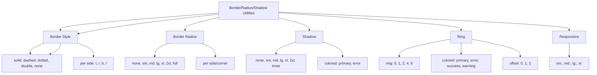

---
tags:
  - "kanban/done"
  - "type/task"
  - "domain/CSS"
  - "priority/P2"
parent: "[[desarrollo]]"
children: []
depends_on:
  - "[[CSS-004]]"
blocks:
  - "[[CSS-034]]"
status: "done"
assignee: "@dev"
created: "2026-08-04"
updated: "2026-08-05"
---

# [[CSS-027]] Utilidades de Border/Radius/Shadow: Width, Color, Radius, Shadow, Ring

## Descripción
Generar utilidades de border, radius, shadow, ring: width, color, radius, shadow, ring. Responsive.

## Código de Ejemplo
```css
/* resources/css/utilities/_border-radius-shadow.css */

/* Border Width */
.border { border-width: 1px; }
.border-0 { border-width: 0; }
.border-2 { border-width: 2px; }
.border-4 { border-width: 4px; }
.border-8 { border-width: 8px; }

.border-t { border-top-width: 1px; }
.border-r { border-right-width: 1px; }
.border-b { border-bottom-width: 1px; }
.border-l { border-left-width: 1px; }

.border-t-0 { border-top-width: 0; }
/* ... t/r/b/l-0 a 8 */

/* Border Style */
.border-solid { border-style: solid; }
.border-dashed { border-style: dashed; }
.border-dotted { border-style: dotted; }
.border-double { border-style: double; }
.border-none { border-style: none; }

/* Border Radius */
.rounded-none { border-radius: 0; }
.rounded-sm { border-radius: var(--tgp-border-radius-sm); }
.rounded { border-radius: var(--tgp-border-radius-md); }
.rounded-md { border-radius: var(--tgp-border-radius-md); }
.rounded-lg { border-radius: var(--tgp-border-radius-lg); }
.rounded-xl { border-radius: var(--tgp-border-radius-xl); }
.rounded-2xl { border-radius: var(--tgp-border-radius-2xl); }
.rounded-full { border-radius: var(--tgp-border-radius-full); }

.rounded-t-none { border-top-left-radius: 0; border-top-right-radius: 0; }
/* ... t/r/b/l, tl/tr/bl/br */

/* Shadow */
.shadow-none { box-shadow: none; }
.shadow-sm { box-shadow: var(--tgp-shadow-sm); }
.shadow { box-shadow: var(--tgp-shadow-sm); }
.shadow-md { box-shadow: var(--tgp-shadow-md); }
.shadow-lg { box-shadow: var(--tgp-shadow-lg); }
.shadow-xl { box-shadow: var(--tgp-shadow-xl); }
.shadow-2xl { box-shadow: var(--tgp-shadow-2xl); }
.shadow-inner { box-shadow: var(--tgp-shadow-inner); }

/* Shadow Color */
.shadow-primary { box-shadow: 0 0 0 1px var(--tgp-color-border-focus), var(--tgp-shadow-md); }
.shadow-error { box-shadow: 0 0 0 1px var(--tgp-color-error), var(--tgp-shadow-md); }

/* Ring (Focus Rings) */
.ring { box-shadow: 0 0 0 3px var(--tgp-color-accent-200); }
.ring-0 { box-shadow: none; }
.ring-1 { box-shadow: 0 0 0 1px var(--tgp-color-accent-400); }
.ring-2 { box-shadow: 0 0 0 2px var(--tgp-color-accent-400); }
.ring-4 { box-shadow: 0 0 0 4px var(--tgp-color-accent-400); }
.ring-8 { box-shadow: 0 0 0 8px var(--tgp-color-accent-400); }

.ring-primary { box-shadow: 0 0 0 3px var(--tgp-color-accent-200); }
.ring-error { box-shadow: 0 0 0 3px rgba(198, 40, 40, 0.3); }
.ring-success { box-shadow: 0 0 0 3px rgba(46, 125, 50, 0.3); }
.ring-warning { box-shadow: 0 0 0 3px rgba(239, 108, 0, 0.3); }
.ring-offset-0 { box-shadow: 0 0 0 3px var(--tgp-color-accent-200); }
.ring-offset-1 { box-shadow: 0 0 0 1px var(--tgp-color-bg-primary), 0 0 0 4px var(--tgp-color-accent-200); }
.ring-offset-2 { box-shadow: 0 0 0 1px var(--tgp-color-bg-primary), 0 0 0 5px var(--tgp-color-accent-200); }

/* Responsive */
@media (min-width: 640px) {
  .sm\:rounded { border-radius: var(--tgp-border-radius-md); }
  .sm\:rounded-lg { border-radius: var(--tgp-border-radius-lg); }
  .sm\:shadow { box-shadow: var(--tgp-shadow-sm); }
  .sm\:shadow-md { box-shadow: var(--tgp-shadow-md); }
}

@media (min-width: 768px) {
  .md\:rounded { border-radius: var(--tgp-border-radius-md); }
  .md\:rounded-lg { border-radius: var(--tgp-border-radius-lg); }
  .md\:shadow-md { box-shadow: var(--tgp-shadow-md); }
  .md\:shadow-lg { box-shadow: var(--tgp-shadow-lg); }
}

@media (min-width: 1024px) {
  .lg\:rounded-lg { border-radius: var(--tgp-border-radius-lg); }
  .lg\:shadow-lg { box-shadow: var(--tgp-shadow-lg); }
}

@media (min-width: 1280px) {
  .xl\:rounded-xl { border-radius: var(--tgp-border-radius-xl); }
  .xl\:shadow-xl { box-shadow: var(--tgp-shadow-xl); }
}
```

## Diagramas Mermaid


## Criterios de Aceptación
- [ ] Border Width: 0, 1, 2, 4, 8 + per side (t, r, b, l)
- [ ] Border Style: solid, dashed, dotted, double, none
- [ ] Border Radius: none, sm, md, lg, xl, 2xl, full + per side/corner
- [ ] Shadow: none, sm, md, lg, xl, 2xl, inner + colored variants
- [ ] Ring: 0, 1, 2, 4, 8 + colored (primary, error, success, warning) + offset (0, 1, 2)
- [ ] Responsive: sm:, md:, lg:, xl: prefixes
- [ ] Documentado en `docu/especificaciones/css-border-radius-shadow-utilities.md`

## Notas Técnicas
- Ring usa box-shadow (no outline) para mejor control
- Ring offset usa doble box-shadow
- Tokens de shadow y radius desde design tokens
- Generadas via PostCSS loop

## Enlaces
- [[CSS-004]] Custom Properties (tokens)
- [[CSS-034]] Build System