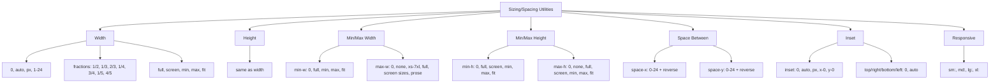

---
tags:
  - "kanban/done"
  - "type/task"
  - "domain/CSS"
  - "priority/P2"
parent: "[[desarrollo]]"
children: []
depends_on:
  - "[[CSS-004]]"
blocks:
  - "[[CSS-034]]"
status: "done"
assignee: "@dev"
created: "2026-08-04"
updated: "2026-08-05"
---

# [[CSS-028]] Utilidades de Sizing/Spacing: Width, Height, Min/Max, Space-X/Y, Inset

## Descripción
Generar utilidades de sizing y spacing: width, height, min/max, space-x/y, inset. Responsive.

## Código de Ejemplo
```css
/* resources/css/utilities/_sizing.css */

/* Width */
.w-0 { width: 0; }
.w-auto { width: auto; }
.w-px { width: 1px; }
.w-1 { width: var(--tgp-spacing-1); }
.w-2 { width: var(--tgp-spacing-2); }
/* ... w-3 a w-24 */
.w-1-2 { width: 50%; }
.w-1-3 { width: 33.333%; }
.w-2-3 { width: 66.666%; }
.w-1-4 { width: 25%; }
.w-3-4 { width: 75%; }
.w-1-5 { width: 20%; }
.w-4-5 { width: 80%; }
.w-full { width: 100%; }
.w-screen { width: 100vw; }
.w-min { width: min-content; }
.w-max { width: max-content; }
.w-fit { width: fit-content; }

/* Height */
.h-0 { height: 0; }
.h-auto { height: auto; }
.h-px { height: 1px; }
.h-1 { height: var(--tgp-spacing-1); }
/* ... h-2 a h-24 */
.h-1-2 { height: 50%; }
.h-1-3 { height: 33.333%; }
.h-1-4 { height: 25%; }
.h-full { height: 100%; }
.h-screen { height: 100vh; }
.h-min { height: min-content; }
.h-max { height: max-content; }
.h-fit { height: fit-content; }

/* Min Width */
.min-w-0 { min-width: 0; }
.min-w-full { min-width: 100%; }
.min-w-min { min-width: min-content; }
.min-w-max { min-width: max-content; }
.min-w-fit { min-width: fit-content; }

/* Max Width */
.max-w-0 { max-width: 0; }
.max-w-none { max-width: none; }
.max-w-xs { max-width: 20rem; }
.max-w-sm { max-width: 24rem; }
.max-w-md { max-width: 28rem; }
.max-w-lg { max-width: 32rem; }
.max-w-xl { max-width: 36rem; }
.max-w-2xl { max-width: 42rem; }
.max-w-3xl { max-width: 48rem; }
.max-w-4xl { max-width: 56rem; }
.max-w-5xl { max-width: 64rem; }
.max-w-6xl { max-width: 72rem; }
.max-w-7xl { max-width: 80rem; }
.max-w-full { max-width: 100%; }
.max-w-min { max-width: min-content; }
.max-w-max { max-width: max-content; }
.max-w-fit { max-width: fit-content; }
.max-w-prose { max-width: 65ch; }
.max-w-screen-sm { max-width: 640px; }
.max-w-screen-md { max-width: 768px; }
.max-w-screen-lg { max-width: 1024px; }
.max-w-screen-xl { max-width: 1280px; }
.max-w-screen-2xl { max-width: 1536px; }

/* Min Height */
.min-h-0 { min-height: 0; }
.min-h-full { min-height: 100%; }
.min-h-screen { min-height: 100vh; }
.min-h-min { min-height: min-content; }
.min-h-max { min-height: max-content; }
.min-h-fit { min-height: fit-content; }

/* Max Height */
.max-h-0 { max-height: 0; }
.max-h-none { max-height: none; }
.max-h-full { max-height: 100%; }
.max-h-screen { max-height: 100vh; }
.max-h-min { max-height: min-content; }
.max-h-max { max-height: max-content; }
.max-h-fit { max-height: fit-content; }

/* Space Between (para flex/grid children) */
.space-x-0 > * + * { margin-left: 0; margin-right: 0; }
.space-x-1 > * + * { margin-left: var(--tgp-spacing-1); margin-right: var(--tgp-spacing-1); }
/* ... space-x-2 a space-x-24 */
.space-x-reverse > * + * { margin-left: 0; margin-right: var(--tgp-spacing-1); }

.space-y-0 > * + * { margin-top: 0; margin-bottom: 0; }
.space-y-1 > * + * { margin-top: var(--tgp-spacing-1); margin-bottom: var(--tgp-spacing-1); }
/* ... space-y-2 a space-y-24 */
.space-y-reverse > * + * { margin-top: 0; margin-bottom: var(--tgp-spacing-1); }

/* Inset (position absolute/fixed) */
.inset-0 { top: 0; right: 0; bottom: 0; left: 0; }
.inset-auto { top: auto; right: auto; bottom: auto; left: auto; }
.inset-px { top: 1px; right: 1px; bottom: 1px; left: 1px; }

.inset-x-0 { left: 0; right: 0; }
.inset-y-0 { top: 0; bottom: 0; }

.top-0 { top: 0; }
.right-0 { right: 0; }
.bottom-0 { bottom: 0; }
.left-0 { left: 0; }

.top-auto { top: auto; }
.right-auto { right: auto; }
.bottom-auto { bottom: auto; }
.left-auto { left: auto; }

/* Responsive */
@media (min-width: 640px) {
  .sm\:w-full { width: 100%; }
  .sm\:h-full { height: 100%; }
  .sm\:max-w-md { max-width: 28rem; }
}
@media (min-width: 768px) {
  .md\:w-1-2 { width: 50%; }
  .md\:w-1-3 { width: 33.333%; }
  .md\:max-w-lg { max-width: 32rem; }
}
@media (min-width: 1024px) {
  .lg\:w-1-3 { width: 33.333%; }
  .lg\:max-w-xl { max-width: 36rem; }
}
@media (min-width: 1280px) {
  .xl\:max-w-2xl { max-width: 42rem; }
}
```

## Diagramas Mermaid


## Criterios de Aceptación
- [ ] Width: 0, auto, px, 1-24, fractions, full, screen, min, max, fit
- [ ] Height: same as width
- [ ] Min/Max Width: 0, none, xs-7xl, full, screen sizes, prose, min/max/fit
- [ ] Min/Max Height: 0, none, full, screen, min/max/fit
- [ ] Space Between: space-x/y 0-24 + reverse
- [ ] Inset: 0, auto, px, x/y-0, top/right/bottom/left 0/auto
- [ ] Responsive: sm:, md:, lg:, xl: prefixes
- [ ] Documentado en `docu/especificaciones/css-sizing-utilities.md`

## Notas Técnicas
- Space-x/y usa `> * + *` selector
- Max-w usa escala tipográfica (rem) + screen breakpoints
- Prose: 65ch para readability
- Inset para positioning absolute/fixed

## Enlaces
- [[CSS-004]] Custom Properties (spacing tokens)
- [[CSS-022]] Spacing Utilities
- [[CSS-034]] Build System