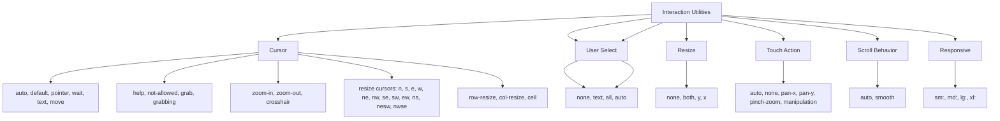

---
tags:
  - "kanban/done"
  - "type/task"
  - "domain/CSS"
  - "priority/P2"
parent: "[[desarrollo]]"
children: []
depends_on:
  - "[[CSS-004]]"
blocks:
  - "[[CSS-034]]"
status: "done"
assignee: "@dev"
created: "2026-08-04"
updated: "2026-08-05"
---

# [[CSS-029]] Utilidades de Interacción: Cursor, Pointer-Events, Select, Resize, Touch-Action

## Descripción
Generar utilidades de interacción: cursor, pointer-events, user-select, resize, touch-action. Responsive.

## Código de Ejemplo
```css
/* resources/css/utilities/_interaction.css */

/* Cursor */
.cursor-auto { cursor: auto; }
.cursor-default { cursor: default; }
.cursor-pointer { cursor: pointer; }
.cursor-wait { cursor: wait; }
.cursor-text { cursor: text; }
.cursor-move { cursor: move; }
.cursor-help { cursor: help; }
.cursor-not-allowed { cursor: not-allowed; }
.cursor-grab { cursor: grab; }
.cursor-grabbing { cursor: grabbing; }
.cursor-zoom-in { cursor: zoom-in; }
.cursor-zoom-out { cursor: zoom-out; }
.cursor-crosshair { cursor: crosshair; }
.cursor-cell { cursor: cell; }
.cursor-row-resize { cursor: row-resize; }
.cursor-col-resize { cursor: col-resize; }
.cursor-n-resize { cursor: n-resize; }
.cursor-s-resize { cursor: s-resize; }
.cursor-e-resize { cursor: e-resize; }
.cursor-w-resize { cursor: w-resize; }
.cursor-ne-resize { cursor: ne-resize; }
.cursor-nw-resize { cursor: nw-resize; }
.cursor-se-resize { cursor: se-resize; }
.cursor-sw-resize { cursor: sw-resize; }
.cursor-ew-resize { cursor: ew-resize; }
.cursor-ns-resize { cursor: ns-resize; }
.cursor-nesw-resize { cursor: nesw-resize; }
.cursor-nwse-resize { cursor: nwse-resize; }

/* Pointer Events */
.pointer-events-none { pointer-events: none; }
.pointer-events-auto { pointer-events: auto; }

/* User Select */
.select-none { user-select: none; }
.select-text { user-select: text; }
.select-all { user-select: all; }
.select-auto { user-select: auto; }

/* Resize */
.resize-none { resize: none; }
.resize { resize: both; }
.resize-y { resize: vertical; }
.resize-x { resize: horizontal; }

/* Touch Action */
.touch-auto { touch-action: auto; }
.touch-none { touch-action: none; }
.touch-pan-x { touch-action: pan-x; }
.touch-pan-y { touch-action: pan-y; }
.touch-pinch-zoom { touch-action: pinch-zoom; }
.touch-manipulation { touch-action: manipulation; }

/* Scroll Behavior */
.scroll-auto { scroll-behavior: auto; }
.scroll-smooth { scroll-behavior: smooth; }

/* Responsive */
@media (min-width: 640px) {
  .sm\:cursor-pointer { cursor: pointer; }
  .sm\:select-none { user-select: none; }
}
@media (min-width: 768px) {
  .md\:cursor-pointer { cursor: pointer; }
  .md\:select-none { user-select: none; }
}
@media (min-width: 1024px) {
  .lg\:cursor-pointer { cursor: pointer; }
  .lg\:select-none { user-select: none; }
}
@media (min-width: 1280px) {
  .xl\:cursor-pointer { cursor: pointer; }
  .xl\:select-none { user-select: none; }
}
```

## Diagramas Mermaid


## Criterios de Aceptación
- [ ] Cursor: 25+ valores (auto, default, pointer, wait, text, move, help, not-allowed, grab, grabbing, zoom-in/out, crosshair, cell, row/col-resize, all resize directions)
- [ ] Pointer Events: none, auto
- [ ] User Select: none, text, all, auto
- [ ] Resize: none, both, y, x
- [ ] Touch Action: auto, none, pan-x, pan-y, pinch-zoom, manipulation
- [ ] Scroll Behavior: auto, smooth
- [ ] Responsive: sm:, md:, lg:, xl: prefixes
- [ ] Documentado en `docu/especificaciones/css-interaction-utilities.md`

## Notas Técnicas
- Cursor: 25+ valores estándar CSS
- Touch-action importante para mobile gestures
- Scroll-smooth para anchor links suaves
- Generadas via PostCSS loop

## Enlaces
- [[CSS-004]] Custom Properties
- [[CSS-033]] Accesibilidad
- [[CSS-034]] Build System