---
tags:
  - "kanban/done"
  - "type/task"
  - "domain/CSS"
  - "priority/P2"
parent: "[[desarrollo]]"
children: []
depends_on:
  - "[[CSS-004]]"
  - "[[CSS-008]]"
blocks:
  - "[[CSS-034]]"
status: "done"
assignee: "@dev"
created: "2026-08-04"
updated: "2026-08-05"
---

# [[CSS-030]] Utilidades de Transición/Animación: Duration, Easing, Delay, Keyframes, Reduce-Motion

## Descripción
Generar utilidades de transición y animación: duration, easing, delay, keyframes, reduce-motion support.

## Código de Ejemplo
```css
/* resources/css/utilities/_transition-animation.css */

/* Transition Duration */
.duration-0 { transition-duration: 0ms; }
.duration-50 { transition-duration: 50ms; }
.duration-100 { transition-duration: 100ms; }
.duration-150 { transition-duration: 150ms; }
.duration-200 { transition-duration: 200ms; }
.duration-300 { transition-duration: 300ms; }
.duration-500 { transition-duration: 500ms; }
.duration-700 { transition-duration: 700ms; }
.duration-1000 { transition-duration: 1000ms; }

/* Transition Timing Function */
.ease-linear { transition-timing-function: linear; }
.ease-in { transition-timing-function: var(--tgp-easing-in); }
.ease-out { transition-timing-function: var(--tgp-easing-out); }
.ease-in-out { transition-timing-function: var(--tgp-easing-in-out); }
.ease-spring { transition-timing-function: var(--tgp-easing-spring); }
.ease-bounce { transition-timing-function: var(--tgp-easing-bounce); }

/* Transition Delay */
.delay-0 { transition-delay: 0ms; }
.delay-50 { transition-delay: 50ms; }
.delay-100 { transition-delay: 100ms; }
.delay-150 { transition-delay: 150ms; }
.delay-200 { transition-delay: 200ms; }
.delay-300 { transition-delay: 300ms; }
.delay-500 { transition-delay: 500ms; }
.delay-700 { transition-delay: 700ms; }
.delay-1000 { transition-delay: 1000ms; }

/* Transition Property */
.transition-none { transition-property: none; }
.transition-all { transition-property: all; }
.transition { transition-property: color, background-color, border-color, text-decoration-color, fill, stroke, opacity, box-shadow, transform, filter, backdrop-filter; transition-timing-function: var(--tgp-easing-out); transition-duration: var(--tgp-duration-normal); }
.transition-colors { transition-property: color, background-color, border-color, text-decoration-color, fill, stroke; transition-timing-function: var(--tgp-easing-out); transition-duration: var(--tgp-duration-fast); }
.transition-opacity { transition-property: opacity; transition-timing-function: var(--tgp-easing-out); transition-duration: var(--tgp-duration-fast); }
.transition-shadow { transition-property: box-shadow; transition-timing-function: var(--tgp-easing-out); transition-duration: var(--tgp-duration-normal); }
.transition-transform { transition-property: transform; transition-timing-function: var(--tgp-easing-out); transition-duration: var(--tgp-duration-normal); }

/* Animation */
.animate-none { animation: none; }
.animate-spin { animation: spin 1s linear infinite; }
.animate-ping { animation: ping 1s cubic-bezier(0, 0, 0.2, 1) infinite; }
.animate-pulse { animation: pulse 2s cubic-bezier(0.4, 0, 0.6, 1) infinite; }
.animate-bounce { animation: bounce 1s infinite; }
.animate-fade-in { animation: fade-in var(--tgp-duration-normal) var(--tgp-easing-out); }
.animate-fade-out { animation: fade-out var(--tgp-duration-fast) var(--tgp-easing-in); }
.animate-slide-up { animation: slide-up var(--tgp-duration-normal) var(--tgp-easing-out); }
.animate-slide-down { animation: slide-down var(--tgp-duration-normal) var(--tgp-easing-out); }
.animate-scale-in { animation: scale-in var(--tgp-duration-fast) var(--tgp-easing-spring); }
.animate-shimmer { animation: shimmer 2s infinite; background: linear-gradient(90deg, transparent, rgba(255,255,255,0.4), transparent); background-size: 200% 100%; }

/* Keyframes (definidas en CSS-008) */
@keyframes spin { to { transform: rotate(360deg); } }
@keyframes ping { 75%, 100% { transform: scale(2); opacity: 0; } }
@keyframes pulse { 0%, 100% { opacity: 1; } 50% { opacity: 0.5; } }
@keyframes bounce { 0%, 100% { transform: translateY(-25%); animation-timing-function: cubic-bezier(0.8, 0, 1, 1); } 50% { transform: none; animation-timing-function: cubic-bezier(0, 0, 0.2, 1); } }
@keyframes fade-in { from { opacity: 0; } to { opacity: 1; } }
@keyframes fade-out { from { opacity: 1; } to { opacity: 0; } }
@keyframes slide-up { from { opacity: 0; transform: translateY(10px); } to { opacity: 1; transform: translateY(0); } }
@keyframes slide-down { from { opacity: 0; transform: translateY(-10px); } to { opacity: 1; transform: translateY(0); } }
@keyframes scale-in { from { opacity: 0; transform: scale(0.95); } to { opacity: 1; transform: scale(1); } }
@keyframes shimmer { 0% { background-position: -200% 0; } 100% { background-position: 200% 0; } }

/* Animation Fill Mode */
.animate-fill-none { animation-fill-mode: none; }
.animate-fill-forwards { animation-fill-mode: forwards; }
.animate-fill-backwards { animation-fill-mode: backwards; }
.animate-fill-both { animation-fill-mode: both; }

/* Reduced Motion - CRÍTICO */
@media (prefers-reduced-motion: reduce) {
  *,
  *::before,
  *::after {
    animation-duration: 0.01ms !important;
    animation-iteration-count: 1 !important;
    transition-duration: 0.01ms !important;
    scroll-behavior: auto !important;
  }
  
  .animate-spin,
  .animate-ping,
  .animate-pulse,
  .animate-bounce,
  .animate-shimmer {
    animation: none !important;
  }
}

/* Will Change */
.will-change-auto { will-change: auto; }
.will-change-transform { will-change: transform; }
.will-change-opacity { will-change: opacity; }
.will-change-scroll { will-change: scroll-position; }

/* Responsive */
@media (min-width: 640px) {
  .sm\:transition { transition-property: color, background-color, border-color, text-decoration-color, fill, stroke, opacity, box-shadow, transform, filter, backdrop-filter; }
}
@media (min-width: 768px) {
  .md\:transition { transition-property: color, background-color, border-color, text-decoration-color, fill, stroke, opacity, box-shadow, transform, filter, backdrop-filter; }
}
```

## Diagramas Mermaid

```mermaid
graph TD
    A[Transition/Animation Utilities] --> B[Duration]
    A --> C[Easing]
    A --> D[Delay]
    A --> E[Property]
    A --> F[Animations]
    A --> G[Keyframes]
    A --> H[Fill Mode]
    A --> I[Reduced Motion]
    A --> J[Will Change]
    A --> K[Responsive]
    
    B --> B1[0, 50, 100, 150, 200, 300, 500, 700, 1000ms]
    
    C --> C1[linear, in, out, in-out, spring, bounce]
    
    D --> D1[0, 50, 100, 150, 200, 300, 500, 700, 1000ms]
    
    E --> E1[none, all, colors, opacity, shadow, transform]
    
    F --> F1[spin, ping, pulse, bounce, fade-in/out, slide-up/down, scale-in, shimmer]
    
    G --> G1[spin, ping, pulse, bounce, fade, slide, scale, shimmer]
    
    H --> H1[none, forwards, backwards, both]
    
    I --> I1[prefers-reduced-motion: reduce]
    I --> I2[duration: 0.01ms, iteration: 1]
    I --> I3[disable: spin, ping, pulse, bounce, shimmer]
    
    J --> J1[auto, transform, opacity, scroll]
    
    K --> K1[sm:, md:, lg:, xl:]
```


## Criterios de Aceptación
- [ ] Duration: 0, 50, 100, 150, 200, 300, 500, 700, 1000ms
- [ ] Easing: linear, in, out, in-out, spring, bounce
- [ ] Delay: 0, 50, 100, 150, 200, 300, 500, 700, 1000ms
- [ ] Property: none, all, colors, opacity, shadow, transform
- [ ] Animations: spin, ping, pulse, bounce, fade-in/out, slide-up/down, scale-in, shimmer
- [ ] Keyframes: 8 definidas (spin, ping, pulse, bounce, fade, slide, scale, shimmer)
- [ ] Fill Mode: none, forwards, backwards, both
- [ ] Reduced Motion: desactiva TODAS las animaciones (duration 0.01ms, iteration 1)
- [ ] Will Change: auto, transform, opacity, scroll
- [ ] Responsive: sm:, md:, lg:, xl:
- [ ] Documentado en `docu/especificaciones/css-transition-animation-utilities.md`

## Notas Técnicas
- Reduced motion: CRÍTICO para accesibilidad
- Duración 0.01ms en lugar de 0 para evitar bugs en algunos navegadores
- Keyframes definidas en CSS base (CSS-008)
- Will-change solo en elementos que realmente animan

## Enlaces
- [[CSS-008]] Motion/Transitions (tokens + keyframes)
- [[CSS-033]] Accesibilidad (reduced-motion)
- [[CSS-034]] Build System