---
tags:
  - "kanban/done"
  - "type/task"
  - "domain/CSS"
  - "priority/P0"
parent: "[[desarrollo]]"
children: []
depends_on:
  - "[[CSS-005]]"
  - "[[CSS-008]]"
  - "[[CSS-030]]"
  - "[[CSS-031]]"
  - "[[UX-006]]"
blocks:
  - "[[CSS-034]]"
status: "done"
assignee: "@dev"
created: "2026-08-04"
updated: "2026-08-05"
---

# [[CSS-033]] Accesibilidad: Focus Visible, Skip Links, Reduced Motion, High Contrast, ARIA Patterns

## Descripción
Implementar utilidades y patrones de accesibilidad: focus visible, skip links, reduced motion, high contrast mode, ARIA patterns, screen reader only.

## Código de Ejemplo
```css
/* resources/css/utilities/_accessibility.css */

/* Focus Visible - Accesibilidad */
:focus {
  outline: none;
}

:focus-visible {
  outline: 2px solid var(--tgp-color-border-focus);
  outline-offset: 2px;
}

/* Focus visible para elementos específicos */
.btn:focus-visible,
.input:focus-visible,
.select:focus-visible,
.link:focus-visible {
  outline: 2px solid var(--tgp-color-border-focus);
  outline-offset: 2px;
}

/* Skip Link - Primer elemento enfocable */
.skip-link {
  position: absolute;
  top: -100%;
  left: 50%;
  transform: translateX(-50%);
  padding: var(--tgp-spacing-3) var(--tgp-spacing-4);
  background: var(--tgp-color-accent-primary);
  color: var(--tgp-color-bg-primary);
  border-radius: var(--tgp-border-radius-md);
  font-weight: var(--tgp-font-weight-medium);
  z-index: var(--tgp-z-index-tooltip);
  text-decoration: none;
}

.skip-link:focus {
  top: var(--tgp-spacing-4);
}

/* Reduced Motion - CRÍTICO */
@media (prefers-reduced-motion: reduce) {
  *,
  *::before,
  *::after {
    animation-duration: 0.01ms !important;
    animation-iteration-count: 1 !important;
    transition-duration: 0.01ms !important;
    scroll-behavior: auto !important;
  }
  
  .animate-spin,
  .animate-ping,
  .animate-pulse,
  .animate-bounce,
  .animate-shimmer {
    animation: none !important;
  }
}

/* High Contrast Mode */
@media (prefers-contrast: more) {
  :root {
    --tgp-color-border-primary: currentColor;
    --tgp-color-border-focus: currentColor;
    --tgp-color-accent-primary: currentColor;
    --tgp-color-success: currentColor;
    --tgp-color-error: currentColor;
    --tgp-color-warning: currentColor;
    --tgp-color-info: currentColor;
  }
  
  .btn,
  .input,
  .card,
  .table {
    border-width: 2px;
  }
  
  .shadow,
  .shadow-md,
  .shadow-lg {
    box-shadow: none;
  }
}

/* Forced Colors (Windows High Contrast) */
@media (forced-colors: active) {
  .btn,
  .input,
  .card,
  .modal {
    border: 1px solid CanvasText;
  }
  
  .btn--primary {
    background: Canvas;
    color: CanvasText;
  }
  
  .sr-only {
    position: absolute;
    width: 1px;
    height: 1px;
    padding: 0;
    margin: -1px;
    overflow: hidden;
    clip: rect(0, 0, 0, 0);
    white-space: nowrap;
    border: 0;
  }
}

/* Screen Reader Only */
.sr-only {
  position: absolute;
  width: 1px;
  height: 1px;
  padding: 0;
  margin: -1px;
  overflow: hidden;
  clip: rect(0, 0, 0, 0);
  white-space: nowrap;
  border: 0;
}

.not-sr-only {
  position: static;
  width: auto;
  height: auto;
  padding: 0;
  margin: 0;
  overflow: visible;
  clip: auto;
  white-space: normal;
}

/* ARIA Live Regions */
.aria-live-polite { 
  position: absolute; 
  width: 1px; 
  height: 1px; 
  overflow: hidden; 
}
[aria-live="polite"] { /* styles handled by browser */ }

/* ARIA Patterns - Focus Trap para modales */
.focus-trap {
  /* Handled by Alpine.js x-trap.focus */
}

/* High Contrast Utilities */
.high-contrast { /* opt-in class para testing */ }
@media (prefers-contrast: more) {
  .high-contrast-auto { /* active */ }
}

/* Text Spacing (WCAG 1.4.12) */
@media (prefers-reduced-motion: no-preference) {
  html {
    line-height: 1.5;
    letter-spacing: 0.01em;
    word-spacing: 0.16em;
  }
}

/* Target Size (WCAG 2.5.5) - mínimo 44x44px */
.touch-target {
  min-height: 44px;
  min-width: 44px;
}

@media (pointer: coarse) {
  .btn,
  .input,
  .select,
  .checkbox,
  .radio,
  .switch {
    min-height: 44px;
    min-width: 44px;
  }
}
```

```blade
{{-- resources/views/components/skip-link.blade.php --}}
<a href="#main-content" class="skip-link">
    Saltar al contenido principal
</a>

<main id="main-content" role="main">
    {{ $slot }}
</main>
```

```blade
{{-- Uso en layouts --}}
<body>
    @include('components.skip-link')
    <header>...</header>
    <main id="main-content" role="main">...</main>
</body>
```

## Diagramas Mermaid

```mermaid
graph TD
    A[Accesibilidad Utilities] --> B[Focus Visible]
    A --> C[Skip Links]
    A --> D[Reduced Motion]
    A --> E[High Contrast]
    A --> F[Forced Colors]
    A --> G[Screen Reader]
    A --> H[Live Regions]
    A --> I[Touch Targets]
    
    B --> B1[:focus-visible outline 2px]
    B --> B2[outline-offset 2px]
    B --> B3[no :focus outline]
    
    C --> C1[skip-link component]
    C --> C2[position absolute + focus visible]
    
    D --> D1[prefers-reduced-motion: reduce]
    D --> D2[duration 0.01ms]
    D --> D3[disable animations]
    
    E --> E1[prefers-contrast: more]
    E --> E2[borders 2px, no shadows]
    
    F --> F1[forced-colors: active]
    F --> F2[CanvasText/Canvas colors]
    
    G --> G1[sr-only utility]
    G --> G2[aria-live regions]
    
    H --> H1[aria-live polite/assertive]
    
    I --> I1[min 44x44px touch targets]
    I --> I2[pointer: coarse media query]
```


## Criterios de Aceptación
- [ ] Focus Visible: :focus-visible con outline 2px accent + offset 2px
- [ ] Skip Link: componente reutilizable, visible al focus
- [ ] Reduced Motion: prefers-reduced-motion desactiva TODAS animaciones
- [ ] High Contrast: prefers-contrast: more → borders 2px, no shadows
- [ ] Forced Colors: forced-colors: active → CanvasText/Canvas
- [ ] Screen Reader: sr-only utility, aria-live regions
- [ ] Touch Targets: min 44x44px para pointer: coarse
- [ ] WCAG 1.4.12: text spacing respetado
- [ ] WCAG 2.5.5: target size 44x44px mínimo
- [ ] Documentado en `docu/especificaciones/css-accessibility.md`

## Notas Técnicas
- Reduced motion: CRÍTICO - desactiva TODAS animaciones
- Duration 0.01ms (no 0) para evitar bugs en navegadores
- High contrast: borders 2px, quita sombras
- Touch targets: 44x44px mínimo para mobile
- Skip link: primer elemento en body
- aria-live: polite para toasts, assertive para errores

## Enlaces
- [[CSS-005]] Reset + Normalize (skip-link, focus-visible)
- [[CSS-008]] Motion/Transitions (reduced-motion)
- [[CSS-030]] Transition/Animation Utilities (reduce-motion)
- [[CSS-031]] Dark Mode (prefers-reduced-motion)
- [[UX-006]] Accesibilidad (auditoría WCAG)
- [[CSS-034]] Build System