---
tags:
  - "kanban/done"
  - "type/task"
  - "domain/CSS"
  - "priority/P2"
parent: "[[desarrollo]]"
children: []
depends_on:
  - "[[CSS-034]]"
  - "[[CSS-035]]"
blocks:
  - "[[CSS-037]]"
  - "[[CSS-038]]"
status: "done"
assignee: "@dev"
created: "2026-08-04"
updated: "2026-08-05"
---

# [[CSS-036]] Documentación Viva: Styleguide con Ejemplos Interactivos

## Descripción
Crear styleguide interactivo accesible en `/styleguide` que documente tokens, componentes, patrones y ejemplos de uso. Sirve como referencia viva para designers y developers.

## Código de Ejemplo
```php
// routes/web.php
Route::middleware(['web', 'auth', 'role:admin|staff'])->group(function () {
    Route::get('/styleguide', [StyleguideController::class, 'index'])->name('styleguide');
    Route::get('/styleguide/{section}', [StyleguideController::class, 'section'])->name('styleguide.section');
});
```

```php
// app/Http/Controllers/StyleguideController.php
class StyleguideController extends Controller
{
    public function index()
    {
        return view('styleguide.index', [
            'sections' => [
                'tokens' => 'Design Tokens',
                'components' => 'Componentes',
                'patterns' => 'Patrones',
                'layouts' => 'Layouts',
                'accessibility' => 'Accesibilidad',
            ]
        ]);
    }
    
    public function section(string $section)
    {
        $sections = [
            'tokens' => ['colors', 'spacing', 'typography', 'shadows', 'border-radius', 'breakpoints', 'transitions'],
            'components' => ['button', 'input', 'select', 'modal', 'card', 'badge', 'avatar', 'dropdown', 'tabs', 'toast', 'tooltip', 'pagination', 'breadcrumb', 'sidebar'],
            'patterns' => ['forms', 'tables', 'cards', 'modals', 'navigation', 'feedback'],
            'layouts' => ['public', 'auth', 'dashboard', 'crm', 'admin'],
            'accessibility' => ['contrast', 'focus', 'keyboard', 'screen-reader', 'reduced-motion'],
        ];
        
        abort_if(!isset($sections[$section]), 404);
        
        return view("styleguide.sections.{$section}", [
            'section' => $section,
            'items' => $sections[$section],
        ]);
    }
}
```

```blade
{{-- resources/views/styleguide/sections/colors.blade.php --}}
@extends('styleguide.layout')

@section('content')
<div class="styleguide-section">
    <header class="mb-8">
        <h1 class="text-3xl font-bold text-text-primary">Paleta de Colores</h1>
        <p class="text-text-secondary mt-2">Tokens semánticos para Light/Dark mode. Todos los pares validados WCAG AA.</p>
    </header>
    
    <section class="mb-12">
        <h2 class="text-xl font-semibold text-text-primary mb-4">Tokens Semánticos</h2>
        <div class="grid grid-cols-1 md:grid-cols-2 lg:grid-cols-3 gap-6">
            @foreach($semanticTokens as $name => $token)
                <article class="color-card rounded-lg border border-border-primary bg-bg-secondary p-6 hover:border-accent-primary transition-colors">
                    <div class="flex items-center justify-between mb-4">
                        <h3 class="font-mono text-sm font-medium text-text-primary">{{ $name }}</h3>
                        <code class="text-xs bg-bg-tertiary px-2 py-1 rounded">var(--tgp-color-{{ $name }})</code>
                    </div>
                    <div class="flex gap-4 mb-4">
                        <div class="flex-1">
                            <div class="text-xs text-text-muted mb-1">Light</div>
                            <div class="h-12 rounded border border-border-primary" style="background: {{ $token['light'] }}"></div>
                            <code class="text-xs text-text-muted">{{ $token['light'] }}</code>
                        </div>
                        <div class="flex-1">
                            <div class="text-xs text-text-muted mb-1">Dark</div>
                            <div class="h-12 rounded border border-border-primary" style="background: {{ $token['dark'] }}"></div>
                            <code class="text-xs text-text-muted">{{ $token['dark'] }}</code>
                        </div>
                    </div>
                    <div class="text-sm text-text-secondary">
                        Contraste: {{ $token['contrast'] }}:1 {{ $token['contrast'] >= 4.5 ? '✅ AA' : '❌' }}
                    </div>
                </article>
            @endforeach
        </div>
    </section>
    
    <section>
        <h2 class="text-xl font-semibold text-text-primary mb-4">Escalas Completas</h2>
        <div class="grid grid-cols-1 md:grid-cols-2 gap-8">
            @foreach(['dark', 'accent', 'light', 'muted'] as $scale)
                <div>
                    <h3 class="font-semibold text-text-primary mb-3 capitalize">{{ $scale }} Scale</h3>
                    <div class="flex flex-wrap gap-2">
                        @foreach($scales[$scale] as $step => $hex)
                            <div class="w-20 h-10 rounded border border-border-primary relative" style="background: {{ $hex }}" title="{{ $step }}: {{ $hex }}"></div>
                        @endforeach
                    </div>
                </div>
            @endforeach
        </div>
    </section>
</div>
@endsection
```

```javascript
// Playground interactivo para componentes (Alpine.js)
document.addEventListener('alpine:init', () => {
    Alpine.data('componentPlayground', (config = {}) => ({
        props: config.defaultProps || {},
        schema: config.schema || {},
        
        updateProp(key, value) {
            this.props[key] = value;
            this.$dispatch('prop-change', { key, value });
        },
        
        getPropControl(key) {
            const prop = this.schema[key];
            if (!prop) return null;
            
            switch (prop.type) {
                case 'select':
                    return `<select x-model="props.${key}" class="select select--sm">
                        ${prop.options.map(o => `<option value="${o}">${o}</option>`).join('')}
                    </select>`;
                case 'boolean':
                    return `<input type="checkbox" x-model="props.${key}" class="checkbox">`;
                case 'text':
                    return `<input type="text" x-model="props.${key}" class="input input--sm">`;
                case 'color':
                    return `<input type="color" x-model="props.${key}" class="w-8 h-8">`;
                default:
                    return '';
            }
        },
        
        resetProps() {
            this.props = { ...this.schema.defaultProps };
        }
    }));
});
```

```blade
{{-- Playground Component --}}
<div x-data="componentPlayground({ 
    schema: {
        variant: { type: 'select', options: ['primary', 'secondary', 'ghost', 'danger', 'success'], default: 'primary' },
        size: { type: 'select', options: ['sm', 'md', 'lg', 'xl'], default: 'md' },
        disabled: { type: 'boolean', default: false },
        loading: { type: 'boolean', default: false },
    }
})" class="playground">
    <div class="playground__preview">
        <x-button :variant="props.variant" :size="props.size" :disabled="props.disabled" :loading="props.loading">
            Botón de prueba
        </x-button>
    </div>
    
    <div class="playground__controls">
        <h4 class="font-semibold mb-4">Controles</h4>
        <div class="grid gap-4">
            <div>
                <label class="label">Variant</label>
                <select x-model="props.variant" class="select">
                    <option value="primary">Primary</option>
                    <option value="secondary">Secondary</option>
                    <option value="ghost">Ghost</option>
                    <option value="danger">Danger</option>
                    <option value="success">Success</option>
                </select>
            </div>
            <div>
                <label class="label">Size</label>
                <select x-model="props.size" class="select">
                    <option value="sm">Small</option>
                    <option value="md">Medium</option>
                    <option value="lg">Large</option>
                    <option value="xl">XL</option>
                </select>
            </div>
            <div class="flex items-center gap-2">
                <input type="checkbox" x-model="props.disabled" class="checkbox">
                <label class="label">Disabled</label>
            </div>
            <div class="flex items-center gap-2">
                <input type="checkbox" x-model="props.loading" class="checkbox">
                <label class="label">Loading</label>
            </div>
        </div>
        <button @click="resetProps" class="btn btn--ghost btn--sm mt-4">Resetear</button>
    </div>
</div>
```

## Diagramas Mermaid

```mermaid
graph TD
    A[Styleguide] --> B[Tokens]
    A --> C[Componentes]
    A --> D[Patrones]
    A --> E[Layouts]
    A --> F[Accesibilidad]
    
    B --> B1[Colores Light/Dark + Contraste]
    B --> B2[Spacing Scale]
    B --> B3[Typography Scale]
    B --> B4[Shadows + Radius]
    B --> B5[Breakpoints]
    B --> B6[Transitions]
    
    C --> C1[Button: variants, sizes, states]
    C --> C2[Input: types, states, validation]
    C --> C3[Modal: sizes, focus trap]
    C --> C4[... 12 más]
    
    D --> D1[Forms: layout, validation]
    D --> D2[Tables: sortable, responsive]
    D --> D3[Cards: variants, layouts]
    D --> D4[Navigation: breadcrumbs, pagination]
    
    E --> E1[Public Layout]
    E --> E2[Auth Layout]
    E --> E3[Dashboard Layout]
    E --> E4[CRM Layout]
    E --> E5[Admin Layout]
    
    F --> F1[Contrast Checker]
    F --> F2[Focus Visible Demo]
    F --> F3[Keyboard Nav Demo]
    F --> F4[Screen Reader Demo]
    F --> F5[Reduced Motion Toggle]
    
    G[Playground] --> G1[Interactive Props Controls]
    G --> G2[Live Preview]
    G --> G3[Code Copy]
    G --> G4[Reset Button]
```


## Criterios de Aceptación
- [ ] Ruta `/styleguide` accesible solo para staff/admin
- [ ] 6 secciones navegables: Tokens, Componentes, Patrones, Layouts, Accesibilidad
- [ ] Sección Colores: tabla interactiva Light/Dark con contraste calculado
- [ ] Sección Componentes: playground interactivo (props controls)
- [ ] Sección Patrones: ejemplos reales (forms, tables, cards)
- [ ] Sección Layouts: preview de los 5 layouts base
- [ ] Sección Accesibilidad: demos interactivos (contraste, focus, keyboard, SR, reduced-motion)
- [ ] Dark mode toggle funcional en styleguide
- [ ] Código copiable (Blade component syntax + CSS classes)
- [ ] Documentado en `docu/especificaciones/styleguide.md`

## Notas Técnicas
- Opcional v1.0, prioridad para v1.1
- Usar Alpine.js para interactividad (theme toggle, tabs, accordions)
- Datos de tokens desde `config/design-tokens.php` (generado por Style Dictionary)
- Playground componentes: Alpine.js + live preview
- Contraste calculado en runtime (JS) o precalculado en build
- Inspiración: Tailwind UI, Radix UI, Shadcn/UI docs

## Enlaces
- [[CSS-034]] Build System (genera tokens PHP)
- [[CSS-035]] Tree Shaking (playground usa imports modulares)
- [[CSS-037]] Testing Visual (Chromatic)
- [[CSS-038]] Publicación npm