---
tags:
  - "kanban/done"
  - "type/task"
  - "domain/CSS"
  - "priority/P2"
parent: "[[desarrollo]]"
children: []
depends_on:
  - "[[CSS-034]]"
  - "[[CSS-036]]"
blocks: []
status: "done"
assignee: "@dev"
created: "2026-08-04"
updated: "2026-08-05"
---

# [[CSS-037]] Testing Visual: Regression Testing (Playwright), Snapshot CSS, a11y Audit

## Descripción
Implementar testing visual automatizado: regression testing con Playwright, snapshot CSS, accessibility audit automatizado.

## Código de Ejemplo
```javascript
// playwright.config.ts
import { defineConfig, devices } from '@playwright/test';

export default defineConfig({
  testDir: './tests/visual',
  fullyParallel: true,
  forbidOnly: !!process.env.CI,
  retries: process.env.CI ? 2 : 0,
  workers: process.env.CI ? 1 : undefined,
  reporter: [
    ['html', { outputFolder: 'playwright-report' }],
    ['json', { outputFile: 'test-results/visual-results.json' }],
  ],
  use: {
    baseURL: 'http://localhost:8000',
    trace: 'on-first-retry',
    screenshot: 'only-on-failure',
    video: 'retain-on-failure',
  },
  projects: [
    {
      name: 'chromium',
      use: { ...devices['Desktop Chrome'] },
    },
    {
      name: 'firefox',
      use: { ...devices['Desktop Firefox'] },
    },
    {
      name: 'webkit',
      use: { ...devices['Desktop Safari'] },
    },
    {
      name: 'Mobile Chrome',
      use: { ...devices['Pixel 5'] },
    },
    {
      name: 'Mobile Safari',
      use: { ...devices['iPhone 12'] },
    },
  ],
  webServer: {
    command: 'php artisan serve --port=8000',
    url: 'http://localhost:8000',
    reuseExistingServer: !process.env.CI,
    timeout: 120000,
  },
});
```

```javascript
// tests/visual/components.spec.ts
import { test, expect } from '@playwright/test';

const components = [
  { name: 'button', variants: ['primary', 'secondary', 'ghost', 'danger', 'success'], states: ['default', 'hover', 'focus', 'disabled', 'loading'] },
  { name: 'input', variants: ['default', 'error', 'disabled'], states: ['default', 'focus'] },
  { name: 'card', variants: ['elevated', 'outlined', 'filled'], states: ['default', 'interactive'] },
  { name: 'modal', variants: ['sm', 'md', 'lg', 'xl', 'full'], states: ['open'] },
  { name: 'dropdown', variants: ['default', 'searchable', 'multi'], states: ['closed', 'open'] },
  { name: 'tooltip', positions: ['top', 'bottom', 'left', 'right'], states: ['visible'] },
  { name: 'toast', variants: ['success', 'error', 'warning', 'info'], states: ['visible'] },
];

for (const component of components) {
  test.describe(`${component.name} visual regression`, () => {
    test.beforeEach(async ({ page }) => {
      await page.goto('/styleguide/components/' + component.name);
      await page.waitForLoadState('networkidle');
    });

    for (const variant of component.variants || ['default']) {
      for (const state of component.states || ['default']) {
        test(`${component.name} - ${variant} - ${state}`, async ({ page }) => {
          // Navegar al ejemplo específico
          await page.getByTestId(`${component.name}-${variant}-${state}`).scrollIntoViewIfNeeded();
          
          // Screenshot
          await expect(page.getByTestId(`${component.name}-${variant}-${state}`)).toHaveScreenshot(
            `${component.name}-${variant}-${state}.png`,
            { threshold: 0.1, maxDiffPixels: 100 }
          );
        });
      }
    });
  });

// Dark mode testing
test.describe('Dark mode visual regression', () => {
  test.beforeEach(async ({ page }) => {
    await page.goto('/styleguide');
    await page.evaluate(() => {
      localStorage.setItem('theme', 'dark');
      document.documentElement.dataset.theme = 'dark';
    });
    await page.reload();
  });

  test('Tokens dark mode', async ({ page }) => {
    await expect(page.locator('[data-testid="color-tokens"]')).toHaveScreenshot('tokens-dark.png', { threshold: 0.1 });
  });

  test('Components dark mode', async ({ page }) => {
    await expect(page.locator('[data-testid="components-preview"]')).toHaveScreenshot('components-dark.png', { threshold: 0.2 });
  });
});

// Responsive testing
test.describe('Responsive visual regression', () => {
  const viewports = [
    { name: 'mobile', width: 375, height: 667 },
    { name: 'tablet', width: 768, height: 1024 },
    { name: 'desktop', width: 1280, height: 720 },
    { name: 'wide', width: 1920, height: 1080 },
  ];

  for (const viewport of viewports) {
    test(`Layout responsive - ${viewport.name}`, async ({ page }) => {
      await page.setViewportSize({ width: viewport.width, height: viewport.height });
      await page.goto('/');
      await page.waitForLoadState('networkidle');
      await expect(page).toHaveScreenshot(`home-${viewport.name}.png`, { 
        threshold: 0.1, 
        fullPage: true 
      });
    });
  });
});

// Accessibility testing
test.describe('Accessibility audit', () => {
  test('Homepage passes axe-core', async ({ page }) => {
    await page.goto('/');
    await page.waitForLoadState('networkidle');
    
    const axeResults = await page.evaluate(async () => {
      const axe = await import('axe-core');
      return await axe.run(document, {
        runOnly: { type: 'tag', values: ['wcag2aa', 'wcag21aa', 'best-practice'] },
      });
    });
    
    expect(axeResults.violations).toHaveLength(0);
  });

  test('Focus visible on all interactive elements', async ({ page }) => {
    await page.goto('/styleguide');
    const interactiveElements = await page.locator('button, a, input, select, textarea, [tabindex]').all();
    
    for (const element of interactiveElements) {
      await element.focus();
      const styles = await element.evaluate(el => getComputedStyle(el));
      expect(styles.outlineWidth).not.toBe('0px');
      expect(styles.outlineColor).not.toBe('transparent');
    });
  });

  test('Color contrast AA on all text', async ({ page }) => {
    await page.goto('/styleguide');
    
    const contrastResults = await page.evaluate(async () => {
      const axe = await import('axe-core');
      return await axe.run(document, {
        runOnly: { type: 'tag', values: ['cat.color'] },
      });
    });
    
    const colorViolations = contrastResults.violations.filter(v => v.id === 'color-contrast');
    expect(colorViolations).toHaveLength(0);
  });
});
```

```javascript
// scripts/visual-test.js - Script para CI
const { execSync } = require('child_process');
const fs = require('fs');

console.log('🔍 Running visual regression tests...');

// 1. Build assets
console.log('📦 Building assets...');
execSync('npm run build:prod', { stdio: 'inherit' });

// 2. Start dev server
console.log('🚀 Starting dev server...');
const server = require('child_process').spawn('php', ['artisan', 'serve', '--port=8000'], { detached: true });

// Wait for server
await new Promise(resolve => setTimeout(resolve, 3000));

// 3. Run Playwright tests
console.log('🎭 Running Playwright tests...');
try {
  execSync('npx playwright test', { stdio: 'inherit' });
  console.log('✅ Visual tests passed!');
} catch (error) {
  console.error('❌ Visual tests failed!');
  process.exit(1);
} finally {
  // Kill server
  process.kill(-server.pid);
}
```

```yaml
# .github/workflows/visual-regression.yml
name: Visual Regression

on:
  push:
    branches: [main, develop]
  pull_request:
    branches: [main]

jobs:
  visual-regression:
    runs-on: ubuntu-latest
    steps:
      - uses: actions/checkout@v4
      
      - name: Setup Node
        uses: actions/setup-node@v4
        with:
          node-version: '20'
          cache: 'npm'
      
      - name: Setup PHP
        uses: shivammathur/setup-php@v2
        with:
          php-version: '8.2'
          extensions: mbstring, pdo_mysql, curl, gd, zip
      
      - name: Install dependencies
        run: |
          composer install --prefer-dist --no-progress
          npm ci
      
      - name: Build assets
        run: npm run build:prod
      
      - name: Run visual tests
        run: npx playwright test
      
      - name: Upload Playwright report
        if: always()
        uses: actions/upload-artifact@v4
        with:
          name: playwright-report
          path: playwright-report
          retention-days: 7
      
      - name: Upload screenshots on failure
        if: failure()
        uses: actions/upload-artifact@v4
        with:
          name: failed-screenshots
          path: test-results
          retention-days: 7
```

## Diagramas Mermaid

```mermaid
graph TD
    A[Visual Testing] --> B[Playwright Config]
    A --> C[Component Tests]
    A --> D[Dark Mode Tests]
    A --> E[Responsive Tests]
    A --> F[a11y Audit]
    A --> F[CI/CD Integration]
    
    B --> B1[5 browsers: chromium, firefox, webkit, mobile]
    B --> B2[threshold: 0.1%]
    B --> B3[fullPage screenshots]
    
    C --> C1[15 components]
    C --> C1[variants x states]
    C --> C2[threshold: 0.1%]
    C --> C3[snapshot comparison]
    
    D --> D1[localStorage theme=dark]
    D --> D2[dataset.theme=dark]
    C --> C3[component snapshots]
    
    E --> E1[4 viewports: mobile, tablet, desktop, wide]
    E --> E2[fullPage: true]
    
    F --> F1[axe-core WCAG 2.1 AA]
    F --> F2[color contrast]
    F --> F3[focus visible]
    F --> F4[keyboard nav]
    
    G[CI/CD] --> G1[GitHub Actions]
    G --> G2[artifact upload]
    G --> G3[PR comments]
```


## Criterios de Aceptación
- [ ] Playwright configurado con 5 navegadores (chromium, firefox, webkit, mobile chrome, mobile safari)
- [ ] 15 componentes probados: variantes × estados (threshold 0.1%)
- [ ] Dark mode testing: localStorage + dataset.theme
- [ ] Responsive: 4 viewports (mobile, tablet, desktop, wide) fullPage
- [ ] a11y audit: axe-core WCAG 2.1 AA (color contrast, focus, keyboard)
- [ ] CI/CD: GitHub Actions con artifact upload
- [ ] Threshold: 0.1% pixel difference, maxDiffPixels: 100
- [ ] Documentado en `docu/especificaciones/visual-testing.md`

## Notas Técnicas
- Threshold 0.1% = tolerancia a diferencias mínimas de render
- fullPage: true para layout tests
- safelist en PurgeCSS para estados de test (hover, focus, etc.)
- Chromatic alternativa para visual regression hosting
- Baseline images versionadas en repo (git-lfs)

## Enlaces
- [[CSS-034]] Build System (build:prod para tests)
- [[CSS-036]] Documentación Viva (styleguide como test target)
- [[CSS-033]] Accesibilidad (axe-core audit)
- [[CSS-038]] Publicación npm
- [[TST-P-009]] Lighthouse CI