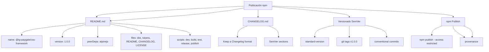

---
tags:
  - "kanban/done"
  - "type/task"
  - "domain/CSS"
  - "priority/P3"
parent: "[[desarrollo]]"
children: []
depends_on:
  - "[[CSS-034]]"
  - "[[CSS-035]]"
  - "[[CSS-036]]"
  - "[[CSS-037]]"
blocks: []
status: "done"
assignee: "@dev"
created: "2026-08-04"
updated: "2026-08-05"
---

# [[CSS-038]] Publicación: Package.json, README, Changelog, Versionado Semver, npm Publish

## Descripción
Preparar el framework CSS para publicación como paquete npm: package.json, README, changelog, versionado semver, npm publish (opcional, privado).

## Código de Ejemplo
```json
// package.json (framework package)
{
  "name": "@tg-paygate/css-framework",
  "version": "1.0.0",
  "description": "TG-PayGate CSS Framework - Design system for TG-PayGate platform",
  "keywords": [
    "css",
    "framework",
    "design-system",
    "components",
    "utilities",
    "dark-mode",
    "rtl",
    "accessibility"
  ],
  "homepage": "https://github.com/tg-paygate/css-framework#readme",
  "repository": {
    "type": "git",
    "url": "git+https://github.com/tg-paygate/css-framework.git"
  },
  "bugs": {
    "url": "https://github.com/tg-paygate/css-framework/issues"
  },
  "license": "MIT",
  "author": "TG-PayGate Team <team@tgpaygate.com>",
  "main": "dist/framework.css",
  "module": "dist/framework.esm.js",
  "types": "dist/index.d.ts",
  "files": [
    "dist",
    "tokens",
    "README.md",
    "CHANGELOG.md",
    "LICENSE"
  ],
  "scripts": {
    "dev": "vite",
    "build": "vite build",
    "build:prod": "vite build --mode production",
    "preview": "vite preview",
    "tokens:build": "node scripts/build-tokens.js",
    "tokens:watch": "node scripts/build-tokens.js --watch",
    "lint": "stylelint \"resources/css/**/*.css\"",
    "lint:fix": "stylelint \"resources/css/**/*.css\" --fix",
    "format": "prettier --write \"resources/css/**/*.css\"",
    "test:visual": "playwright test",
    "test:a11y": "playwright test --project=a11y",
    "release": "standard-version",
    "publish": "npm publish",
    "prepare": "npm run build:prod"
  },
  "peerDependencies": {
    "alpinejs": "^3.13.0"
  },
  "devDependencies": {
    "vite": "^5.0.0",
    "laravel-vite-plugin": "^1.0.0",
    "postcss": "^8.4.0",
    "postcss-nested": "^6.0.0",
    "postcss-import": "^16.0.0",
    "autoprefixer": "^10.4.0",
    "cssnano": "^6.0.0",
    "@fullhuman/postcss-purgecss": "^6.0.0",
    "style-dictionary": "^4.0.0",
    "stylelint": "^16.0.0",
    "prettier": "^3.0.0",
    "playwright": "^1.40.0",
    "@playwright/test": "^1.40.0",
    "standard-version": "^9.5.0"
  },
  "engines": {
    "node": ">=18.0.0"
  },
  "stylelint": {
    "extends": [
      "stylelint-config-standard",
      "stylelint-config-recess-order"
    ],
    "rules": {
      "color-hex-case": "lower",
      "color-hex-length": "short",
      "selector-class-pattern": "^[a-z][a-z0-9]*(-[a-z0-9]+)*(__[a-z0-9]+(-[a-z0-9]+)*)?(--[a-z0-9]+(-[a-z0-9]+)*)?$",
      "custom-property-pattern": "^tgp-[a-z][a-z0-9]*(-[a-z0-9]+)*$"
    }
  }
}
```

```markdown
# README.md

# TG-PayGate CSS Framework

> Design system CSS para la plataforma TG-PayGate. Componentes accesibles, dark mode nativo, RTL ready, tree-shaking ready.

## Características

- 🎨 **Design Tokens**: Colores, spacing, tipografía, sombras, radius, z-index, breakpoints, transiciones
- 🌙 **Dark Mode**: Tokens semánticos duales, `prefers-color-scheme`, toggle manual, persistencia
- 🌐 **RTL Ready**: Logical properties, auto-mirroring, direction utilities
- ♿ **Accesibilidad**: WCAG 2.1 AA, focus-visible, skip links, reduced motion, high contrast
- 📦 **Tree Shaking**: Imports modulares, PurgeCSS, < 50KB gzipped
- 🧩 **15 Componentes**: Button, Input, Select, Modal, Card, Table, Dropdown, Tabs, Toast, Tooltip, Avatar, Badge, Pagination, Breadcrumb, Sidebar
- 🛠️ **Utilidades**: 200+ utilities (spacing, typography, color, flexbox, grid, sizing, interaction, transition)
- 🌍 **RTL Ready**: Logical properties, auto-mirroring
- ♿ **A11y First**: Focus visible, skip links, reduced motion, high contrast, ARIA patterns

## Instalación

```bash
npm install @tg-paygate/css-framework
# o
yarn add @tg-paygate/css-framework
```

## Uso

### CSS (Import completo)

```css
@import '@tg-paygate/css-framework/dist/framework.css';
```

### CSS Modular (Tree Shaking)

```css
/* Solo lo que necesitas */
@import '@tg-paygate/css-framework/components/button';
@import '@tg-paygate/css-framework/components/form';
@import '@tg-paygate/css-framework/utilities/spacing';
@import '@tg-paygate/css-framework/utilities/typography';
```

### Blade (Laravel)

```blade
@vite(['resources/css/app.css', 'resources/js/app.js'])
```

### JavaScript (Alpine.js)

```javascript
import Alpine from 'alpinejs';
import '@tg-paygate/css-framework/js/framework.js';

Alpine.start();
```

## Dark Mode

```html
<!-- Auto (sistema) -->
<html data-theme="system">

<!-- Forzado light -->
<html data-theme="light">

<!-- Forzado dark -->
<html data-theme="dark">
```

```javascript
// Toggle programático
document.documentElement.dataset.theme = 'dark';
// o
localStorage.setItem('theme', 'dark');
```

## RTL Support

```html
<html dir="rtl" lang="ar">
<!-- Componentes se adaptan automáticamente via logical properties -->
```

## Componentes

| Componente | Variantes | Estados |
|------------|-----------|---------|
| Button | primary, secondary, ghost, danger, success | default, hover, focus, active, disabled, loading |
| Input | 7 types | default, hover, focus, error, disabled |
| Modal | sm, md, lg, xl, full | open, closed |
| Dropdown | default, searchable, multi | closed, open |
| Card | elevated, outlined, filled | default, interactive |
| ... | ... | ... |

## Utilidades

200+ utilidades responsivas (mobile-first):

- **Spacing**: margin, padding, gap (0-24 + auto)
- **Display**: block, flex, grid, hidden, invisible, sr-only
- **Flexbox/Grid**: direction, wrap, justify, align, gap, order, basis
- **Typography**: family, size, weight, color, align, truncate, decoration
- **Color**: text, bg, border, placeholder, accent, gradient
- **Border/Radius/Shadow**: width, style, color, radius, shadow, ring
- **Sizing**: width, height, min/max, space-x/y, inset
- **Interaction**: cursor, pointer-events, select, resize, touch-action
- **Transition**: duration, easing, delay, property
- **Accessibility**: focus-visible, skip-link, reduced-motion, high-contrast

## Build

```bash
# Desarrollo
npm run dev

# Producción
npm run build:prod

# Tokens
npm run tokens:build

# Tests visuales
npm run test:visual

# Lint
npm run lint
```

## Dark Mode

Tokens semánticos duales (Light/Dark) - solo 10 tokens cambian:

```css
:root {
  --tgp-color-bg-primary: var(--tgp-color-light-100);
  --tgp-color-text-primary: var(--tgp-color-dark-900);
}

[data-theme="dark"] {
  --tgp-color-bg-primary: var(--tgp-color-dark-900);
  --tgp-color-text-primary: var(--tgp-color-light-100);
}
```

## Accesibilidad

- ✅ WCAG 2.1 AA
- ✅ Focus visible en todos los interactivos
- ✅ Skip links
- ✅ Reduced motion (prefers-reduced-motion)
- ✅ High contrast mode (prefers-contrast: more)
- ✅ Forced colors (Windows High Contrast)
- ✅ Touch targets 44x44px mínimo
- ✅ ARIA patterns en todos los componentes
- ✅ Skip links
- ✅ Screen reader only utilities

## Browser Support

- Chrome 90+
- Firefox 88+
- Safari 14+
- Edge 90+
- No IE11

## Licencia

MIT License - ver LICENSE para detalles.
```

```markdown
# CHANGELOG.md

# Changelog

All notable changes to this project will be documented in this file.

The format is based on [Keep a Changelog](https://keepachangelog.com/en/1.0.0/),
and this project adheres to [Semantic Versioning](https://semver.org/spec/v2.0.0.html).

## [1.0.0] - 2026-08-04

### Added
- Design tokens system (color, spacing, typography, shadows, radius, z-index, breakpoints, transitions)
- 15 core components (Button, Input, Select, Modal, Card, Table, Dropdown, Tabs, Toast, Tooltip, Avatar, Badge, Pagination, Breadcrumb, Sidebar)
- 200+ utility classes (spacing, display, flexbox, grid, typography, color, border, sizing, interaction, transition, accessibility)
- Dark mode support with semantic tokens
- RTL support with logical properties
- Accessibility utilities (focus-visible, skip links, reduced motion, high contrast, ARIA patterns)
- Tree-shaking ready modular imports
- Visual regression testing with Playwright
- Accessibility audit with axe-core
- Styleguide documentation at /styleguide

### Changed
- N/A (initial release)

### Deprecated
- N/A

### Removed
- N/A

### Fixed
- N/A

### Security
- N/A
```

```bash
# Release script (standard-version)
npx standard-version

# Publicar (si es público)
npm publish --access public

# O privado
npm publish --access restricted
```

## Diagramas Mermaid


## Criterios de Aceptación
- [ ] package.json completo: name, version, description, peerDeps (alpinejs), files, scripts, engines
- [ ] README.md completo: instalación, uso, dark mode, RTL, componentes, utilidades, a11y, browser support
- [ ] CHANGELOG.md formato Keep a Changelog + SemVer
- [ ] Versionado: standard-version (convencional commits)
- [ ] npm publish configurado (privado: --access restricted)
- [ ] LICENSE MIT incluido
- [ ] GitHub Actions CI/CD para publish automático
- [ ] Documentado en `docu/especificaciones/npm-publish.md`

## Notas Técnicas
- Peer dependency: alpinejs ^3.13.0 (requerido para componentes interactivos)
- Files: dist (CSS/JS), tokens (JSON), docs
- Engines: node >= 18
- Private registry: --access restricted (GitHub Packages o npm private)
- Standard-version para versionado automático
- Provenance attestation en publish

## Enlaces
- [[CSS-034]] Build System (dist output)
- [[CSS-035]] Tree Shaking (modular imports)
- [[CSS-036]] Documentación Viva (styleguide)
- [[CSS-037]] Testing Visual (regression)