---
tags:
  - "kanban/done"
  - "type/task"
  - "domain/DOC"
  - "priority/P1"
parent: "[[desarrollo]]"
children: []
depends_on:
  - "[[FUN-001]]"
blocks:
  - "[[DOC-003]]"
  - "[[DOC-004]]"
  - "[[DOC-005]]"
  - "[[DOC-006]]"
  - "[[DOC-007]]"
  - "[[DOC-008]]"
  - "[[DOC-009]]"
  - "[[DOC-010]]"
  - "[[DOC-011]]"
  - "[[DOC-012]]"
  - "[[DOC-013]]"
  - "[[DOC-014]]"
  - "[[DOC-015]]"
  - "[[DOC-016]]"
  - "[[DOC-002]]"
status: "done"
assignee: "@dev"
created: "2026-08-04"
updated: "2026-08-05"
---

# [[DOC-001]] Estructura docu/{kanban,arquitectura,decisiones,especificaciones,guias,runbooks}

## Descripción
Crear estructura de directorios para documentación técnica en `docu/` siguiendo estándares organizados.

## Código de Ejemplo
```bash
# Estructura de directorios a crear
docu/
├── kanban/              # Tablero Kanban (todo.md, backlog.md, etc.)
├── arquitectura/        # Decisiones de arquitectura (ADRs)
├── decisiones/          # Registro de decisiones técnicas (ADRs)
├── especificaciones/    # Especificaciones técnicas detalladas
├── guias/               # Guías de usuario y desarrollador
└── runbooks/            # Procedimientos operativos (runbooks)
```

```markdown
# docu/kanban/README.md
# Kanban Board - TG-PayGate

## Columnas
- **Backlog**: Tareas pendientes de priorizar
- **Todo**: Tareas listas para empezar
- **In Progress**: Tareas en desarrollo activo
- **Review**: Tareas en revisión/QA
- **Done**: Tareas completadas

## Convenciones
- Cada tarea = un archivo `.md` en `docu/kanban/tasks/`
- Formato: `PREFIJO-NNN.md` (ej: `CRE-001.md`)
- Frontmatter obligatorio con: tags, type, domain, priority, parent, children, depends_on, blocks, status, assignee, created, updated

## Flujo de trabajo
1. Nueva tarea → Backlog
2. Priorizada → Todo
3. En desarrollo → In Progress
4. En revisión → Review
5. Completada → Done
```

```markdown
# docu/arquitectura/README.md
# Arquitectura TG-PayGate

## Visión General
Arquitectura Domain-Driven Design con subdominios separados por contexto.

## Dominios
- **Public**: Sitio web público (landing, checkout, canales)
- **Creadores**: Panel de creadores (dashboard, canales, analytics)
- **Staff/CRM**: Soporte, facturación, gestión
- **Admin**: Configuración global, reportes, feature flags

## Patrones
- Domain-Driven Design
- Repository Pattern
- Service Layer
- Event-Driven (para webhooks, notificaciones)
```

## Diagramas Mermaid

```mermaid
graph TD
    A[docu/] --> B[kanban/]
    A --> C[arquitectura/]
    A --> D[decisiones/]
    A --> E[especificaciones/]
    A --> F[guias/]
    A --> G[runbooks/]
    
    B --> B1[todo.md]
    B --> B2[backlog.md]
    B --> B3[in-progress.md]
    B --> B4[review.md]
    B --> B5[done.md]
    B --> B6[tasks/]
    
    C --> C1[adr-001-domain-driven.md]
    C --> C2[adr-002-single-users-table.md]
    C --> C3[adr-003-subdominios.md]
    
    D --> D1[adr-001-texto.md]
    D --> D2[adr-002-texto.md]
    
    E --> E1[design-tokens.md]
    E --> E2[api-telegram.md]
    E --> E3[api-pagos.md]
    
    F --> F1[guia-usuario-creador.md]
    F --> F2[guia-usuario-cliente.md]
    F --> F3[guia-desarrollador.md]
    
    G --> G1[runbook-deploy.md]
    G --> G2[runbook-incident.md]
    G --> G3[runbook-backup.md]
```


## Criterios de Aceptación
- [ ] Directorios creados: kanban, arquitectura, decisiones, especificaciones, guias, runbooks
- [ ] README.md en cada directorio explicando propósito
- [ ] Convenciones de nomenclatura documentadas
- [ ] Estructura Kanban documentada (columnas, flujo, convenciones)
- [ ] Estructura ADRs documentada (formato, numeración, plantilla)
- [ ] Estructura especificaciones documentada
- [ ] Estructura guías documentada
- [ ] Estructura runbooks documentada

## Notas Técnicas
- Usar kebab-case para nombres de archivos
- Frontmatter YAML obligatorio en todos los .md
- Referencias cruzadas con wikilinks `[[PAGE]]`
- Diagramas Mermaid para diagramas técnicos

## Enlaces
- [[KAN-001]] Setup inicial Kanban
- [[DOC-002]] ADR-001 Domain Driven Design