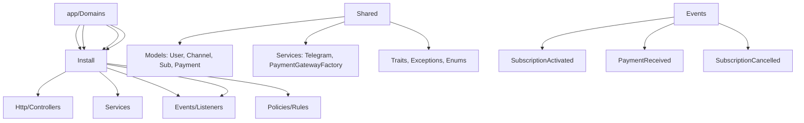

---
tags:
  - "kanban/done"
  - "type/task"
  - "domain/DOC"
  - "priority/P1"
parent: "[[desarrollo]]"
children: []
depends_on:
  - "[[DOC-001]]"
blocks: []
status: "done"
assignee: "@dev"
created: "2026-08-04"
updated: "2026-08-05"
---

# [[DOC-002]] ADR-001: Domain-Driven Design + Subdominios

## Descripción
Documentar la decisión arquitectónica de usar Domain-Driven Design con subdominios separados.

## Código de Ejemplo
```markdown
# ADR-001: Domain-Driven Design con Subdominios

## Status
Accepted

## Contexto
TG-PayGate es una plataforma SaaS compleja con múltiples contextos de negocio:
- Plataforma pública (landing, checkout, canales)
- Panel de creadores (gestión canales, analytics, retiros)
- Panel de staff/CRM (soporte, facturación, moderación)
- Panel admin (config global, métricas, feature flags)
- Instalador portable

## Decisión
Usar Domain-Driven Design con subdominios aislados:
- Cada subdominio = bounded context independiente
- Código organizado en `app/Domains/{Public,Creadores,Staff,Install}`
- Comunicación entre dominios via Domain Events / Services compartidos
- Base de datos compartida pero esquemas lógicos separados

## Consecuencias
### Positivas
- Separación clara de responsabilidades
- Equipos pueden trabajar en paralelo en dominios distintos
- Escalabilidad: cada dominio puede escalar independientemente
- Testing más fácil (contextos acotados)
- Onboarding más fácil (contexto acotado)

### Negativas
- Complejidad inicial mayor
- Duplicación controlada de código (value objects, enums)
- Comunicación entre dominios requiere eventos/servicios
- Overhead de coordinación entre equipos

## Alternativas Consideradas
1. **Monolito modular simple**: Mantenible pero no escala bien en equipos
2. **Microservicios**: Overhead operacional excesivo para etapa actual
3. **Monolito monolítico**: Acoplamiento fuerte, difícil escalar equipos

## Implementación
- `app/Domains/{Public,Creadores,Staff,Install}/` cada uno con:
  - `Http/Controllers/`
  - `Services/`
  - `Models/` (solo los propios del dominio)
  - `Events/` + `Listeners/`
  - `Policies/`
  - `Rules/`
- Compartido en `app/`:
  - `Models/` compartidos (User, ChannelPago, Subscription, etc.)
  - `Services/` transversales (TelegramService, PaymentGatewayFactory)
  - `Traits/` compartidos
  - `Exceptions/` base

## Decisión
**Aceptado**: DDD con subdominios como bounded contexts.
```

## Diagramas Mermaid


## Criterios de Aceptación
- [ ] Documento ADR-001 creado en `docu/decisiones/adr-001-domain-driven.md`
- [ ] Formato estándar ADR: Status, Context, Decision, Consequences, Alternatives
- [ ] Diagrama Mermaid de arquitectura de dominios
- [ ] Justificación clara de la decisión

## Notas Técnicas
- Formato ADR basado en Michael Nygard
- Numeración secuencial: ADR-001, ADR-002, etc.
- Estado: Proposed | Accepted | Superseded | Deprecated

## Enlaces
- [[DOC-001]] Estructura docu
- [[DOC-003]] ADR-002 Users Table