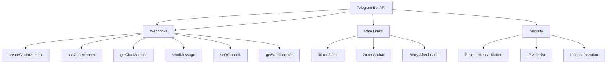

---
tags:
  - "kanban/done"
  - "type/task"
  - "domain/DOC"
  - "priority/P1"
parent: "[[desarrollo]]"
children: []
depends_on:
  - "[[DOC-001]]"
blocks: []
status: "done"
assignee: "@dev"
created: "2026-08-04"
updated: "2026-08-05"
---

# [[DOC-007]] Spec: API Telegram (webhooks, invite links, ban, rate limits)

## Descripción
Documentar la especificación completa de la API de Telegram Bot utilizada en TG-PayGate.

## Código de Ejemplo
```markdown
# Spec: API Telegram Bot

## Endpoints Utilizados

### createChatInviteLink
```
POST https://api.telegram.org/bot{token}/createChatInviteLink
```
**Parámetros:**
- `chat_id` (Integer|String): ID del chat/canal/grupo
- `member_limit` (Integer): Límite de miembros (1 para enlace único)
- `expire_date` (Integer): Unix timestamp de expiración
- `creates_join_request` (Boolean): false para enlace directo

**Respuesta:**
```json
{
  "ok": true,
  "result": {
    "invite_link": "https://t.me/+abc123",
    "creator": {...},
    "expire_date": 1234567890,
    "member_limit": 1
  }
}
```

### banChatMember
```
POST https://api.telegram.org/bot{token}/banChatMember
```
**Parámetros:**
- `chat_id` (Integer|String)
- `user_id` (Integer)
- `until_date` (Integer): Opcional, Unix timestamp
- `revoke_messages` (Boolean): Default false

### getChatMember
```
POST https://api.telegram.org/bot{token}/getChatMember
```
**Parámetros:**
- `chat_id` (Integer|String)
- `user_id` (Integer)

### sendMessage
```
POST https://api.telegram.org/bot{token}/sendMessage
```
**Parámetros:**
- `chat_id` (Integer|String)
- `text` (String)
- `parse_mode` (String): "HTML" | "MarkdownV2"
- `reply_markup` (Object): Inline keyboard

### setWebhook
```
POST https://api.telegram.org/bot{token}/setWebhook
```
**Parámetros:**
- `url` (String): HTTPS URL
- `certificate` (InputFile): Opcional, certificado público
- `max_connections` (Integer): 1-100
- `allowed_updates` (Array): ["message", "callback_query", ...]

### deleteWebhook
```
POST https://api.telegram.org/bot{token}/deleteWebhook
```

### getWebhookInfo
```
POST https://api.telegram.org/bot{token}/getWebhookInfo
```

## Webhooks
### Eventos soportados
- `message`: Nuevos mensajes
- `callback_query`: Botones inline presionados
- `chat_member`: Cambios en miembros del chat

### Estructura Update
```json
{
  "update_id": 123456789,
  "message": {...},
  "callback_query": {...},
  "chat_member": {...}
}
```

## Rate Limits
- **30 requests/second** por bot (global)
- **20 requests/second** por chat
- **1 request/second** para same chat_id en sendMessage
- **30 requests/second** para getUpdates

## Rate Limit Handling
- **429 Too Many Requests**: Retry-After header indica segundos a esperar
- Exponential backoff recomendado
- Queue local para requests

## Error Codes Comunes
- **400 Bad Request**: Parámetros inválidos
- **401 Unauthorized**: Token inválido
- **403 Forbidden**: Bot no tiene permisos en chat
- **404 Not Found**: Chat/user no encontrado
- **409 Conflict**: Webhook ya existe
- **429 Too Many Requests**: Rate limit excedido

## Webhook vs Polling
- **Webhook**: Recomendado para producción, latency ~0
- **Polling**: getUpdates con offset, latency ~1-2s
- Long polling: timeout 30s recomendado

## Security
- Validar `secret_token` en header `X-Telegram-Bot-Api-Secret-Token`
- Verificar IP de Telegram (rangos oficiales)
- Sanitizar input de usuarios

## Enlaces
- [[PUB-007]] Webhook Handler
- [[PUB-008]] Telegram Bot API Base
- [[CRM-009]] Integración Telegram CRM
```

## Diagramas Mermaid


## Criterios de Aceptación
- [ ] Documentados todos los endpoints usados
- [ ] Parámetros y respuestas documentados
- [ ] Rate limits documentados con manejo
- [ ] Webhook structure documentada
- [ ] Error codes listados
- [ ] Security best practices documentadas
- [ ] Ejemplos de código PHP/Laravel incluidos

## Enlaces
- [[PUB-007]] Webhook Handler
- [[PUB-008]] Telegram Bot API Base
- [[CRM-009]] Integración Telegram CRM
- [[PUB-007]] Webhook Handler