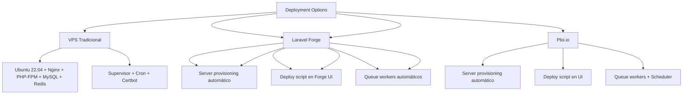

---
tags:
  - "kanban/done"
  - "type/task"
  - "domain/DOC"
  - "priority/P1"
parent: "[[desarrollo]]"
children: []
depends_on:
  - "[[DOC-001]]"
blocks: []
status: "done"
assignee: "@dev"
created: "2026-08-04"
updated: "2026-08-05"
---

# [[DOC-011]] Guía: Deployment Genérico (VPS, Docker, Laravel Forge, Ploi)

## Descripción
Guía completa de despliegue para TG-PayGate en diferentes entornos: VPS tradicional, Docker, Laravel Forge y Ploi.

## Código de Ejemplo

### VPS Tradicional (Ubuntu 22.04 + Nginx + PHP-FPM + MySQL + Redis)

```bash
# 1. Preparar servidor
sudo apt update && sudo apt upgrade -y
sudo apt install -y nginx mysql-server redis-server php8.2-fpm php8.2-{cli,mbstring,curl,gd,mysql,zip,xml,bcmath,xml} supervisor certbot python3-certbot-nginx

# Configurar MySQL
sudo mysql_secure_installation
sudo mysql -e "CREATE DATABASE tg_paygate CHARACTER SET utf8mb4 COLLATE utf8mb4_unicode_ci;"
sudo mysql -e "CREATE USER 'tgp_user'@'localhost' IDENTIFIED BY 'strong_password';"
sudo mysql -e "GRANT ALL PRIVILEGES ON tg_paygate.* TO 'tgp_user'@'localhost'; FLUSH PRIVILEGES;"

# Configurar Nginx
sudo tee /etc/nginx/sites-available/tgpagate << 'EOF'
server {
    listen 80;
    server_name tudominio.com www.tudominio.com;
    root /var/www/tgpagate/public;
    index index.php;

    location / {
        try_files $uri $uri/ /index.php?$query_string;
    }

    location ~ \.php$ {
        fastcgi_pass unix:/var/run/php/php8.2-fpm.sock;
        fastcgi_param SCRIPT_FILENAME $document_root$fastcgi_script_name;
        include fastcgi_params;
        fastcgi_param SCRIPT_FILENAME $document_root$fastcgi_script_name;
    }

    location ~ /\.(env|git) { deny all; }
    
    location ~* \.(js|css|png|jpg|jpeg|gif|ico|svg|woff2)$ {
        expires 1y;
        add_header Cache-Control "public, immutable";
    }

    gzip on;
    gzip_types text/plain text/css application/json application/javascript text/xml application/xml application/xml+rss text/javascript;
}
EOF

sudo ln -s /etc/nginx/sites-available/tgpagate /etc/nginx/sites-enabled/
sudo nginx -t && sudo systemctl reload nginx

# Configurar SSL con Let's Encrypt
sudo certbot --nginx -d tudominio.com -d www.tudominio.com

# Configurar Supervisor para Queue Workers
sudo tee /etc/supervisor/conf.d/tgpagate-worker.conf << 'EOF'
[program:tgpagate-worker]
process_name=%(program_name)s_%(process_num)02d
command=php /var/www/tgpagate/artisan queue:work redis --sleep=3 --tries=3 --max-time=3600
autostart=true
autorestart=true
user=www-data
numprocs=4
redirect_stderr=true
stdout_logfile=/var/www/tgpagate/storage/logs/worker.log
stopwaitsecs=3600
EOF

sudo supervisorctl reread && sudo supervisorctl update && sudo supervisorctl status tgpagate-worker:*

# Configurar Cron
sudo crontab -e -u www-data
# * * * * * cd /var/www/tgpagate && php artisan schedule:run >> /dev/null 2>&1
```

### Docker (Docker Compose)

```yaml
# docker-compose.yml
version: '3.8'

services:
  nginx:
    image: nginx:alpine
    ports:
      - "80:80"
      - "443:443"
    volumes:
      - ./nginx.conf:/etc/nginx/nginx.conf:ro
      - ./certbot/conf:/etc/letsencrypt:ro
      - ./certbot/www:/var/www/certbot:ro
      - ./public:/var/www/html/public:ro
    depends_on:
      - php

  php:
    build:
      context: .
      dockerfile: Dockerfile
    volumes:
      - ./:/var/www/html
    environment:
      - APP_ENV=production
      - APP_DEBUG=false
      - DB_HOST=mysql
      - DB_DATABASE=tg_paygate
      - DB_USERNAME=tgp_user
      - DB_PASSWORD=${DB_PASSWORD}
      - REDIS_HOST=redis
      - REDIS_PASSWORD=${REDIS_PASSWORD}
    depends_on:
      - mysql
      - redis

  mysql:
    image: mysql:8.0
    environment:
      MYSQL_DATABASE: tg_paygate
      MYSQL_USER: tgp_user
      MYSQL_PASSWORD: ${DB_PASSWORD}
      MYSQL_ROOT_PASSWORD: ${DB_ROOT_PASSWORD}
    volumes:
      - mysql_data:/var/lib/mysql
    command: --default-authentication-plugin=mysql_native_password

  redis:
    image: redis:7-alpine
    command: redis-server --appendonly yes
    volumes:
      - redis_data:/data

  certbot:
    image: certbot/certbot
    volumes:
      - ./certbot/conf:/etc/letsencrypt
      - ./certbot/www:/var/www/certbot
    entrypoint: "/bin/sh -c 'trap exit TERM; while :; do certbot renew; sleep 12h & wait; done'"

volumes:
  mysql_data:
  redis_data:
```

```dockerfile
# Dockerfile
FROM php:8.2-fpm

RUN apt-get update && apt-get install -y \
    nginx \
    libpng-dev \
    libonig-dev \
    libxml2-dev \
    zip unzip \
    libzip-dev \
    libpq-dev \
    && docker-php-ext-install pdo_mysql mbstring exif pcntl bcmath gd zip

COPY --from=composer:latest /usr/bin/composer /usr/bin/composer

WORKDIR /var/www/html

COPY composer.json composer.lock ./
RUN composer install --no-dev --optimize-autoloader --no-interaction

COPY . .
RUN chown -R www-data:www-data /var/www/html/storage /var/www/html/bootstrap/cache
RUN chmod -R 775 /var/www/html/storage /var/www/html/bootstrap/cache

EXPOSE 9000
CMD ["php-fpm"]
```

### Laravel Forge

```bash
# En Laravel Forge:
# 1. Crear servidor: DigitalOcean/Linode/AWS, Ubuntu 22.04, PHP 8.2, MySQL 8, Redis
# 2. Crear sitio: tgpagate.com, root: /home/forge/tgpagate/public
# 3. Configurar variables de entorno en Forge UI
# 3. Deploy script:
cd /home/forge/tgpagate
git pull origin main
composer install --no-dev --optimize-autoloader
npm ci && npm run build
php artisan migrate --force
php artisan config:cache && php artisan route:cache && php artisan view:cache
php artisan queue:restart
```

### Ploi.io

```bash
# En Ploi.io panel:
# 1. Add Server: SSH key, Ubuntu 22.04, PHP 8.2, MySQL 8, Redis
# 2. Add Site: tgpagate.com, Web Directory: /public, PHP 8.2
# 3. Add Database: tg_paygate
# 4. Add Redis
# 4. Deploy script:
cd /home/ploi/tgpagate
git pull origin main
composer install --no-dev --optimize-autoloader
npm ci && npm run build
php artisan migrate --force
php artisan config:cache && php artisan route:cache && php artisan view:cache
php artisan queue:restart
```

## Diagramas Mermaid


## Criterios de Aceptación
- [ ] VPS: Ubuntu 22.04, Nginx, PHP-FPM 8.2, MySQL 8, Redis, SSL Let's Encrypt
- [ ] Docker: docker-compose.yml multi-servicio, healthchecks, volumes persistentes
- [ ] Laravel Forge: provisioning automático, deploy script, queue workers
- [ ] Ploi.io: provisioning automático, deploy script, queue workers
- [ ] SSL: Let's Encrypt wildcard para subdominios
- [ ] Queue workers: Supervisor (VPS) / Horizon (Forge) / Supervisor (Ploi)
- [ ] Cron jobs: schedule:run, queue:work, backups
- [ ] SSL: Let's Encrypt wildcard *.tudominio.com
- [ ] Monitoring: Laravel Telescope (opcional), Sentry (opcional)
- [ ] Backup: BD diaria, storage semanal, retención 30 días

## Notas Técnicas
- PHP 8.2+ requerido (JIT opcional)
- MySQL 8.0+ / PostgreSQL 14+
- Redis 7+ para cache/queues/sessions
- Nginx con gzip, cache headers, rate limiting
- OPcache habilitado en producción
- OPcache JIT habilitado para PHP 8.2+
- Permisos: www-data:www-data, storage/cache 775
- Firewall: UFW allow 22, 80, 443; deny else
- Fail2ban para SSH/nginx
- Logrotate para logs nginx/php

## Enlaces
- [[DOC-012]] Guía usuario: Staff CRM
- [[DOC-013]] Guía usuario: Admin
- [[DOC-015]] Runbook
- [[ADM-009]] Backup/Restore