---
tags:
  - "kanban/done"
  - "type/task"
  - "domain/DOC"
  - "priority/P1"
parent: "[[desarrollo]]"
children: []
depends_on:
  - "[[DOC-001]]"
blocks: []
status: "done"
assignee: "@dev"
created: "2026-08-04"
updated: "2026-08-05"
---

# [[DOC-012]] Guía usuario: Staff CRM (tickets, SLA, macros, KB)

## Descripción
Guía completa para el personal de soporte (Staff) que usa el panel CRM: gestión de tickets, SLA, macros/respuestas predefinidas, base de conocimiento.

## Código de Ejemplo
```markdown
# Guía Staff CRM - TG-PayGate

## Acceso al Panel CRM
- URL: https://crm.tudominio.com
- Credenciales: email + password + 2FA (obligatorio para staff)
- Roles: staff (tickets), admin (gestión completa)

## Dashboard Principal
- **Colas de tickets**: Sin asignar, Mis tickets, Equipo, Escalados, Vencidos
- **Métricas en tiempo real**: Volumen, tiempo respuesta, resolución, CSAT
- **Accesos rápidos**: Nuevo ticket, Base de conocimiento, Reportes

## Gestión de Tickets

### Crear Ticket
1. Click "Nuevo Ticket" → Seleccionar categoría, prioridad
2. Asunto descriptivo + descripción detallada
3. Asignar a: mí / equipo / específico
4. Etiquetas/tags para categorización
5. Crear → Notificación automática a cliente + staff

### Flujo de Estados
- **Open**: Nuevo, sin asignar
- **Pending**: En espera de respuesta cliente
- **Waiting**: En espera de info interna / terceros
- **Closed**: Resuelto, cerrado

### SLA Timers
- **Respuesta inicial**: Según prioridad (Urgente: 2h, Alta: 8h, Normal: 24h, Baja: 72h)
- **Resolución**: Según prioridad (Urgente: 8h, Alta: 24h, Normal: 72h, Baja: 1 semana)
- **Alertas**: 50% tiempo → warning, 80% → critical, Vencido → escalation

### Responder Tickets
- **Respuesta pública**: Visible para cliente (email + in-app + Telegram opcional)
- **Nota interna**: Solo staff, no notifica al cliente
- **Macros/Canned Replies**: Atajos para respuestas frecuentes (Ctrl+M)
- **Adjuntos**: Arrastrar/pegar, máx 10MB, tipos permitidos
- **Time tracking**: Registrar tiempo invertido (opcional)

### Cambiar Estado
- **Asignar**: A mí / A compañero / A equipo
- **Cambiar prioridad**: Urgente/Alta/Normal/Baja
- **Cambiar estado**: Open → Pending → Waiting → Closed
- **Cerrar**: Requiere resolución + nota cierre opcional

### Macros/Canned Replies
- **Crear**: Admin → Macros → Nueva (nombre, contenido, variables: {{ticket_id}}, {{customer_name}})
- **Usar**: En respuesta, tecla "/" + nombre macro
- **Variables**: {{ticket_id}}, {{customer_name}}, {{agent_name}}, {{channel_name}}

### Adjuntos
- Tipos: Imágenes, PDF, DOC, TXT, ZIP
- Máx 10MB por archivo, 50MB total por ticket
- Vista previa inline para imágenes/PDF

## Base de Conocimiento (KB)

### Crear Artículos
1. CRM → Base de Conocimiento → Nuevo Artículo
2. Título claro, categoría, tags
3. Contenido: Editor WYSIWYG (Trix/Quill)
4. Publicado/Interno (solo staff)
5. Destacado (featured) para FAQ

### Estructura
- Categorías: Técnico, Facturación, Cuenta, Canales, Pagos, API
- Tags para filtrado cruzado
- Artículos destacados (featured) en dashboard

### Feedback
- Botón "¿Útil?" / "No útil" al final
- Comentarios opcionales
- Reporte mensual: más/menos útiles

## Cliente 360°
- **Perfil**: Datos, canales, suscripciones, pagos
- **Tickets**: Historial completo, filtros
- **Pagos**: Historial, facturas, reembolsos
- **Health Score**: 0-100 (engagement, pagos, tickets, tenure)
- **Notas/Tag**: Internas, solo staff
- **Acciones rápidas**: Impersonar, suspender, extender, nota

## Reportes
- **Volumen**: Por día/semana/mes, por canal, categoría
- **Tiempos**: Respuesta (first response), Resolución, SLA compliance
- **CSAT**: Encuesta post-cierre (1-5 estrellas + comentario)
- **Backlog Aging**: Tickets abiertos > 24h, > 48h, > 1 semana
- **Agente**: Volumen, tiempo respuesta, resolución, CSAT, SLA compliance

## Automatizaciones
- **Reglas**: Trigger (creado, actualizado, respondido, SLA breach) → Acciones (asignar, etiquetar, notificar, cambiar estado, macro)
- **SLA Breach**: Alertar a supervisor, escalar a senior
- **Auto-assign**: Round-robin / Skills-based / Least loaded
- **Macros**: Ejecutar secuencia de acciones

## Atajos de Teclado
- `N`: Nuevo ticket
- `R`: Responder
- `I`: Nota interna
- `M`: Macros
- `S`: Cambiar estado
- `A`: Asignar a mí
- `/`: Buscar tickets
- `?`: Ayuda atajos

## Integración Telegram (Staff)
- Grupo staff: Notificaciones tiempo real
- Comandos: `/tickets`, `/unassigned`, `/mytickets`, `/search <query>`
- Callbacks: Asignarme, Asignar a..., Responder, Cerrar, Prioridad
```

## Diagramas Mermaid

```mermaid
graph TD
    A[Staff CRM Guide] --> B[Dashboard]
    A --> B[Tickets]
    A --> C[Knowledge Base]
    A --> D[Client 360]
    A --> E[Reports]
    A --> F[Automation]
    
    B --> B1[Queues: Unassigned, Mine, Team, Escalated]
    B --> B2[KPIs: Volume, SLA, CSAT]
    
    C[Tickets] --> C1[Create: Category, Priority, Assignee]
    C --> C1[States: Open, Pending, Waiting, Closed]
    C --> C2[SLA Timers: Response/Resolution]
    C --> C2[Replies: Public, Internal, Macros]
    C --> C3[Attachments, Time Tracking]
    C --> C4[Status Transitions]
    
    C[KB] --> C1[Categories + Articles]
    C --> C2[Search + Filters]
    C --> C3[Feedback: Useful/Not]
    
    D[Client 360] --> D1[Profile + Channels + Payments]
    C --> C2[Tickets History]
    C --> C4[Health Score]
    C --> C5[Notes + Tags]
    
    E[Reports] --> E1[Volume, Response, Resolution, CSAT]
    E --> E1[Backlog Aging]
    
    F[Automation] --> F1[Rules: Trigger → Action]
    F --> F2[SLA Breach Alerts]
    F --> F3[Auto-assign, Tags, Macros]
```


## Criterios de Aceptación
- [ ] Documentación completa en Markdown con navegación
- [ ] Capturas de pantalla anotadas para cada sección
- [ ] Ejemplos reales de macros, reglas, flujos
- [ ] Video tutorial corto por sección (opcional v1.1)
- [ ] Versión PDF exportable para offline
- [ ] Versión interactiva en `/docs/crm-staff` (opcional v1.1)
- [ ] Checklist de onboarding para nuevo staff

## Enlaces
- [[CRM-001]] Ticketing
- [[CRM-002]] Colas
- [[CRM-003]] Respuestas
- [[CRM-004]] Cliente 360
- [[CRM-006]] Base conocimiento
- [[CRM-007]] Reportes
- [[CRM-008]] Automatizaciones
- [[CRM-009]] Telegram Integration