---
tags:
  - "kanban/done"
  - "type/task"
  - "domain/DOC"
  - "priority/P1"
parent: "[[desarrollo]]"
children: []
depends_on:
  - "[[DOC-001]]"
blocks: []
status: "done"
assignee: "@dev"
created: "2026-08-04"
updated: "2026-08-05"
---

# [[DOC-015]] Runbook: Incident Response, Rollback, Scaling, Backup/Restore

## Descripción
Runbook operativo para incidentes, rollbacks, escalado y procedimientos de backup/restore.

## Código de Ejemplo
```markdown
# Runbook Operativo - TG-PayGate

## Clasificación de Incidentes

### Severidad
| Nivel | Definición | Tiempo Respuesta | Escalación |
|-------|------------|------------------|------------|
| SEV-1 | Servicio caído, pérdida datos, breach seguridad | 15 min | Inmediato: On-call + Tech Lead + CTO |
| SEV-2 | Funcionalidad crítica degradada, performance severa | 30 min | On-call + Tech Lead |
| SEV-3 | Bug no crítico, UX degradada | 2 horas | On-call |
| SEV-4 | Mejora, feature request, tarea mantenimiento | Próximo sprint | Backlog |

## Runbooks por Escenario

### 1. Servicio Caído (SEV-1)
```bash
# 1. Verificar salud
curl -f https://api.tgpagate.com/health || echo "DOWN"

# 2. Verificar servicios
systemctl status nginx php8.2-fpm mysql redis supervisor

# 3. Revisar logs recientes
tail -100 /var/www/tgpagate/storage/logs/laravel.log
journalctl -u nginx -u php8.2-fpm -u mysql -u redis --since "10 minutes ago"

# 3. Quick fixes comunes
php artisan optimize:clear
php artisan queue:restart
systemctl reload nginx php8.2-fpm

# 4. Si DB caída
systemctl restart mysql
# Verificar replicación si replica

# 5. Si cache lleno
redis-cli FLUSHALL
php artisan cache:clear
```

### 2. Deployment Fallido (Rollback)
```bash
# Rollback automático (si deploy via Forge/Forge CLI)
forge deploy:rollback --site=tgpagate

# Rollback manual
cd /var/www/tgpagate
git log --oneline -5  # Identificar commit anterior estable
git checkout <commit-hash> -- .
composer install --no-dev --optimize-autoloader
npm ci && npm run build
php artisan migrate --force
php artisan optimize:clear
php artisan config:cache && php artisan route:cache && php artisan view:cache
php artisan queue:restart
```

### 3. Base de Datos Corrupta / Restaurar Backup
```bash
# Restaurar desde backup más reciente
# 1. Identificar backup más reciente sano
ls -la /backups/db/

# 2. Restaurar
gunzip -c /backups/db/tgpagate_20240115_0300.sql.gz | mysql -u tgp_user -p tg_paygate

# 3. Verificar integridad
php artisan migrate:status
php artisan db:seed --class=VerifyDataIntegritySeeder
```

### 4. Escalado de Emergencia (Auto-scaling)
```bash
# Escalar workers (si usa Horizon/Supervisor)
# Horizon
php artisan horizon:scale 10

# Supervisor
supervisorctl set rpcinterface:supervisor
supervisorctl update
supervisorctl start tgpagate-worker:*
supervisorctl status

# Docker Swarm / Kubernetes
kubectl scale deployment tgpagate-api --replicas=10
kubectl scale deployment tgpagate-worker --replicas=8
```

### 5. Certificados SSL Expirados / Por Expirar
```bash
# Verificar
certbot certificates

# Renovar manual
certbot renew --force-renewal

# Verificar auto-renovación
systemctl status certbot.timer
systemctl status certbot-renew.timer
```

### 6. Fuga de Memoria / CPU 100%
```bash
# Identificar proceso
htop
ps aux --sort=-%cpu | head -20

# PHP memory leak
php -r 'echo memory_get_usage(true);'  # En código
# O usar Blackfire/Xdebug profiling

# Reinicio graceful
php artisan queue:restart
systemctl reload php8.2-fpm
```

### 7. Brecha de Seguridad / Data Breach
```bash
# 1. Contener
# Revocar tokens/sesiones comprometidas
php artisan session:flush
redis-cli FLUSHALL

# 2. Rotar secretos
# Rotar APP_KEY, JWT secrets, API keys, DB passwords
php artisan key:generate --force
# Rotar secrets en .env y Vault/Secrets Manager

# 3. Notificar
# GDPR: 72h notificación autoridad + usuarios afectados
# Logs forenses: preservar logs, DB snapshots
```

## Diagramas Mermaid

```mermaid
graph TD
    A[Runbook] --> B[SEV-1: Down]
    A --> B[Rollback Deploy]
    A --> C[DB Restore]
    A --> D[Auto-scaling]
    A --> E[SSL Certs]
    A --> F[Memory/CPU]
    A --> G[Security Breach]
    
    B --> B1[Health check]
    B --> B2[Services status]
    B --> B3[Logs analysis]
    B --> B4[Quick fixes]
    B --> B5[DB recovery]
    
    C[Rollback] --> C1[Forge/Manual]
    C --> C2[Git checkout]
    C --> C2[Re-deploy]
    C --> C3[Migrate + Cache]
    
    C[DB Restore] --> C1[Identify backup]
    C --> C2[Restore + Verify]
    C --> C3[Integrity check]
    
    D[Auto-scaling] --> D1[Horizon/Supervisor]
    D --> D2[K8s HPA]
    D --> D3[Queue workers]
    
    E[SSL] --> E1[certbot renew]
    E --> E2[Timer check]
    
    F[Memory/CPU] --> F1[htop/ps]
    F --> F2[PHP memory leak]
    F --> F3[Graceful restart]
    
    G[Breach] --> G1[Contain: revoke tokens]
    G --> G2[Rotate secrets]
    G --> G3[Notify GDPR 72h]
    G --> G4[Forensic logs]
```


## Criterios de Aceptación
- [ ] Runbook documentado en Markdown con procedimientos paso a paso
- [ ] Comandos copiables y probados
- [ ] Diagramas de decisión para cada escenario
- [ ] Contactos de escalación actualizados
- [ ] Checklists de verificación post-incidente
- [ ] Plantillas de comunicación (Slack, Email, Statuspage)
- [ ] Post-mortem template
- [ ] Checklist de preparación para on-call

## Notas Técnicas
- Mantener runbook actualizado cada release
- Simulacros trimestrales (Game Days)
- Post-mortem obligatorio para SEV-1/SEV-2
- Runbook versionado en Git junto con código
- Acceso rápido: alias `runbook` en shell, bookmark en navegador

## Enlaces
- [[ADM-009]] Backup/Restore
- [[ADM-015]] Runbook
- [[TST-S-004]] DAST
- [[TST-S-005]] Pentest checklist