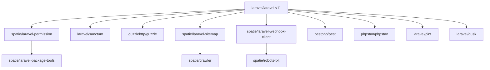

---
tags:
  - "kanban/done"
  - "type/task"
  - "domain/FUN"
  - "priority/P0"
parent: "[[desarrollo]]"
children: []
depends_on: []
blocks:
  - "[[FUN-002]]"
  - "[[FUN-003]]"
  - "[[FUN-005]]"
  - "[[CSS-001]]"
  - "[[UX-001]]"
  - "[[ADM-001]]"
  - "[[ADM-002]]"
  - "[[ADM-008]]"
  - "[[ADM-010]]"
  - "[[DOC-001]]"
  - "[[FUN-008]]"
  - "[[INS-001]]"
  - "[[KAN-001]]"
  - "[[PUB-011]]"
  - "[[PUB-012]]"
  - "[[PUB-013]]"
status: "done"
assignee: "@dev"
created: "2026-08-04"
updated: "2026-08-05"
---

# [[FUN-001]] Inicializar Proyecto Laravel 11 + Dependencias Core

## Descripción
Crear el proyecto base Laravel 11 con todas las dependencias core necesarias para TG-PayGate: permisos, API tokens, HTTP client, sitemaps, webhooks.

## Código de Ejemplo
```bash
# Crear proyecto
composer create-project laravel/laravel tg-paygate --prefer-dist --no-interaction

# Dependencias core
composer require spatie/laravel-permission laravel/sanctum guzzlehttp/guzzle spatie/laravel-sitemap spatie/laravel-webhook-client

# Dev dependencies
composer require --dev pestphp/pest pestphp/pest-plugin-laravel phpstan/phpstan larastan/larastan laravel/pint laravel/dusk
```

```json
// composer.json - scripts personalizados
{
    "scripts": {
        "test": "pest --parallel",
        "test:coverage": "pest --coverage",
        "lint": "pint --test",
        "lint:fix": "pint",
        "static": "phpstan analyse --memory-limit=512M",
        "ci": "composer lint && composer static && composer test"
    }
}
```

## Cálculos y Algoritmos (LaTeX)
### Matriz de Dependencias Core
$$
\begin{aligned}
\text{Core} &= \{ \text{spatie/laravel-permission}, \text{laravel/sanctum}, \text{guzzlehttp/guzzle}, \\
&\quad \text{spatie/laravel-sitemap}, \text{spatie/laravel-webhook-client} \} \\
\text{Dev} &= \{ \text{pestphp/pest}, \text{phpstan/phpstan}, \text{laravel/pint}, \text{laravel/dusk} \}
\end{aligned}
$$

## Diagramas Mermaid
### Árbol de Dependencias


## Criterios de Aceptación
- [ ] `composer create-project` ejecuta sin errores
- [ ] Todas las dependencias core instaladas en `composer.json`
- [ ] `php artisan --version` muestra Laravel 11.x
- [ ] `composer test` ejecuta Pest correctamente
- [ ] `composer lint` ejecuta Pint sin errores
- [ ] `composer static` ejecuta PHPStan nivel 5 sin errores

## Notas Técnicas
- Usar `--prefer-dist --no-interaction` para CI/CD
- PHP 8.2+ requerido (extensiones: openssl, pdo_mysql, mbstring, curl, gd, zip)
- SQLite para desarrollo local, MySQL 8.0+ para producción
- Configurar `minimum-stability: stable` en composer.json

## Enlaces
- [[FUN-002]] Estructura Domains
- [[FUN-003]] RouteServiceProvider Subdominios
- [[CSS-001]] Arquitectura Framework CSS
- [[UX-001]] User Research