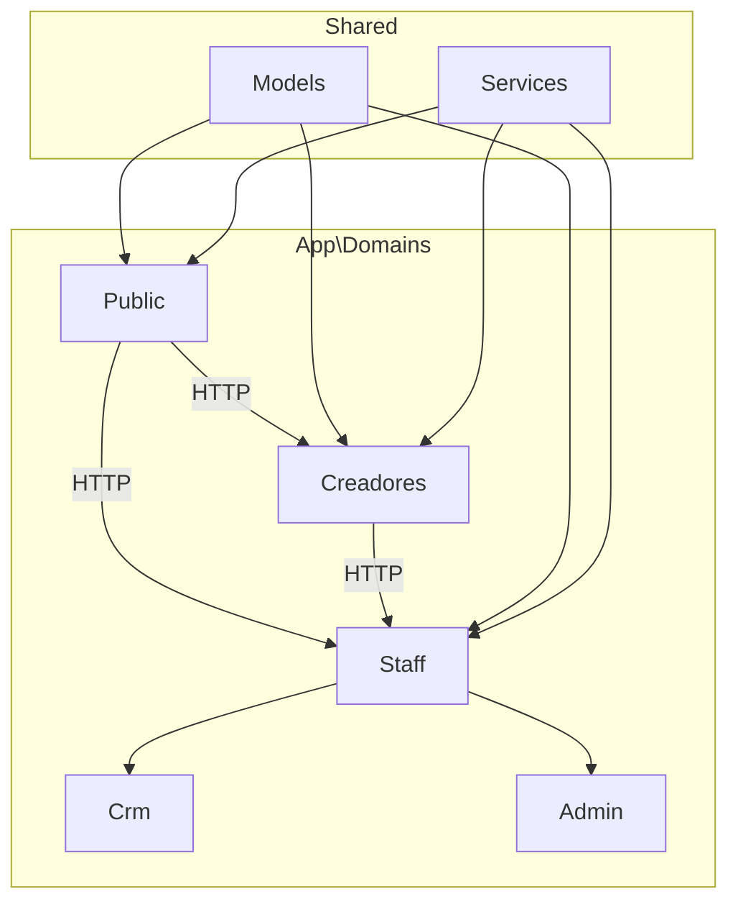

---
tags:
  - "kanban/done"
  - "type/task"
  - "domain/FUN"
  - "priority/P0"
parent: "[[desarrollo]]"
children: []
depends_on:
  - "[[FUN-001]]"
blocks:
  - "[[FUN-003]]"
  - "[[FUN-004]]"
  - "[[FUN-005]]"
  - "[[FUN-006]]"
  - "[[FUN-007]]"
  - "[[FUN-008]]"
  - "[[FUN-009]]"
  - "[[PUB-001]]"
  - "[[CRE-001]]"
  - "[[ADM-001]]"
  - "[[CRM-001]]"
status: "done"
assignee: "@dev"
created: "2026-08-04"
updated: "2026-08-05"
---

# [[FUN-002]] Configurar Estructura app/Domains/{Public,Creadores,Staff}

## Descripción
Implementar arquitectura Domain-Driven Design (DDD) con 3 dominios principales: Public (sitio web), Creadores (panel creadores), Staff (CRM + Admin compartido).

## Código de Ejemplo
```php
// app/Domains/Public/Http/Controllers/ChannelController.php
namespace App\Domains\Public\Http\Controllers;

use App\Domains\Public\Services\ChannelService;
use App\Http\Controllers\Controller;

class ChannelController extends Controller
{
    public function __construct(protected ChannelService $service) {}

    public function index() { /* listado público */ }
    public function show(string $slug) { /* detalle canal */ }
}

// app/Domains/Creadores/Http/Controllers/DashboardController.php
namespace App\Domains\Creadores\Http\Controllers;

use App\Domains\Creadores\Services\AnalyticsService;
use App\Http\Controllers\Controller;

class DashboardController extends Controller
{
    public function __construct(protected AnalyticsService $analytics) {}

    public function index() { /* dashboard creador */ }
}

// app/Domains/Staff/Http/Controllers/BaseStaffController.php
namespace App\Domains\Staff\Http\Controllers;

use App\Http\Controllers\Controller;

abstract class BaseStaffController extends Controller
{
    // Lógica compartida CRM + Admin
}
```

```bash
# Estructura de directorios a crear
app/Domains/
├── Public/
│   ├── Http/Controllers/
│   ├── Models/
│   ├── Services/
│   └── Views/
├── Creadores/
│   ├── Http/Controllers/
│   ├── Models/
│   ├── Services/
│   └── Views/
└── Staff/
    ├── Http/Controllers/
    │   ├── Crm/
    │   └── Admin/
    ├── Models/
    ├── Services/
    └── Views/
        ├── crm/
        └── admin/
```

## Cálculos y Algoritmos (LaTeX)
### Separación de Responsabilidades por Dominio
$$
\begin{aligned}
\text{Public} &= \{ \text{Landing}, \text{Listado Canales}, \text{Checkout}, \text{SEO} \} \\
\text{Creadores} &= \{ \text{Onboarding}, \text{Canales CRUD}, \text{Analytics}, \text{Retiros}, \text{API} \} \\
\text{Staff} &= \{ \text{BaseController}, \text{Políticas}, \text{Servicios Compartidos} \} \\
\text{Staff/Crm} &= \{ \text{Tickets}, \text{Cliente360}, \text{KB}, \text{Reportes} \} \\
\text{Staff/Admin} &= \{ \text{Config Global}, \text{Staff Mgmt}, \text{Métricas}, \text{Flags} \}
\end{aligned}
$$

## Diagramas Mermaid
### Arquitectura de Dominios


## Criterios de Aceptación
- [ ] Directorios `app/Domains/{Public,Creadores,Staff}` creados con subdirectorios
- [ ] Namespaces PSR-4 configurados en `composer.json` autoload
- [ ] Controladores base creados por dominio
- [ ] Service providers registrados si necesario
- [ ] Vistas organizadas por dominio en `resources/views/domains/`

## Notas Técnicas
- Usar `namespace App\Domains\Public\Http\Controllers;` etc.
- Models compartidos en `app/Models/` (User, CanalPago, Suscripcion, Ticket)
- Services específicos por dominio, servicios compartidos en `app/Services/`
- Views en `resources/views/domains/{public,creadores,staff}/`

## Enlaces
- [[FUN-001]] Proyecto Base
- [[FUN-003]] RouteServiceProvider
- [[FUN-004]] Middleware Subdominio
- [[PUB-001]] Landing Page
- [[CRE-001]] Onboarding Creador