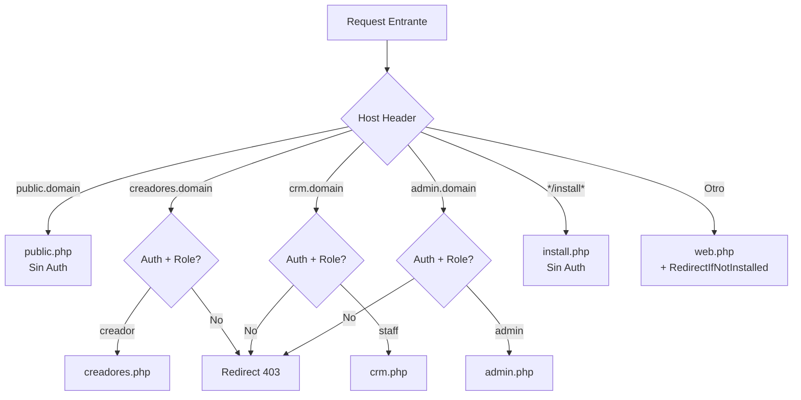

---
tags:
  - "kanban/done"
  - "type/task"
  - "domain/FUN"
  - "priority/P0"
parent: "[[desarrollo]]"
children: []
depends_on:
  - "[[FUN-002]]"
blocks:
  - "[[FUN-004]]"
  - "[[PUB-001]]"
  - "[[CRE-001]]"
  - "[[ADM-001]]"
  - "[[CRM-001]]"
  - "[[INS-001]]"
status: "done"
assignee: "@dev"
created: "2026-08-04"
updated: "2026-08-05"
---

# [[FUN-003]] Configurar RouteServiceProvider para Subdominios Dinámicos

## Descripción
Modificar `RouteServiceProvider` para cargar rutas dinámicamente según 4 subdominios: public, creadores, crm, admin. Cada subdominio tiene su archivo de rutas aislado.

## Código de Ejemplo
```php
// app/Providers/RouteServiceProvider.php
namespace App\Providers;

use Illuminate\Foundation\Support\Providers\RouteServiceProvider as ServiceProvider;
use Illuminate\Support\Facades\Route;

class RouteServiceProvider extends ServiceProvider
{
    public const HOME = '/dashboard';

    public function boot(): void
    {
        $this->configureRateLimiting();
        
        $domain = config('app.domain'); // tudominio.com

        // PUBLIC - Sin auth
        Route::middleware('web')
            ->domain("public.{$domain}")
            ->group(base_path('routes/domains/public.php'));

        // CREADORES - Auth + role:creador
        Route::middleware(['web', 'auth', 'role:creador'])
            ->domain("creadores.{$domain}")
            ->group(base_path('routes/domains/creadores.php'));

        // CRM - Auth + role:staff (permisos crm.*)
        Route::middleware(['web', 'auth', 'role:staff'])
            ->domain("crm.{$domain}")
            ->group(base_path('routes/domains/crm.php'));

        // ADMIN - Auth + role:admin (permisos admin.*)
        Route::middleware(['web', 'auth', 'role:admin'])
            ->domain("admin.{$domain}")
            ->group(base_path('routes/domains/admin.php'));

        // INSTALADOR - Sin auth, sin middleware subdominio
        Route::middleware('web')
            ->prefix('install')
            ->name('install.')
            ->group(base_path('routes/install.php'));

        // FALLBACK - Redirigir según estado instalación
        Route::middleware(['web', \App\Http\Middleware\RedirectIfNotInstalled::class])
            ->group(base_path('routes/web.php'));
    }

    protected function configureRateLimiting(): void
    {
        RateLimiter::for('api', function (Request $request) {
            return Limit::perMinute(60)->by($request->user()?->id ?: $request->ip());
        });
        
        RateLimiter::for('install', function (Request $request) {
            return Limit::perMinute(10)->by($request->ip());
        });
    }
}
```

```php
// routes/domains/public.php
use App\Domains\Public\Http\Controllers\ChannelController;
use App\Domains\Public\Http\Controllers\CheckoutController;

Route::get('/', [ChannelController::class, 'index'])->name('home');
Route::get('/canales', [ChannelController::class, 'index'])->name('channels.index');
Route::get('/canal/{slug}', [ChannelController::class, 'show'])->name('channels.show');
Route::get('/checkout/{channel}', [CheckoutController::class, 'create'])->name('checkout.create');
Route::post('/checkout/{channel}', [CheckoutController::class, 'store'])->name('checkout.store');
Route::get('/checkout/success/{subscription}', [CheckoutController::class, 'success'])->name('checkout.success');
```

## Cálculos y Algoritmos (LaTeX)
### Resolución de Rutas por Subdominio
$$
\text{Route}(host, path) = 
\begin{cases}
\text{public.php} & \text{si } host = \text{public.}\{domain\} \\
\text{creadores.php} & \text{si } host = \text{creadores.}\{domain\} \land user.role = \text{creador} \\
\text{crm.php} & \text{si } host = \text{crm.}\{domain\} \land user.role = \text{staff} \\
\text{admin.php} & \text{si } host = \text{admin.}\{domain\} \land user.role = \text{admin} \\
\text{install.php} & \text{si } path = /install/* \\
\text{web.php} & \text{fallback con RedirectIfNotInstalled}
\end{cases}
$$

## Diagramas Mermaid
### Flujo de Resolución de Rutas


## Criterios de Aceptación
- [ ] `RouteServiceProvider::boot()` carga 4 archivos de rutas por subdominio
- [ ] Middleware `role:` aplicado correctamente por subdominio
- [ ] Rutas instalador aisladas en `routes/install.php`
- [ ] Fallback `web.php` con middleware `RedirectIfNotInstalled`
- [ ] Rate limiting configurado para API e instalador
- [ ] `php artisan route:list` muestra rutas organizadas por dominio

## Notas Técnicas
- Configurar `APP_DOMAIN` en `.env` (ej: `tudominio.com`)
- Subdominios en InfinityFree: `public`, `creadores`, `crm`, `admin`
- SSL wildcard o certificados individuales por subdominio
- Tests: verificar que cada subdominio solo acepta roles correctos

## Enlaces
- [[FUN-002]] Estructura Dominios
- [[FUN-004]] Middleware EnsureCorrectSubdomain
- [[FUN-005]] Spatie Permission
- [[INS-001]] Middleware RedirectIfNotInstalled