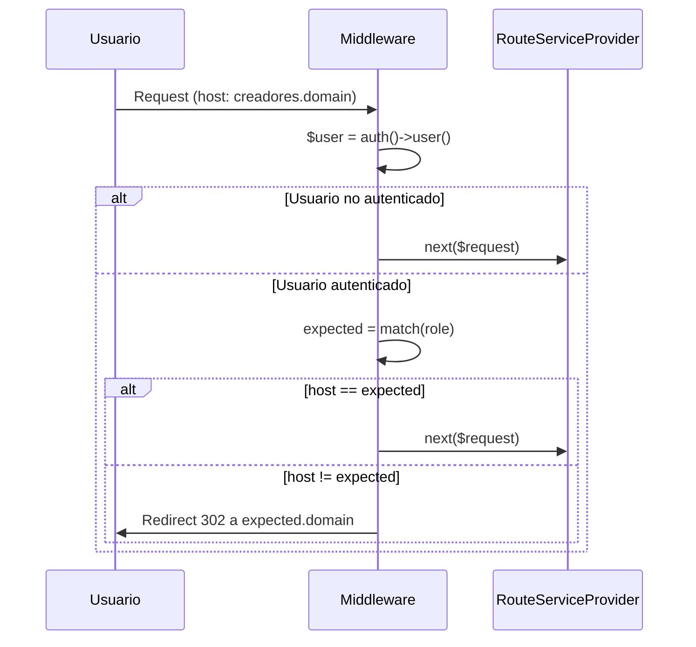

---
tags:
  - "kanban/done"
  - "type/task"
  - "domain/FUN"
  - "priority/P0"
parent: "[[desarrollo]]"
children: []
depends_on:
  - "[[FUN-003]]"
blocks:
  - "[[FUN-004]]"
  - "[[PUB-001]]"
  - "[[CRE-001]]"
  - "[[ADM-001]]"
  - "[[CRM-001]]"
  - "[[INS-001]]"
  - "[[TST-F-004]]"
status: "done"
assignee: "@dev"
created: "2026-08-04"
updated: "2026-08-05"
---

# [[FUN-004]] Middleware EnsureCorrectSubdomain (Validar Rol ↔ Subdominio)

## Descripción
Middleware que valida que el usuario autenticado acceda al subdominio correspondiente a su rol. Redirige automáticamente si hay mismatch.

## Código de Ejemplo
```php
// app/Http/Middleware/EnsureCorrectSubdomain.php
namespace App\Http\Middleware;

use Closure;
use Illuminate\Http\Request;
use Symfony\Component\HttpFoundation\Response;

class EnsureCorrectSubdomain
{
    public function handle(Request $request, Closure $next): Response
    {
        $user = $request->user();
        
        // Solo validar si hay usuario autenticado
        if (!$user) {
            return $next($request);
        }

        $host = $request->getHost();
        $domain = config('app.domain');
        
        $expectedDomain = match ($user->role) {
            'creador' => "creadores.{$domain}",
            'staff'   => "crm.{$domain}",
            'admin'   => "admin.{$domain}",
            default   => "public.{$domain}", // user, guest
        };

        // Si el host no coincide, redirigir al subdominio correcto
        if ($host !== $expectedDomain) {
            $url = "https://{$expectedDomain}{$request->getRequestUri()}";
            return redirect($url)->with('status', 'Redirigido a tu área correspondiente');
        }

        return $next($request);
    }
}
```

```php
// app/Http/Kernel.php - Registrar middleware
protected $middlewareAliases = [
    // ...
    'subdomain' => \App\Http\Middleware\EnsureCorrectSubdomain::class,
];

// O en grupos de middleware
protected $middlewareGroups = [
    'web' => [
        // ...
        \App\Http\Middleware\EnsureCorrectSubdomain::class,
    ],
];
```

## Cálculos y Algoritmos (LaTeX)
### Mapeo Rol → Subdominio
$$
\begin{aligned}
f: \text{Role} &\to \text{Subdomain} \\
f(\text{user}) &= \text{public.} \\
f(\text{creador}) &= \text{creadores.} \\
f(\text{staff}) &= \text{crm.} \\
f(\text{admin}) &= \text{admin.}
\end{aligned}
$$

### Validación de Redirección
$$
\text{redirect}(host, role) = 
\begin{cases}
\text{https://}f(role)\{domain\}\{uri\} & \text{si } host \neq f(role)\{domain\} \\
\text{continue} & \text{si } host = f(role)\{domain\}
\end{cases}
$$

## Diagramas Mermaid
### Flujo del Middleware


## Criterios de Aceptación
- [ ] Middleware creado en `app/Http/Middleware/EnsureCorrectSubdomain.php`
- [ ] Registrado en `Kernel.php` (alias `subdomain` o grupo `web`)
- [ ] Redirige `creador` que accede a `admin.domain` → `creadores.domain`
- [ ] Redirige `staff` que accede a `public.domain` → `crm.domain`
- [ ] Permite acceso a `user` (role=user) en `public.domain`
- [ ] No interfiere con rutas `/install/*` (excluir en Kernel o rutas)
- [ ] Tests: matrix 4 roles × 4 subdominios = 16 combinaciones

## Notas Técnicas
- Excluir rutas de instalador: `Route::prefix('install')->withoutMiddleware([EnsureCorrectSubdomain::class])`
- Preservar `RequestUri` en redirección (query strings, params)
- Usar HTTPS en producción (configurar `APP_URL` con https)
- Log de redirecciones para debugging: `Log::info('Subdomain redirect', ['from' => $host, 'to' => $expectedDomain, 'user' => $user->id])`

## Enlaces
- [[FUN-003]] RouteServiceProvider
- [[FUN-005]] Spatie Permission (roles)
- [[INS-001]] RedirectIfNotInstalled (orden middleware)