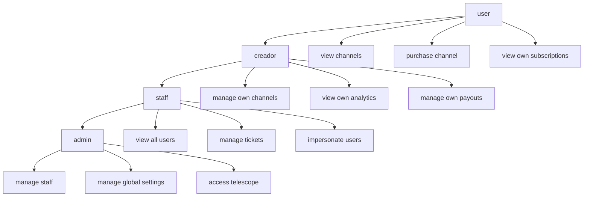

---
tags:
  - "kanban/done"
  - "type/task"
  - "domain/FUN"
  - "priority/P0"
parent: "[[desarrollo]]"
children: []
depends_on:
  - "[[FUN-001]]"
blocks:
  - "[[FUN-006]]"
  - "[[FUN-007]]"
  - "[[CRE-003]]"
  - "[[ADM-003]]"
  - "[[CRM-001]]"
  - "[[TST-F-004]]"
  - "[[ADM-001]]"
  - "[[ADM-002]]"
  - "[[ADM-004]]"
  - "[[ADM-005]]"
  - "[[ADM-006]]"
  - "[[ADM-007]]"
  - "[[ADM-008]]"
  - "[[ADM-010]]"
  - "[[CLI-002]]"
  - "[[CRE-010]]"
  - "[[CRM-002]]"
  - "[[CRM-003]]"
  - "[[CRM-005]]"
  - "[[CRM-006]]"
  - "[[CRM-007]]"
  - "[[CRM-008]]"
  - "[[CRM-009]]"
  - "[[CRM-010]]"
  - "[[CRM-012]]"
  - "[[CRM-013]]"
  - "[[INS-001]]"
  - "[[PUB-002]]"
  - "[[PUB-003]]"
  - "[[PUB-004]]"
  - "[[PUB-005]]"
  - "[[PUB-006]]"
  - "[[PUB-007]]"
  - "[[PUB-008]]"
  - "[[PUB-009]]"
  - "[[PUB-010]]"
  - "[[PUB-011]]"
  - "[[PUB-012]]"
  - "[[PUB-013]]"
  - "[[TST-F-003]]"
status: "done"
assignee: "@dev"
created: "2026-08-04"
updated: "2026-08-05"
---

# [[FUN-005]] Instalar y Configurar spatie/laravel-permission

## Descripción
Configurar paquete spatie/laravel-permission para gestión de roles y permisos. 4 roles base: user, creador, staff, admin con matriz de permisos granular.

## Código de Ejemplo
```bash
# Instalar (ya en FUN-001)
composer require spatie/laravel-permission

# Publicar config y migraciones
php artisan vendor:publish --provider="Spatie\Permission\PermissionServiceProvider" --tag="config"
php artisan vendor:publish --provider="Spatie\Permission\PermissionServiceProvider" --tag="migrations"
php artisan migrate
```

```php
// config/permission.php - Configuración clave
return [
    'models' => [
        'permission' => Spatie\Permission\Models\Permission::class,
        'role' => Spatie\Permission\Models\Role::class,
    ],
    'table_names' => [
        'roles' => 'roles',
        'permissions' => 'permissions',
        'model_has_permissions' => 'model_has_permissions',
        'model_has_roles' => 'model_has_roles',
        'role_has_permissions' => 'role_has_permissions',
    ],
    'cache' => [
        'expiration_time' => 86400, // 24h
        'key' => 'spatie.permission.cache',
        'model_key' => 'model',
        'store' => 'default',
    ],
];
```

```php
// database/seeders/RolePermissionSeeder.php
namespace Database\Seeders;

use Illuminate\Database\Seeder;
use Spatie\Permission\Models\Role;
use Spatie\Permission\Models\Permission;

class RolePermissionSeeder extends Seeder
{
    public function run(): void
    {
        // Limpiar cache
        app()[\Spatie\Permission\PermissionRegistrar::class]->forgetCachedPermissions();

        // ===== PERMISOS BASE =====
        $permissions = [
            // Public
            'view channels', 'view channel detail', 'purchase channel',
            
            // User (cliente)
            'view own subscriptions', 'manage own profile', 'create tickets',
            
            // Creador
            'manage own channels', 'view own analytics', 'manage own payouts',
            'manage own api tokens', 'manage own team', 'configure webhooks',
            
            // Staff (CRM)
            'view all users', 'view all channels', 'manage tickets',
            'assign tickets', 'view reports', 'manage knowledge base',
            'impersonate users', 'suspend channels', 'extend subscriptions',
            
            // Admin
            'manage staff', 'manage global settings', 'manage feature flags',
            'view security logs', 'manage backups', 'access telescope',
            'manage fees', 'manage limits', 'view all transactions',
        ];

        foreach ($permissions as $perm) {
            Permission::firstOrCreate(['name' => $perm, 'guard_name' => 'web']);
        }

        // ===== ROLES =====
        $roles = [
            'user' => ['view channels', 'view channel detail', 'purchase channel', 'view own subscriptions', 'manage own profile', 'create tickets'],
            'creador' => ['view channels', 'view channel detail', 'purchase channel', 'view own subscriptions', 'manage own profile', 'create tickets', 'manage own channels', 'view own analytics', 'manage own payouts', 'manage own api tokens', 'manage own team', 'configure webhooks'],
            'staff' => ['view all users', 'view all channels', 'manage tickets', 'assign tickets', 'view reports', 'manage knowledge base', 'impersonate users', 'suspend channels', 'extend subscriptions'],
            'admin' => ['manage staff', 'manage global settings', 'manage feature flags', 'view security logs', 'manage backups', 'access telescope', 'manage fees', 'manage limits', 'view all transactions'],
        ];

        foreach ($roles as $roleName => $perms) {
            $role = Role::firstOrCreate(['name' => $roleName, 'guard_name' => 'web']);
            $role->syncPermissions($perms);
        }
    }
}
```

```php
// app/Models/User.php - Traits y helpers
use Spatie\Permission\Traits\HasRoles;

class User extends Authenticatable
{
    use HasRoles;

    public function isCreador(): bool { return $this->hasRole('creador'); }
    public function isStaff(): bool { return $this->hasRole('staff'); }
    public function isAdmin(): bool { return $this->hasRole('admin'); }
    public function isUser(): bool { return $this->hasRole('user'); }
}
```

## Cálculos y Algoritmos (LaTeX)
### Matriz de Permisos (Roles × Permisos)
$$
\begin{array}{c|cccccccc}
\text{Permiso} & \text{user} & \text{creador} & \text{staff} & \text{admin} \\
\hline
\text{view channels} & \checkmark & \checkmark & \checkmark & \checkmark \\
\text{manage own channels} & & \checkmark & & \\
\text{view all channels} & & & \checkmark & \checkmark \\
\text{manage tickets} & & & \checkmark & \checkmark \\
\text{manage staff} & & & & \checkmark \\
\text{manage global settings} & & & & \checkmark \\
\end{array}
$$

### Herencia de Permisos
$$
\text{Permisos}(role) = \bigcup_{r \in \text{roles\_jerárquicos}(role)} \text{PermisosBase}(r)
$$

## Diagramas Mermaid
### Jerarquía de Roles


## Criterios de Aceptación
- [ ] `spatie/laravel-permission` instalado y configurado
- [ ] Migraciones ejecutadas (roles, permissions, pivot tables)
- [ ] Seeder `RolePermissionSeeder` crea 4 roles + ~25 permisos
- [ ] User model usa trait `HasRoles`
- [ ] Helpers `isCreador()`, `isStaff()`, `isAdmin()`, `isUser()` funcionan
- [ ] Middleware `role:` funciona (ej: `middleware('role:creador')`)
- [ ] Cache de permisos configurado (24h TTL)
- [ ] Tests: asignar roles, verificar permisos, cache invalidation

## Notas Técnicas
- Ejecutar seeder en instalador: `php artisan db:seed --class=RolePermissionSeeder`
- Cache: `php artisan permission:cache-reset` después de cambios
- Team support: `spatie/laravel-permission` soporta teams (opcional v1.1)
- Wildcard permissions: `Permission::create(['name' => 'manage *'])` no soportado nativamente

## Enlaces
- [[FUN-001]] Dependencias Core
- [[FUN-006]] Migración Users
- [[FUN-007]] Seeders Roles/Permisos
- [[FUN-004]] Middleware Subdominio (usa roles)
- [[TST-F-004]] Tests Roles + Middleware