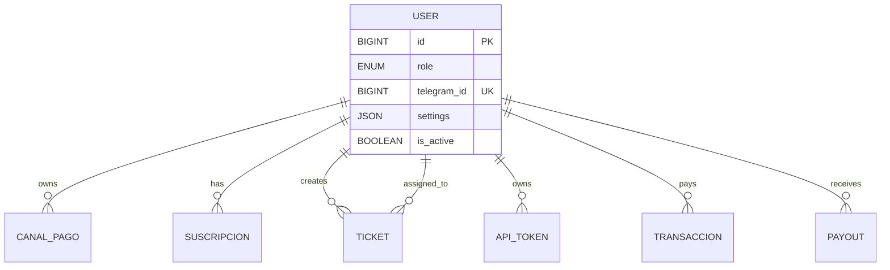

---
tags:
  - "kanban/done"
  - "type/task"
  - "domain/FUN"
  - "priority/P0"
parent: "[[desarrollo]]"
children: []
depends_on:
  - "[[FUN-005]]"
blocks:
  - "[[FUN-007]]"
  - "[[CRE-003]]"
  - "[[PUB-004]]"
  - "[[PUB-007]]"
  - "[[INS-006]]"
status: "done"
assignee: "@dev"
created: "2026-08-04"
updated: "2026-08-05"
---

# [[FUN-006]] Migración Users + Campos: role, telegram_id, email_verified_at, settings

## Descripción
Crear migración para tabla `users` extendida con campos específicos de TG-PayGate: role (enum), telegram_id (único), email_verified_at, settings (JSON), y campos de cifrado.

## Código de Ejemplo
```php
// database/migrations/YYYY_MM_DD_create_users_table.php
use Illuminate\Database\Migrations\Migration;
use Illuminate\Database\Schema\Blueprint;
use Illuminate\Support\Facades\Schema;

return new class extends Migration
{
    public function up(): void
    {
        Schema::create('users', function (Blueprint $table) {
            $table->id();
            $table->string('name');
            $table->string('email')->unique();
            $table->timestamp('email_verified_at')->nullable();
            $table->string('password');
            $table->rememberToken();
            
            // Campos TG-PayGate
            $table->enum('role', ['user', 'creador', 'staff', 'admin'])->default('user');
            $table->unsignedBigInteger('telegram_id')->nullable()->unique();
            $table->json('settings')->nullable()->comment('Preferencias UI, notificaciones, 2FA');
            $table->string('timezone')->default('UTC');
            $table->string('locale')->default('es');
            $table->boolean('is_active')->default(true);
            $table->timestamp('last_login_at')->nullable();
            $table->ipAddress('last_login_ip')->nullable();
            
            $table->timestamps();
            
            // Índices
            $table->index(['role', 'is_active']);
            $table->index('telegram_id');
        });
    }

    public function down(): void
    {
        Schema::dropIfExists('users');
    }
};
```

```php
// database/migrations/YYYY_MM_DD_add_encrypted_casts_to_users.php
// Para tokens de bot Telegram cifrados (se guardan en CanalPago, no en User)
// Pero user puede tener API tokens personales (Sanctum)
```

```php
// app/Models/User.php - Model completo
namespace App\Models;

use Illuminate\Foundation\Auth\User as Authenticatable;
use Illuminate\Notifications\Notifiable;
use Laravel\Sanctum\HasApiTokens;
use Spatie\Permission\Traits\HasRoles;

class User extends Authenticatable
{
    use HasApiTokens, HasRoles, Notifiable;

    protected $fillable = [
        'name', 'email', 'password', 'role', 'telegram_id', 
        'settings', 'timezone', 'locale', 'is_active'
    ];

    protected $hidden = ['password', 'remember_token'];

    protected $casts = [
        'email_verified_at' => 'datetime',
        'password' => 'hashed',
        'role' => 'string', // enum se castea a string
        'settings' => 'array',
        'last_login_at' => 'datetime',
        'is_active' => 'boolean',
    ];

    // Scopes
    public function scopeActive($query) { return $query->where('is_active', true); }
    public function scopeByRole($query, string $role) { return $query->where('role', $role); }
    public function scopeCreadores($query) { return $query->where('role', 'creador'); }
    public function scopeStaff($query) { return $query->whereIn('role', ['staff', 'admin']); }

    // Helpers
    public function isCreador(): bool { return $this->role === 'creador'; }
    public function isStaff(): bool { return in_array($this->role, ['staff', 'admin']); }
    public function isAdmin(): bool { return $this->role === 'admin'; }
    public function isUser(): bool { return $this->role === 'user'; }

    // Settings accessors
    public function getSetting(string $key, mixed $default = null): mixed
    {
        return data_get($this->settings, $key, $default);
    }

    public function setSetting(string $key, mixed $value): void
    {
        $settings = $this->settings ?? [];
        data_set($settings, $key, $value);
        $this->settings = $settings;
        $this->save();
    }
}
```

## Cálculos y Algoritmos (LaTeX)
### Esquema de Tabla Users
$$
\text{users} = \{
\begin{aligned}
&id: \text{BIGINT UNSIGNED PK}, \\
&name: \text{VARCHAR(255)}, \\
&email: \text{VARCHAR(255) UNIQUE}, \\
&email\_verified\_at: \text{TIMESTAMP NULL}, \\
&password: \text{VARCHAR(255)}, \\
&role: \text{ENUM('user','creador','staff','admin') DEFAULT 'user'}, \\
&telegram\_id: \text{BIGINT UNSIGNED UNIQUE NULL}, \\
&settings: \text{JSON NULL}, \\
&timezone: \text{VARCHAR(50) DEFAULT 'UTC'}, \\
&locale: \text{VARCHAR(10) DEFAULT 'es'}, \\
&is\_active: \text{BOOLEAN DEFAULT TRUE}, \\
&last\_login\_at: \text{TIMESTAMP NULL}, \\
&last\_login\_ip: \text{IP ADDRESS NULL}, \\
&created\_at, updated\_at: \text{TIMESTAMP}
\end{aligned}
\}
$$

### Índices Compuestos
$$
\text{Index}(role, is\_active) \quad \text{para queries: } WHERE role = ? AND is\_active = TRUE
$$

## Diagramas Mermaid
### Relaciones User


## Criterios de Aceptación
- [ ] Migración crea tabla `users` con todos los campos especificados
- [ ] Enum `role` con 4 valores: user, creador, staff, admin
- [ ] `telegram_id` único y nullable (para vincular cuenta Telegram)
- [ ] `settings` JSON para preferencias flexibles
- [ ] Índices en `(role, is_active)` y `telegram_id`
- [ ] Model `User` con casts correctos (array para settings, datetime para fechas)
- [ ] Scopes `active()`, `byRole()`, `creadores()`, `staff()` funcionan
- [ ] Helpers `isCreador()`, `isStaff()`, `isAdmin()`, `isUser()`
- [ ] Accessors `getSetting()` / `setSetting()` para JSON

## Notas Técnicas
- `telegram_id` se usa para webhook de Telegram (identificar usuario por chat_id)
- `settings` almacena: `{ "theme": "dark", "notifications": {"email": true, "telegram": false}, "2fa_enabled": false }`
- `role` se sincroniza con `spatie/laravel-permission` (role = nombre del role)
- En instalador: crear admin inicial con `role = 'admin'`

## Enlaces
- [[FUN-005]] Spatie Permission
- [[FUN-007]] Seeders
- [[CRE-003]] Canales CRUD (owner = user)
- [[PUB-004]] Checkout (crea suscripcion para user)
- [[INS-007]] Admin Inicial (role=admin)