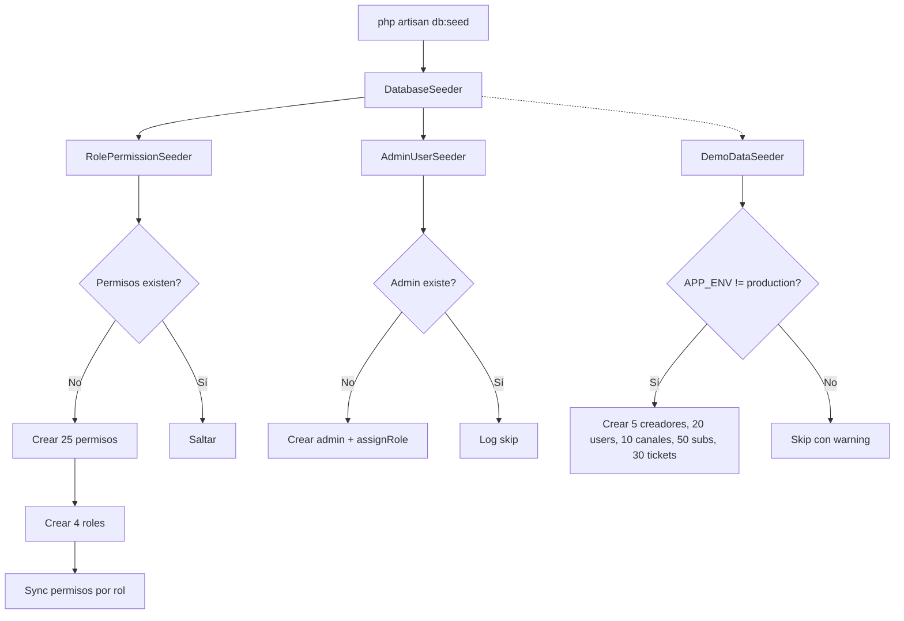

---
tags:
  - "kanban/done"
  - "type/task"
  - "domain/FUN"
  - "priority/P0"
parent: "[[desarrollo]]"
children: []
depends_on:
  - "[[FUN-006]]"
blocks:
  - "[[CRE-001]]"
  - "[[ADM-001]]"
  - "[[CRM-001]]"
  - "[[INS-006]]"
  - "[[TST-F-002]]"
status: "done"
assignee: "@dev"
created: "2026-08-04"
updated: "2026-08-05"
---

# [[FUN-007]] Seeders: Roles + Permisos + Admin Inicial + Datos Demo

## Descripción
Crear seeders para poblar la base de datos: RolePermissionSeeder (roles/permisos), AdminUserSeeder (primer admin), y DemoDataSeeder (datos de prueba para desarrollo/staging).

## Código de Ejemplo
```php
// database/seeders/RolePermissionSeeder.php
namespace Database\Seeders;

use Illuminate\Database\Seeder;
use Spatie\Permission\Models\Role;
use Spatie\Permission\Models\Permission;

class RolePermissionSeeder extends Seeder
{
    public function run(): void
    {
        app()[\Spatie\Permission\PermissionRegistrar::class]->forgetCachedPermissions();

        $permissions = [
            // Público
            'view channels', 'view channel detail', 'purchase channel',
            
            // Usuario (cliente)
            'view own subscriptions', 'manage own profile', 'create tickets',
            'view own invoices', 'manage own payment methods',
            
            // Creador
            'manage own channels', 'view own analytics', 'manage own payouts',
            'manage own api tokens', 'manage own team', 'configure webhooks',
            'view own revenue', 'export own data',
            
            // Staff (CRM)
            'view all users', 'view all channels', 'manage tickets',
            'assign tickets', 'view reports', 'manage knowledge base',
            'impersonate users', 'suspend channels', 'extend subscriptions',
            'ban users', 'view user details', 'manage tags',
            
            // Admin
            'manage staff', 'manage global settings', 'manage feature flags',
            'view security logs', 'manage backups', 'access telescope',
            'manage fees', 'manage limits', 'view all transactions',
            'manage roles', 'manage permissions', 'run migrations',
        ];

        foreach ($permissions as $perm) {
            Permission::firstOrCreate(['name' => $perm, 'guard_name' => 'web']);
        }

        $roles = [
            'user' => ['view channels', 'view channel detail', 'purchase channel', 'view own subscriptions', 'manage own profile', 'create tickets', 'view own invoices', 'manage own payment methods'],
            'creador' => ['view channels', 'view channel detail', 'purchase channel', 'view own subscriptions', 'manage own profile', 'create tickets', 'view own invoices', 'manage own payment methods', 'manage own channels', 'view own analytics', 'manage own payouts', 'manage own api tokens', 'manage own team', 'configure webhooks', 'view own revenue', 'export own data'],
            'staff' => ['view all users', 'view all channels', 'manage tickets', 'assign tickets', 'view reports', 'manage knowledge base', 'impersonate users', 'suspend channels', 'extend subscriptions', 'ban users', 'view user details', 'manage tags'],
            'admin' => ['manage staff', 'manage global settings', 'manage feature flags', 'view security logs', 'manage backups', 'access telescope', 'manage fees', 'manage limits', 'view all transactions', 'manage roles', 'manage permissions', 'run migrations'],
        ];

        foreach ($roles as $roleName => $perms) {
            $role = Role::firstOrCreate(['name' => $roleName, 'guard_name' => 'web']);
            $role->syncPermissions($perms);
        }
    }
}
```

```php
// database/seeders/AdminUserSeeder.php
namespace Database\Seeders;

use Illuminate\Database\Seeder;
use App\Models\User;
use Illuminate\Support\Facades\Hash;

class AdminUserSeeder extends Seeder
{
    public function run(): void
    {
        // Solo ejecutar si no existe admin
        if (User::where('role', 'admin')->exists()) {
            $this->command->info('Admin user already exists, skipping.');
            return;
        }

        $admin = User::create([
            'name' => env('ADMIN_NAME', 'Super Admin'),
            'email' => env('ADMIN_EMAIL', 'admin@tudominio.com'),
            'password' => Hash::make(env('ADMIN_PASSWORD', 'changeme123')),
            'role' => 'admin',
            'email_verified_at' => now(),
            'is_active' => true,
            'settings' => [
                'theme' => 'system',
                'notifications' => ['email' => true, 'telegram' => false],
                '2fa_enabled' => false,
            ],
        ]);

        $admin->assignRole('admin');
        
        $this->command->info("Admin user created: {$admin->email}");
    }
}
```

```php
// database/seeders/DemoDataSeeder.php (solo development/staging)
namespace Database\Seeders;

use Illuminate\Database\Seeder;
use App\Models\{User, CanalPago, Suscripcion, Ticket};
use Illuminate\Support\Facades\Hash;

class DemoDataSeeder extends Seeder
{
    public function run(): void
    {
        if (app()->environment('production')) {
            $this->command->warn('DemoDataSeeder skipped in production.');
            return;
        }

        // Creadores demo
        $creadores = User::factory()->count(5)->creador()->create([
            'password' => Hash::make('password'),
            'email_verified_at' => now(),
        ]);

        // Usuarios demo
        $users = User::factory()->count(20)->user()->create([
            'password' => Hash::make('password'),
            'email_verified_at' => now(),
        ]);

        // Canales demo
        $canales = CanalPago::factory()->count(10)->create([
            'owner_id' => $creadores->random(),
            'status' => 'active',
        ]);

        // Suscripciones demo
        Suscripcion::factory()->count(50)->create([
            'user_id' => $users->random(),
            'canal_pago_id' => $canales->random(),
            'status' => fake()->randomElement(['active', 'expired', 'cancelled']),
        ]);

        // Tickets demo
        Ticket::factory()->count(30)->create([
            'user_id' => $users->random(),
            'status' => fake()->randomElement(['open', 'pending', 'closed']),
        ]);

        $this->command->info('Demo data created successfully.');
    }
}
```

```php
// database/seeders/DatabaseSeeder.php
namespace Database\Seeders;

use Illuminate\Database\Seeder;

class DatabaseSeeder extends Seeder
{
    public function run(): void
    {
        $this->call([
            RolePermissionSeeder::class,
            AdminUserSeeder::class,
            // DemoDataSeeder::class, // Solo en development
        ]);
    }
}
```

## Cálculos y Algoritmos (LaTeX)
### Jerarquía de Seeders
$$
\text{DatabaseSeeder} \to 
\begin{cases}
\text{RolePermissionSeeder} & \text{(siempre)} \\
\text{AdminUserSeeder} & \text{(si no existe admin)} \\
\text{DemoDataSeeder} & \text{(solo !production)}
\end{cases}
$$

### Complejidad de Permisos
$$
|P| = 25, \quad |R| = 4, \quad \text{Promedio permisos/rol} = \frac{\sum |P_r|}{4} \approx 12
$$

## Diagramas Mermaid
### Flujo de Seeding


## Criterios de Aceptación
- [ ] `RolePermissionSeeder` crea 25 permisos y 4 roles con sync correcto
- [ ] `AdminUserSeeder` crea admin solo si no existe (idempotente)
- [ ] `DemoDataSeeder` solo ejecuta en non-production
- [ ] `php artisan db:seed` ejecuta todo sin errores
- [ ] `php artisan db:seed --class=RolePermissionSeeder` funciona aislado
- [ ] Admin creado tiene role 'admin' y permisos completos
- [ ] Password hasheada, email_verified_at seteado
- [ ] Settings JSON con defaults

## Notas Técnicas
- En instalador (INS-006): ejecutar `RolePermissionSeeder` + `AdminUserSeeder` con datos del formulario
- `DemoDataSeeder` usa factories (crear factories para User, CanalPago, Suscripcion, Ticket)
- `RolePermissionSeeder` debe ser idempotente (firstOrCreate + syncPermissions)
- Cache permissions: `permission:cache-reset` después de seeder

## Enlaces
- [[FUN-006]] Migración Users
- [[FUN-005]] Spatie Permission
- [[INS-006]] Migraciones en Instalador
- [[INS-007]] Admin Inicial (usa AdminUserSeeder logic)
- [[TST-F-002]] Unit Tests Services