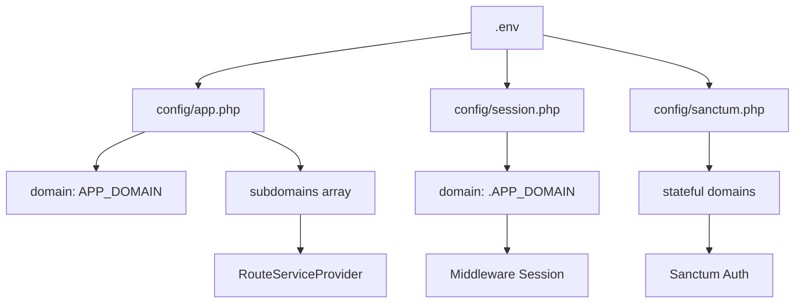

---
tags:
  - "kanban/done"
  - "type/task"
  - "domain/FUN"
  - "priority/P0"
parent: "[[desarrollo]]"
children: []
depends_on:
  - "[[FUN-001]]"
blocks:
  - "[[FUN-003]]"
  - "[[INS-002]]"
  - "[[INS-005]]"
  - "[[CSS-034]]"
  - "[[TST-F-001]]"
  - "[[ADM-002]]"
  - "[[CLI-001]]"
  - "[[CLI-003]]"
  - "[[CLI-005]]"
  - "[[CRE-001]]"
  - "[[CRE-011]]"
  - "[[CRE-015]]"
  - "[[CRM-011]]"
  - "[[PUB-011]]"
  - "[[PUB-019]]"
status: "done"
assignee: "@dev"
created: "2026-08-04"
updated: "2026-08-05"
---

# [[FUN-008]] Configurar .env.example Portable + Config Multi-dominio

## Descripción
Crear archivo `.env.example` completo y portable (sin credenciales hardcodeadas) que funcione en cualquier servidor PHP con MySQL. Configurar `config/*` para soportar multi-dominio dinámico.

## Código de Ejemplo
```env
# .env.example
APP_NAME="TG-PayGate"
APP_ENV=production
APP_KEY=
APP_DEBUG=false
APP_URL=https://public.tudominio.com
APP_DOMAIN=tudominio.com

LOG_CHANNEL=stack
LOG_LEVEL=error
LOG_DEPRECATIONS_CHANNEL=null

DB_CONNECTION=mysql
DB_HOST=127.0.0.1
DB_PORT=3306
DB_DATABASE=
DB_USERNAME=
DB_PASSWORD=

BROADCAST_DRIVER=log
CACHE_DRIVER=database
FILESYSTEM_DISK=local
QUEUE_CONNECTION=database
SESSION_DRIVER=database
SESSION_LIFETIME=120

MEMCACHED_HOST=127.0.0.1

REDIS_HOST=127.0.0.1
REDIS_PASSWORD=null
REDIS_PORT=6379

MAIL_MAILER=smtp
MAIL_HOST=
MAIL_PORT=587
MAIL_USERNAME=
MAIL_PASSWORD=
MAIL_ENCRYPTION=tls
MAIL_FROM_ADDRESS=
MAIL_FROM_NAME="${APP_NAME}"

# Telegram Bot API
TELEGRAM_API_URL=https://api.telegram.org
TELEGRAM_WEBHOOK_SECRET=

# Pasarelas de Pago (configurar según proveedor)
STRIPE_KEY=
STRIPE_SECRET=
STRIPE_WEBHOOK_SECRET=
MERCADOPAGO_ACCESS_TOKEN=
MERCADOPAGO_PUBLIC_KEY=
PAYPAL_CLIENT_ID=
PAYPAL_CLIENT_SECRET=

# Framework CSS
CSS_FRAMEWORK_VERSION=1.0.0
CSS_FRAMEWORK_PREFIX=tgp

# Instalación
INSTALLED=false

# Feature Flags
FEATURE_AFFILIATE=false
FEATURE_WHITE_LABEL=false
FEATURE_MULTI_CURRENCY=true
```

```php
// config/app.php - Dominio base dinámico
'domain' => env('APP_DOMAIN', 'localhost'),

'url' => env('APP_URL', 'http://localhost'),

'asset_url' => env('ASSET_URL', null),

// Subdominios calculados
'subdomains' => [
    'public' => 'public.' . env('APP_DOMAIN', 'localhost'),
    'creadores' => 'creadores.' . env('APP_DOMAIN', 'localhost'),
    'crm' => 'crm.' . env('APP_DOMAIN', 'localhost'),
    'admin' => 'admin.' . env('APP_DOMAIN', 'localhost'),
],
```

```php
// config/session.php - Sesión compartida entre subdominios
'domain' => env('SESSION_DOMAIN', '.' . env('APP_DOMAIN', 'localhost')),

// Configurar same_site para subdominios
'same_site' => 'lax', // o 'none' con secure=true en prod
```

```php
// config/sanctum.php - API tokens para creadores
'stateful' => explode(',', env('SANCTUM_STATEFUL_DOMAINS', 'localhost,127.0.0.1')),

'expiration' => 3600, // 1 hora tokens personales

'token_prefix' => env('CSS_FRAMEWORK_PREFIX', 'tgp') . '_',
```

## Cálculos y Algoritmos (LaTeX)
### Generación Dinámica de Subdominios
$$
\begin{aligned}
\text{subdomain}(type) &= type \cdot \text{.}\cdot \text{APP\_DOMAIN} \\
\text{public} &= \text{public.}\{\text{APP\_DOMAIN}\} \\
\text{creadores} &= \text{creadores.}\{\text{APP\_DOMAIN}\} \\
\text{crm} &= \text{crm.}\{\text{APP\_DOMAIN}\} \\
\text{admin} &= \text{admin.}\{\text{APP\_DOMAIN}\}
\end{aligned}
$$

### Cookie Domain para Sesión Compartida
$$
\text{SESSION\_DOMAIN} = \text{.}\{\text{APP\_DOMAIN}\} \quad \text{(punto inicial para subdominios)}
$$

## Diagramas Mermaid
### Configuración Multi-dominio


## Criterios de Aceptación
- [ ] `.env.example` tiene todas las variables necesarias documentadas
- [ ] Sin credenciales reales (valores vacíos o placeholders)
- [ ] `APP_DOMAIN` configurable para cualquier dominio
- [ ] `config/app.php` expone `domain` y `subdomains` array
- [ ] `config/session.php` usa `.APP_DOMAIN` para sesión compartida
- [ ] `config/sanctum.php` configurado para tokens creadores
- [ ] Variables de feature flags documentadas
- [ ] Funciona en: local (localhost), staging, producción, InfinityFree

## Notas Técnicas
- `APP_DOMAIN` = dominio raíz (ej: `tudominio.com`, `probandowebadas.infinityfree.io`)
- Subdominios se construyen dinámicamente: `{sub}.{APP_DOMAIN}`
- Sesión compartida requiere `SESSION_DOMAIN=.{APP_DOMAIN}` (punto inicial)
- En local: `APP_DOMAIN=localhost` → subdominios `public.localhost` (requiere `/etc/hosts` o `lvh.me`)
- `INSTALLED=false` por defecto, instalador lo cambia a `true`
- `CSS_FRAMEWORK_PREFIX` usado en tokens CSS (`--tgp-color-...`) y Sanctum tokens

## Enlaces
- [[FUN-001]] Proyecto Base
- [[FUN-003]] RouteServiceProvider (usa config/app.php)
- [[FUN-004]] Middleware Subdominio (usa config/app.php)
- [[INS-002]] Helper Installation::isInstalled() (lee INSTALLED)
- [[INS-005]] Paso 2 DB (escribe .env final)
- [[CSS-034]] Build System (usa CSS_FRAMEWORK_PREFIX)