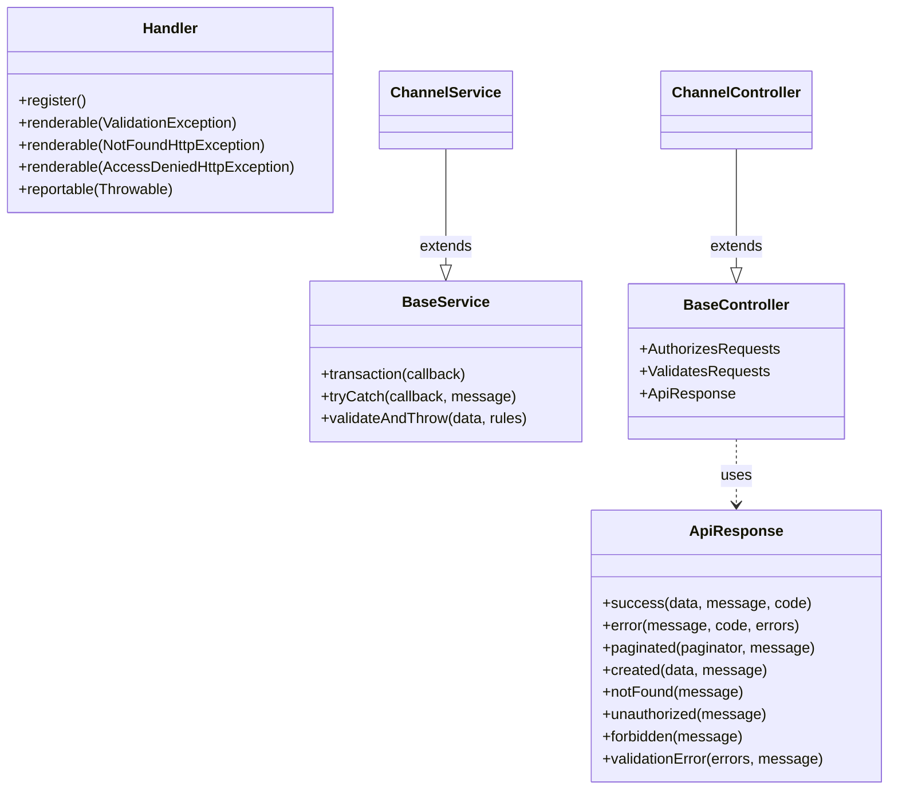

---
tags:
  - kanban/todo
  - type/task
  - domain/FUN
  - priority/P1
parent: "[[desarrollo]]"
children: []
depends_on:
  - "[[FUN-002]]"
blocks:
  - "[[PUB-001]]"
  - "[[CRE-001]]"
  - "[[ADM-001]]"
  - "[[CRM-001]]"
  - "[[TST-F-001]]"
status: todo
assignee: "@dev"
created: 2026-08-04
updated: 2026-08-04
---

# [[FUN-009]] BaseService, BaseController, ApiResponse, Exception Handler Global

## Descripción
Crear clases base compartidas: BaseService (patrón servicio), BaseController (respuestas estandarizadas), ApiResponse trait (JSON consistente), y Exception Handler global para manejo unificado de errores.

## Código de Ejemplo
```php
// app/Services/BaseService.php
namespace App\Services;

use Illuminate\Support\Facades\DB;
use Illuminate\Support\Facades\Log;
use Exception;

abstract class BaseService
{
    protected function transaction(callable $callback)
    {
        return DB::transaction($callback);
    }

    protected function tryCatch(callable $callback, string $errorMessage = 'Operation failed'): mixed
    {
        try {
            return $callback();
        } catch (Exception $e) {
            Log::error($errorMessage, [
                'error' => $e->getMessage(),
                'trace' => $e->getTraceAsString(),
                'service' => static::class,
            ]);
            throw $e;
        }
    }

    protected function validateAndThrow(array $data, array $rules, array $messages = []): void
    {
        $validator = validator($data, $rules, $messages);
        if ($validator->fails()) {
            throw new \Illuminate\Validation\ValidationException($validator);
        }
    }
}
```

```php
// app/Http/Controllers/BaseController.php
namespace App\Http\Controllers;

use Illuminate\Foundation\Auth\Access\AuthorizesRequests;
use Illuminate\Foundation\Validation\ValidatesRequests;
use Illuminate\Routing\Controller as BaseController;
use App\Traits\ApiResponse;

abstract class Controller extends BaseController
{
    use AuthorizesRequests, ValidatesRequests, ApiResponse;
}
```

```php
// app/Traits/ApiResponse.php
namespace App\Traits;

use Illuminate\Http\JsonResponse;
use Illuminate\Pagination\LengthAwarePaginator;

trait ApiResponse
{
    protected function success(mixed $data = null, string $message = 'Success', int $code = 200): JsonResponse
    {
        return response()->json([
            'success' => true,
            'message' => $message,
            'data' => $data,
        ], $code);
    }

    protected function error(string $message = 'Error', int $code = 400, mixed $errors = null): JsonResponse
    {
        return response()->json([
            'success' => false,
            'message' => $message,
            'errors' => $errors,
        ], $code);
    }

    protected function paginated(LengthAwarePaginator $paginator, string $message = 'Success'): JsonResponse
    {
        return $this->success([
            'items' => $paginator->items(),
            'pagination' => [
                'current_page' => $paginator->currentPage(),
                'per_page' => $paginator->perPage(),
                'total' => $paginator->total(),
                'last_page' => $paginator->lastPage(),
            ],
        ], $message);
    }

    protected function created(mixed $data = null, string $message = 'Created'): JsonResponse
    {
        return $this->success($data, $message, 201);
    }

    protected function notFound(string $message = 'Resource not found'): JsonResponse
    {
        return $this->error($message, 404);
    }

    protected function unauthorized(string $message = 'Unauthorized'): JsonResponse
    {
        return $this->error($message, 401);
    }

    protected function forbidden(string $message = 'Forbidden'): JsonResponse
    {
        return $this->error($message, 403);
    }

    protected function validationError(array $errors, string $message = 'Validation failed'): JsonResponse
    {
        return $this->error($message, 422, $errors);
    }
}
```

```php
// app/Exceptions/Handler.php - Exception Handler Global
namespace App\Exceptions;

use Illuminate\Foundation\Exceptions\Handler as ExceptionHandler;
use Illuminate\Http\Request;
use Illuminate\Validation\ValidationException;
use Symfony\Component\HttpKernel\Exception\NotFoundHttpException;
use Symfony\Component\HttpKernel\Exception\AccessDeniedHttpException;
use Throwable;

class Handler extends ExceptionHandler
{
    protected $dontReport = [
        // No reportar 404s, 403s, validation errors
    ];

    protected $dontFlash = [
        'password', 'password_confirmation', 'token',
    ];

    public function register(): void
    {
        $this->renderable(function (ValidationException $e, Request $request) {
            if ($request->expectsJson()) {
                return response()->json([
                    'success' => false,
                    'message' => 'Validation failed',
                    'errors' => $e->errors(),
                ], 422);
            }
        });

        $this->renderable(function (NotFoundHttpException $e, Request $request) {
            if ($request->expectsJson()) {
                return response()->json([
                    'success' => false,
                    'message' => 'Resource not found',
                ], 404);
            }
            // Vista 404 personalizada
            return response()->view('errors.404', [], 404);
        });

        $this->renderable(function (AccessDeniedHttpException $e, Request $request) {
            if ($request->expectsJson()) {
                return response()->json([
                    'success' => false,
                    'message' => 'Access denied',
                ], 403);
            }
            return response()->view('errors.403', [], 403);
        });

        $this->reportable(function (Throwable $e) {
            // Log solo errores 5xx, no 4xx
            if ($this->shouldReport($e) && !$this->isClientError($e)) {
                logger()->error('Unhandled exception', [
                    'message' => $e->getMessage(),
                    'file' => $e->getFile(),
                    'line' => $e->getLine(),
                    'trace' => $e->getTraceAsString(),
                ]);
            }
        });
    }

    private function isClientError(Throwable $e): bool
    {
        $status = method_exists($e, 'getStatusCode') ? $e->getStatusCode() : 500;
        return $status >= 400 && $status < 500;
    }
}
```

## Cálculos y Algoritmos (LaTeX)
### Patrón Respuesta API Estándar
$$
\text{Response} = 
\begin{cases}
\{ success: true, message: string, data: T \} & \text{éxito} \\
\{ success: false, message: string, errors: object \} & \text{error}
\end{cases}
$$

### Paginación Estándar
$$
\text{Pagination} = \{ current\_page, per\_page, total, last\_page \}
$$

## Diagramas Mermaid
### Jerarquía de Clases Base


## Criterios de Aceptación
- [ ] `BaseService` con `transaction()`, `tryCatch()`, `validateAndThrow()`
- [ ] `BaseController` extiende Laravel Controller + traits
- [ ] `ApiResponse` trait con métodos: success, error, paginated, created, notFound, unauthorized, forbidden, validationError
- [ ] `Handler` maneja ValidationException, NotFoundHttpException, AccessDeniedHttpException
- [ ] Respuestas JSON consistentes en toda la API
- [ ] Vistas de error personalizadas: `errors.404`, `errors.403`, `errors.500`
- [ ] Logging solo errores 5xx (no 4xx)
- [ ] Tests: verificar formato de respuesta en controladores

## Notas Técnicas
- Usar en todos los controladores de API (creadores, staff, public AJAX)
- Vistas Blade para errores HTML (no JSON)
- `tryCatch` en services para logging automático
- `validateAndThrow` lanza `ValidationException` que Handler convierte a JSON 422
- Sanctum tokens usan `ApiResponse` para consistencia

## Enlaces
- [[FUN-002]] Estructura Dominios (controllers heredan BaseController)
- [[CRE-008]] API Tokens (usa ApiResponse)
- [[PUB-006]] Webhook Handler (usa ApiResponse)
- [[TST-F-003]] Feature Tests Auth (verifican formato respuesta)