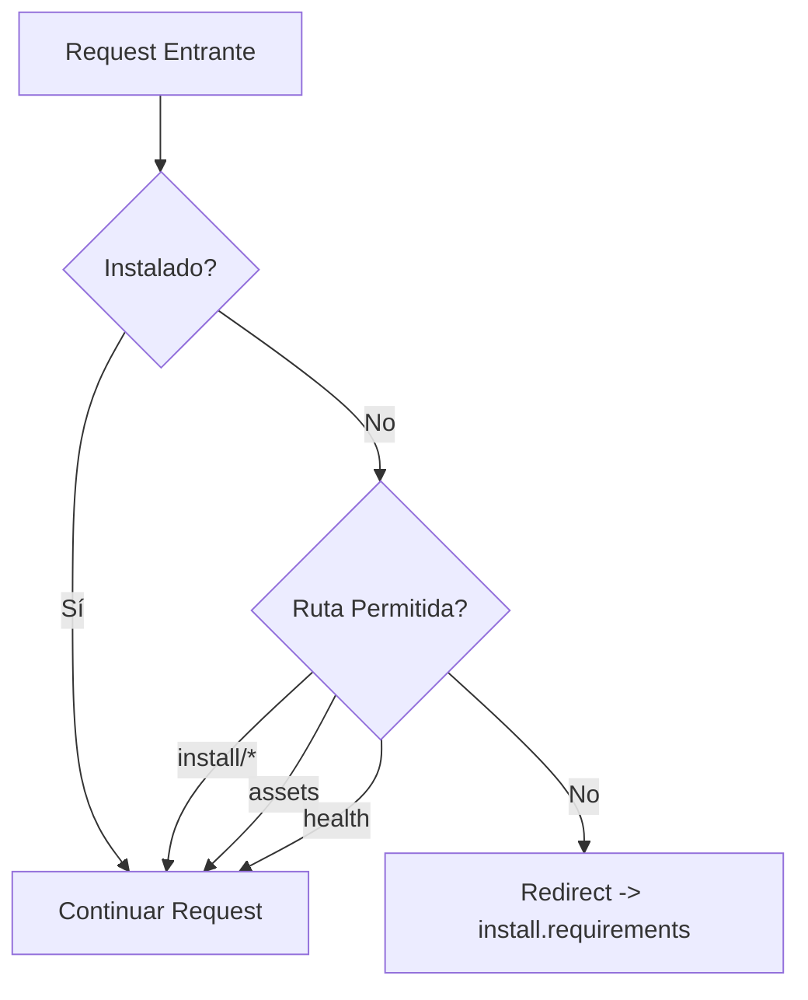

---
tags:
  - "kanban/done"
  - "type/task"
  - "domain/INS"
  - "priority/P0"
parent: "[[desarrollo]]"
children: []
depends_on:
  - "[[FUN-001]]"
  - "[[FUN-005]]"
  - "[[FUN-006]]"
blocks:
  - "[[INS-002]]"
  - "[[INS-003]]"
  - "[[INS-004]]"
  - "[[INS-005]]"
  - "[[INS-006]]"
  - "[[INS-007]]"
  - "[[INS-008]]"
  - "[[INS-009]]"
  - "[[INS-010]]"
  - "[[INS-011]]"
  - "[[INS-012]]"
status: "done"
assignee: "@dev"
created: "2026-08-04"
updated: "2026-08-05"
---

# [[INS-001]] Middleware `RedirectIfNotInstalled` (Global, Excluye `/install/*`, Assets)

## Descripción
Implementar middleware global que redirige al instalador si el sitio no está instalado, excluyendo rutas de instalación y assets.

## Código de Ejemplo
```php
// app/Http/Middleware/RedirectIfNotInstalled.php
namespace App\Http\Middleware;

use Closure;
use Illuminate\Http\Request;
use App\Helpers\Installation;

class RedirectIfNotInstalled
{
    public function handle(Request $request, Closure $next): Response
    {
        // Permitir si ya está instalado
        if (Installation::isInstalled()) {
            return $next($request);
        }

        // Permitir rutas de instalación
        if ($request->is('install*') || $request->is('_install*')) {
            return $next($request);
        }

        // Permitir assets (CSS, JS, imágenes, fuentes)
        if ($request->is('css/*') || $request->is('js/*') || 
            $request->is('images/*') || $request->is('fonts/*') ||
            $request->is('favicon.ico') || $request->is('robots.txt') ||
            $request->is('sitemap*.xml')) {
            return $next($request);
        }

        // Permitir health check
        if ($request->is('health') || $request->is('up')) {
            return $next($request);
        }

        // Redirigir al instalador
        return redirect()->route('install.requirements');
    }
}
```

```php
// app/Helpers/Installation.php
namespace App\Helpers;

use Illuminate\Support\Facades\File;
use Illuminate\Support\Facades\DB;
use Illuminate\Support\Facades\Schema;

class Installation
{
    public static function isInstalled(): bool
    {
        // 1. Verificar archivo flag
        if (!File::exists(storage_path('installed'))) {
            return false;
        }

        // 2. Verificar .env tiene APP_KEY y DB_*
        $env = File::get(base_path('.env'));
        if (!preg_match('/^APP_KEY=.+/m', $env)) return false;
        if (!preg_match('/^DB_DATABASE=.+/m', $env)) return false;
        if (!preg_match('/^DB_USERNAME=.+/m', $env)) return false;

        // 3. Verificar migraciones ejecutadas (tabla migrations existe y tiene registros)
        try {
            if (!Schema::hasTable('migrations')) return false;
            if (DB::table('migrations')->count() === 0) return false;
        } catch (\Exception) {
            return false;
        }

        return true;
    }
}
```

```php
// app/Http/Kernel.php - Registro en middleware global
protected $middleware = [
    // ...
    \App\Http\Middleware\RedirectIfNotInstalled::class,
];
```

## Diagramas Mermaid


## Criterios de Aceptación
- [ ] Middleware registrado globalmente en Kernel.php
- [ ] Verifica archivo `storage/installed` existe
- [ ] Verifica `.env` tiene APP_KEY y credenciales DB
- [ ] Verifica tabla `migrations` existe y tiene registros
- [ ] Excluye rutas: `install/*`, assets (css, js, images, fonts), favicon, robots.txt, sitemap, health
- [ ] Redirige a `install.requirements` si no instalado
- [ ] Tests: unit tests para Installation::isInstalled()

## Notas Técnicas
- Middleware debe ir ANTES de `StartSession` y `Authenticate`
- `Installation::isInstalled()` cacheable (1 hora)
- `storage/installed` creado en paso final del instalador
- Exclusión de assets: regex o prefixes en array configurable

## Enlaces
- [[INS-002]] Helper Installation::isInstalled()
- [[INS-003]] Rutas install.php
- [[INS-004]] Paso 1: Requisitos
- [[INS-009]] Seguridad instalador