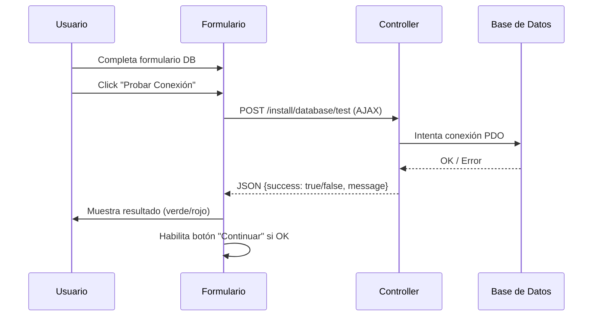

---
tags:
  - "kanban/done"
  - "type/task"
  - "domain/INS"
  - "priority/P0"
parent: "[[desarrollo]]"
children: []
depends_on:
  - "[[INS-004]]"
blocks:
  - "[[INS-006]]"
  - "[[INS-007]]"
  - "[[INS-007]]"
  - "[[INS-011]]"
  - "[[INS-012]]"
status: "done"
assignee: "@dev"
created: "2026-08-04"
updated: "2026-08-05"
---

# [[INS-005]] Paso 2: Base de Datos (Form + AJAX Test Connection + Driver Check)

## Descripción
Implementar segundo paso del instalador: configuración de base de datos con formulario, test de conexión AJAX y verificación de driver.

## Código de Ejemplo
```blade
{{-- resources/views/install/database.blade.php --}}
@extends('install.layout')

@section('content')
<div class="min-h-screen flex items-center justify-center bg-bg-primary px-4 py-12">
    <div class="w-full max-w-3xl">
        {{-- Progress Steps --}}
        <div class="flex items-center justify-center mb-8">
            @foreach(['Requisitos', 'Base de Datos', 'Admin', 'Pasarelas', 'Finalizar'] as $index => $step)
            <div class="flex items-center">
                <div class="w-10 h-10 rounded-full flex items-center justify-center text-sm font-medium
                    {{ $index < 1 ? 'bg-accent-primary text-white' : ($index === 1 ? 'bg-accent-primary text-white' : 'bg-bg-tertiary text-text-muted') }
                ">
                    {{ $index + 1 }}
                </div>
                @if($index < 4)
                <div class="w-16 h-1 mx-2 bg-{{ $index < 1 ? 'accent-primary' : 'border-border-primary' }}"></div>
                @endif
            @endforeach
        </div>

        <div class="card card--elevated p-8">
            <div class="text-center mb-8">
                <h1 class="text-2xl font-bold text-text-primary mb-2">Configurar Base de Datos</h1>
                <p class="text-text-secondary">Ingresa los datos de conexión a tu base de datos MySQL</p>
            </div>

            <form action="{{ route('install.database.test') }}" method="POST" id="db-form" class="space-y-6">
                @csrf

                <div class="grid md:grid-cols-2 gap-4">
                    <div>
                        <label class="label">Driver</label>
                        <select name="db_connection" class="select" required>
                            <option value="mysql" selected>MySQL</option>
                            <option value="pgsql">PostgreSQL</option>
                            <option value="sqlite">SQLite</option>
                        </select>
                    </div>

                    <div>
                        <label class="label">Host</label>
                        <input type="text" name="db_host" class="input" value="{{ old('db_host', '127.0.0.1') }}" required>
                    </div>

                    <div>
                        <label class="label">Puerto</label>
                        <input type="number" name="db_port" class="input" value="{{ old('db_port', '3306') }}" min="1" max="65535" required>
                    </div>

                    <div>
                        <label class="label">Base de Datos</label>
                        <input type="text" name="db_database" class="input" placeholder="tg_paygate" required>
                    </div>

                    <div>
                        <label class="label">Usuario</label>
                        <input type="text" name="db_username" class="input" placeholder="root" required>
                    </div>

                    <div>
                        <label class="label">Contraseña</label>
                        <input type="password" name="db_password" class="input" placeholder="••••••••" autocomplete="new-password">
                    </div>
                </div>

                <div class="flex items-center gap-4 pt-4">
                    <button type="button" onclick="testConnection()" class="btn btn--ghost btn--lg flex-1">
                        <x-icon name="wifi" class="w-4 h-4 mr-2" />
                        Probar Conexión
                    </button>
                    <button type="submit" class="btn btn--primary btn--lg" disabled id="btn-continue">
                        Continuar
                        <x-icon name="arrow-right" class="w-4 h-4 ml-2" />
                    </button>
                </div>

                <div id="test-result" class="hidden mt-4 p-4 rounded-lg"></div>
            </form>
        </div>
    </div>
</div>
@endsection

@push('scripts')
<script>
function testConnection() {
    const btn = event.target;
    const originalText = btn.innerHTML;
    btn.disabled = true;
    btn.innerHTML = '<x-icon name="loader" class="w-4 h-4 animate-spin mr-2" /> Probando...';

    const formData = new FormData(document.getElementById('db-form'));

    fetch('{{ route("install.database.test") }}', {
        method: 'POST',
        body: new URLSearchParams(new FormData(document.getElementById('db-form'))),
        headers: {
            'X-CSRF-TOKEN': '{{ csrf_token() }}',
            'Accept': 'application/json'
        }
    })
    .then(r => r.json())
    .then(data => {
        const resultDiv = document.getElementById('test-result');
        resultDiv.classList.remove('hidden');
        
        if (data.success) {
            resultDiv.className = 'mt-4 p-4 rounded-lg bg-success-50 dark:bg-success-900/30 border border-success-200';
            resultDiv.innerHTML = '<div class="flex items-center gap-2 text-success-700"><x-icon name="check-circle" class="w-5 h-5" /> Conexión exitosa</div>';
            document.getElementById('btn-continue').disabled = false;
        } else {
            resultDiv.className = 'mt-4 p-4 rounded-lg bg-error-50 dark:bg-error-900/30 border border-error-200';
            resultDiv.innerHTML = '<div class="flex items-center gap-2 text-error-700"><x-icon name="x-circle" class="w-5 h-5" /> {{ data.message }}</div>';
        }
    })
    .catch(() => {
        document.getElementById('test-result').className = 'mt-4 p-4 rounded-lg bg-error-50 dark:bg-error-900/30 border border-error-200';
        document.getElementById('test-result').innerHTML = '<div class="flex items-center gap-2 text-error-700"><x-icon name="x-circle" class="w-5 h-5" /> Error de conexión</div>';
    })
    .finally(() => {
        btn.disabled = false;
        btn.innerHTML = originalText;
    });
}
</script>
@endpush
```

```php
// app/Http/Controllers/InstallController.php - testDatabase
public function testDatabase(Request $request)
{
    $request->validate([
        'db_connection' => 'required|in:mysql,pgsql,sqlite',
        'db_host' => 'required|string',
        'db_port' => 'required|integer|min:1|max:65535',
        'db_database' => 'required|string',
        'db_username' => 'required|string',
        'db_password' => 'nullable|string',
    ]);

    try {
        $config = $request->only(['db_connection', 'db_host', 'db_port', 'db_database', 'db_username', 'db_password']);
        
        $dsn = match($request->db_connection) {
            'mysql' => "mysql:host={$request->db_host};port={$request->db_port};dbname={$request->db_database}",
            'pgsql' => "pgsql:host={$request->db_host};port={$request->db_port};dbname={$request->db_database}",
            'sqlite' => "sqlite:{$request->db_database}",
            default => throw new \Exception('Driver no soportado'),
        };

        $pdo = new \PDO($dsn, $request->db_username, $request->db_password, [
            \PDO::ATTR_ERRMODE => \PDO::ERRMODE_EXCEPTION,
            \PDO::ATTR_TIMEOUT => 10,
        ]);

        // Verificar permisos creando tabla temporal
        $pdo->exec('CREATE TEMPORARY TABLE test_install (id INT)');
        $pdo->exec('DROP TEMPORARY TABLE test_install');

        return response()->json(['success' => true, 'message' => 'Conexión exitosa']);
    } catch (\Exception $e) {
        return response()->json(['success' => false, 'message' => $e->getMessage()], 422);
    }
}
```

## Diagramas Mermaid


## Criterios de Aceptación
- [ ] Formulario con campos: driver (select), host, puerto, base de datos, usuario, contraseña
- [ ] Botón "Probar Conexión" hace AJAX POST a `/install/database/test`
- [ ] Validación server-side: driver en [mysql, pgsql, sqlite], host requerido, puerto numérico
- [ ] Conexión PDO con timeout 10s, crea/drop tabla temporal para verificar permisos
- [ ] Respuesta JSON: {success: true/false, message}
- [ ] UI: muestra resultado verde/rojo, habilita botón "Continuar" si éxito
- [ ] Driver check: verifica extensión PDO instalada (pdo_mysql, pdo_pgsql, pdo_sqlite)

## Notas Técnicas
- AJAX con fetch(), CSRF token en headers
- Botón "Continuar" deshabilitado hasta test exitoso
- Validación driver check: `extension_loaded('pdo_mysql')` etc.
- Timeout PDO 10s para evitar cuelgues
- Tabla temporal para verificar permisos CREATE/DROP

## Enlaces
- [[INS-004]] Paso 1: Requisitos
- [[INS-006]] Paso 3: Migraciones
- [[INS-011]] Paso 2.5: Pasarelas
- [[INS-012]] Paso 2.6: Config Fiscal