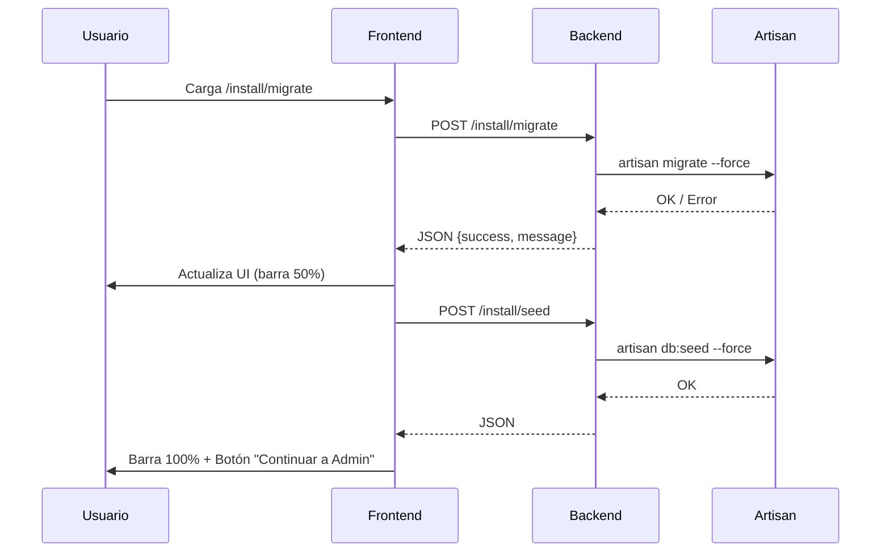

---
tags:
  - "kanban/done"
  - "type/task"
  - "domain/INS"
  - "priority/P0"
parent: "[[desarrollo]]"
children: []
depends_on:
  - "[[INS-005]]"
blocks:
  - "[[INS-007]]"
  - "[[INS-011]]"
  - "[[INS-012]]"
status: "done"
assignee: "@dev"
created: "2026-08-04"
updated: "2026-08-05"
---

# [[INS-006]] Paso 3: Migraciones + Seeders (artisan migrate --force + roles/perms)

## Descripción
Implementar tercer paso del instalador: ejecución de migraciones y seeders con artisan migrate --force y seeders de roles/permisos.

## Código de Ejemplo
```blade
{{-- resources/views/install/migrate.blade.php --}}
@extends('install.layout')

@section('content')
<div class="min-h-screen flex items-center justify-center bg-bg-primary px-4 py-12">
    <div class="w-full max-w-3xl">
        {{-- Progress Steps --}}
        <div class="flex items-center justify-center mb-8">
            @foreach(['Requisitos', 'Base de Datos', 'Migraciones', 'Admin', 'Pasarelas', 'Finalizar'] as $index => $step)
            <div class="flex items-center">
                <div class="w-10 h-10 rounded-full flex items-center justify-center text-sm font-medium
                    {{ $index < 2 ? 'bg-accent-primary text-white' : ($index === 2 ? 'bg-accent-primary text-white' : 'bg-bg-tertiary text-text-muted') }
                ">
                    {{ $index + 1 }}
                </div>
                @if($index < 5)
                <div class="w-16 h-1 mx-2 bg-{{ $index < 2 ? 'accent-primary' : 'border-border-primary' }}"></div>
                @endif
            @endforeach
        </div>

        <div class="card card--elevated p-8">
            <div class="text-center mb-8">
                <div class="w-16 h-16 mx-auto mb-4 bg-accent-100 dark:bg-accent-900/30 rounded-full flex items-center justify-center">
                    <x-icon name="database" class="w-8 h-8 text-accent-primary" />
                </div>
                <h1 class="text-2xl font-bold text-text-primary mb-2">Ejecutando Migraciones</h1>
                <p class="text-text-secondary">Creando tablas y seeders iniciales...</p>
            </div>

            <div id="migrate-progress" class="space-y-6">
                {{-- Paso 1: Migraciones --}}
                <div class="p-4 bg-bg-tertiary rounded-lg">
                    <div class="flex items-center justify-between mb-2">
                        <span class="font-medium text-text-primary">Ejecutando migraciones...</span>
                        <span id="migrate-status" class="text-sm text-text-secondary">Pendiente</span>
                    </div>
                    <div class="w-full bg-bg-secondary rounded-full h-2">
                        <div id="migrate-bar" class="h-full bg-accent-primary rounded-full transition-all duration-300" style="width: 0%"></div>
                    </div>
                    <p class="text-sm text-text-muted mt-2" id="migrate-output">Esperando...</p>
                </div>

                {{-- Paso 2: Seeders --}}
                <div class="p-4 bg-bg-tertiary rounded-lg mt-4 hidden" id="seeder-section">
                    <div class="flex items-center justify-between mb-2">
                        <span class="font-medium text-text-primary">Ejecutando seeders...</span>
                        <span id="seeder-status" class="text-sm text-text-secondary">Pendiente</span>
                    </div>
                    <div class="w-full bg-bg-secondary rounded-full h-2">
                        <div id="seeder-bar" class="h-full bg-success rounded-full transition-all duration-300" style="width: 0%"></div>
                    </div>
                    <p class="text-sm text-text-muted mt-2" id="seeder-output">Esperando migraciones...</p>
                </div>
            </div>

            <div class="mt-6 text-center" id="complete-actions" class="hidden">
                <a href="{{ route('install.admin') }}" class="btn btn--primary btn--lg">
                    Continuar a Admin
                    <x-icon name="arrow-right" class="w-4 h-4 ml-2" />
                </a>
            </div>
        </div>
    </div>
</div>
@endsection

@push('scripts')
<script>
let currentStep = 0;
const steps = ['migrate', 'seed'];

async function runInstallSteps() {
    for (const step of steps) {
        updateStepUI(step, 'running');
        
        try {
            const response = await fetch(`/install/${step}`, {
                method: 'POST',
                headers: {
                    'Content-Type': 'application/json',
                    'X-CSRF-TOKEN': document.querySelector('meta[name="csrf-token"]').content
                }
            });
            
            const data = await response.json();
            
            if (data.success) {
                updateStepUI(step, 'completed');
                showOutput(step, data.message);
                updateProgress(step);
            } else {
                showError(step, data.message);
                return;
            }
        } catch (error) {
            showError(step, 'Error de conexión: ' + error.message);
            return;
        }
    }
    
    // Todo completado
    document.getElementById('complete-actions').classList.remove('hidden');
    document.getElementById('seeder-section').classList.add('hidden');
}

function updateStepUI(step, status) {
    const statusEl = document.getElementById(`${step}-status`);
    const barEl = document.getElementById(`${step}-bar`);
    
    if (statusEl) statusEl.textContent = status === 'running' ? 'Ejecutando...' : 
                    status === 'completed' ? 'Completado' : 'Error';
    
    if (barEl) {
        if (status === 'running') barEl.style.width = '50%';
        else if (status === 'completed') barEl.style.width = '100%';
    }
}

function showOutput(step, message) {
    const outputEl = document.getElementById(`${step}-output`);
    if (outputEl) {
        outputEl.textContent = message;
        outputEl.className = 'text-sm text-success mt-2';
    }
}

function showError(step, message) {
    const statusEl = document.getElementById(`${step}-status`);
    const barEl = document.getElementById(`${step}-bar`);
    if (statusEl) statusEl.textContent = 'Error: ' + message;
    if (barEl) barEl.style.backgroundColor = '#ef4444';
}

function updateProgress(step) {
    const index = steps.indexOf(step);
    const total = steps.length;
    const progress = ((index + 1) / total) * 100;
    // Could update overall progress bar if exists
}

document.addEventListener('DOMContentLoaded', () => {
    runInstallSteps();
});
</script>
@endpush
```

```php
// app/Http/Controllers/InstallController.php - migrate
public function runMigrations()
{
    try {
        Artisan::call('migrate', ['--force' => true]);
        return response()->json(['success' => true, 'message' => 'Migraciones ejecutadas correctamente']);
    } catch (\Exception $e) {
        \Log::error('Migration failed', ['error' => $e->getMessage()]);
        return response()->json(['success' => false, 'message' => $e->getMessage()], 500);
    }
}
```

```php
// routes/install.php - POST /install/migrate
Route::post('migrate', [InstallController::class, 'runMigrations'])
    ->name('migrate.run');
```

```php
// database/seeders/DatabaseSeeder.php
class DatabaseSeeder extends Seeder
{
    public function run(): void
    {
        $this->call([
            RolePermissionSeeder::class,
            AdminUserSeeder::class,
            // DemoDataSeeder::class, // Solo en development
        ]);
    }
}
```

## Diagramas Mermaid


## Criterios de Aceptación
- [ ] POST `/install/migrate` ejecuta `artisan migrate --force`
- [ ] POST `/install/seed` ejecuta `artisan db:seed --force`
- [ ] Frontend: barra de progreso 0% → 50% → 100%
- [ ] UI muestra output en tiempo real (migrate-output, seeder-output)
- [ ] Manejo errores: muestra mensaje error, no avanza
- [ ] Al completar: muestra botón "Continuar a Admin"
- [ ] Seeders: RolePermissionSeeder + AdminUserSeeder
- [ ] Logging: errores en log de Laravel

## Notas Técnicas
- AJAX POST con CSRF token
- `artisan migrate --force` no interactivo
- `artisan db:seed --force` ejecuta DatabaseSeeder
- DatabaseSeeder llama: RolePermissionSeeder + AdminUserSeeder
- Progress bar: 0% → 50% (migrate) → 100% (seed)
- Error handling: try/catch, log en storage/logs

## Enlaces
- [[INS-005]] Paso 2: Base de Datos
- [[INS-007]] Paso 4: Admin Inicial
- [[INS-011]] Paso 2.5: Pasarelas
- [[INS-012]] Paso 2.6: Config Fiscal