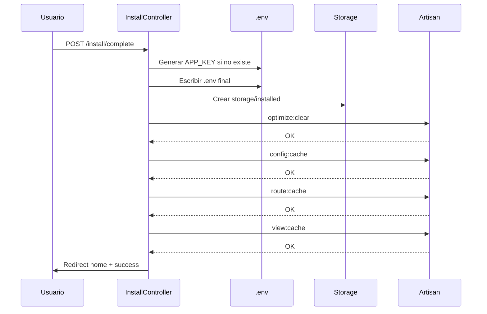

---
tags:
  - "kanban/done"
  - "type/task"
  - "domain/INS"
  - "priority/P0"
parent: "[[desarrollo]]"
children: []
depends_on:
  - "[[INS-008]]"
blocks:
  - "[[INS-012]]"
status: "done"
assignee: "@dev"
created: "2026-08-04"
updated: "2026-08-05"
---

# [[INS-009]] Paso 5: Finalizar (Escribir .env, APP_KEY, storage/installed, optimize:clear)

## Descripción
Implementar paso final del instalador: escritura final del .env, generación de APP_KEY, creación de storage/installed, optimización y limpieza de cache.

## Código de Ejemplo
```blade
{{-- resources/views/install/complete.blade.php --}}
@extends('install.layout')

@section('content')
<div class="min-h-screen flex items-center justify-center bg-bg-primary px-4 py-12">
    <div class="w-full max-w-3xl">
        {{-- Progress Steps --}}
        <div class="flex items-center justify-center mb-8">
            @foreach(['Requisitos', 'Base de Datos', 'Migraciones', 'Admin', 'Pasarelas', 'Fiscal', 'Finalizar'] as $index => $step)
            <div class="flex items-center">
                <div class="w-10 h-10 rounded-full flex items-center justify-center text-sm font-medium
                    {{ $index < 6 ? 'bg-accent-primary text-white' : 'bg-accent-primary text-white' }
                ">
                    {{ $index + 1 }}
                </div>
                @if($index < 6)
                <div class="w-16 h-1 mx-2 bg-accent-primary"></div>
                @endif
            @endforeach
        </div>

        <div class="card card--elevated p-8">
            <div class="text-center mb-8">
                <div class="w-16 h-16 mx-auto mb-4 bg-success-100 dark:bg-success-900/30 rounded-full flex items-center justify-center">
                    <x-icon name="check-circle" class="w-8 h-8 text-success-600" />
                </div>
                <h1 class="text-2xl font-bold text-text-primary mb-2">¡Instalación Completada!</h1>
                <p class="text-text-secondary">TG-PayGate está listo para usar</p>
            </div>

            <div class="card card--elevated p-6 mb-6">
                <h2 class="text-xl font-semibold mb-4">Resumen de la Instalación</h2>
                <div class="space-y-3 text-sm">
                    <div class="flex justify-between">
                        <span class="text-text-secondary">Base de datos</p>
                        <span class="badge badge--success">Configurada</span>
                    </div>
                    <div class="flex justify-between">
                        <span class="text-text-secondary">Migraciones</span>
                        <span class="badge badge--success">Ejecutadas</span>
                    </div>
                    <div class="flex justify-between">
                        <span class="text-text-secondary">Administrador</span>
                        <span class="badge badge--success">Creado</span>
                    </div>
                    <div class="flex justify-between">
                        <span class="text-text-secondary">Pasarelas</span>
                        <span class="badge badge--success">Configuradas</span>
                    </div>
                    <div class="flex justify-between">
                        <span class="text-text-secondary">Configuración Fiscal</span>
                        <span class="badge badge--success">Completada</span>
                    </div>
                    <div class="flex justify-between">
                        <span class="text-text-secondary">APP_KEY</span>
                        <span class="badge badge--success">Generada</span>
                    </div>
                    <div class="flex justify-between">
                        <span class="text-text-secondary">Storage/installed</span>
                        <span class="badge badge--success">Creado</span>
                    </div>
                </div>
            </div>

            <div class="card card--elevated p-6 mb-6">
                <h2 class="text-xl font-semibold mb-4">Próximos Pasos</h2>
                <ul class="space-y-3 text-sm text-text-secondary">
                    <li class="flex items-center gap-2"><x-icon name="check" class="w-4 h-4 text-success" /> Configura tu dominio y SSL en el servidor web</li>
                    <li class="flex items-center gap-2"><x-icon name="check" class="w-4 h-4 text-success" /> Configura el cron: <code class="bg-bg-secondary px-1.5 py-0.5 rounded">* * * * * cd /ruta/proyecto && php artisan schedule:run</code></li>
                    <li class="flex items-center gap-2"><x-icon name="check" class="w-4 h-4 text-success" /> Configura queue worker: <code class="bg-bg-secondary px-1.5 py-0.5 rounded">php artisan queue:work</code></li>
                    <li class="flex items-center gap-2"><x-icon name="check" class="w-4 h-4 text-success" /> Configura SSL válido (requerido para webhooks Telegram/MP)</li>
                    <li class="flex items-center gap-2"><x-icon name="check" class="w-4 h-4 text-success" /> Configura backups automáticos de BD y storage</li>
                </ul>
            </div>

            <div class="flex justify-end gap-4 mt-8">
                <a href="{{ route('home') }}" class="btn btn--primary btn--lg">
                    Ir al Panel de Control
                    <x-icon name="arrow-right" class="w-4 h-4 ml-2" />
                </a>
            </div>
        </div>
    </div>
</div>
@endsection
```

```php
// app/Http/Controllers/InstallController.php - complete
public function complete()
{
    // 1. Generar APP_KEY si no existe
    if (empty(config('app.key')) || config('app.key') === '') {
        $key = 'base64:' . base64_encode(random_bytes(32));
        $this->updateEnvFile('APP_KEY', $key);
    }

    // 2. Escribir .env final con todas las configuraciones
    $this->finalizeEnvFile();

    // 3. Crear archivo storage/installed
    \App\Helpers\Installation::markInstalled();

    // 4. Limpiar y optimizar
    Artisan::call('optimize:clear');
    Artisan::call('config:cache');
    Artisan::call('route:cache');
    Artisan::call('view:cache');

    return redirect()->route('home')->with('success', '¡Instalación completada! TG-PayGate está listo para usar.');
}

private function finalizeEnvFile()
{
    $envPath = base_path('.env');
    $env = file_get_contents(base_path('.env'));

    // Asegurar APP_KEY
    if (!preg_match('/^APP_KEY=.+/m', $env)) {
        $key = 'base64:' . base64_encode(random_bytes(32));
        $env = preg_replace('/^APP_KEY=.*/m', "APP_KEY=base64:" . base64_encode(random_bytes(32)), $env);
    }

    // Asegurar APP_URL
    $env = preg_replace('/^APP_URL=.*/m', 'APP_URL=' . config('app.url'), $env);

    file_put_contents($envPath, $env);
}
```

```php
// routes/install.php - POST /install/complete
Route::post('complete', [InstallController::class, 'complete'])
    ->name('complete');
```

## Diagramas Mermaid


## Criterios de Aceptación
- [ ] Genera APP_KEY si no existe (base64:random_bytes(32))
- [ ] Escribe .env final con todas las configuraciones
- [ ] Crea storage/installed (flag de instalación)
- [ ] Ejecuta optimize:clear, config:cache, route:cache, view:cache
- [ ] Redirige a home con mensaje de éxito
- [ ] Middleware RedirectIfNotInstalled ahora permite acceso normal

## Notas Técnicas
- APP_KEY: base64: + random_bytes(32)
- .env final escrito atómicamente
- storage/installed: flag simple para middleware
- optimize:clear limpia cache, config:cache compila configuración
- route:cache y view:cache para producción
- Middleware RedirectIfNotInstalled ahora permite acceso

## Enlaces
- [[INS-007]] Paso 4: Admin Inicial
- [[INS-006]] Paso 3: Migraciones
- [[INS-011]] Paso 2.5: Pasarelas
- [[INS-012]] Paso 2.6: Configuración Fiscal