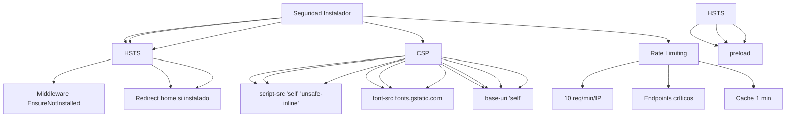

---
tags:
  - kanban/todo
  - type/task
  - domain/INS
  - priority/P0
parent: "[[desarrollo]]"
children: []
depends_on:
  - "[[INS-009]]"
blocks: []
status: todo
assignee: "@dev"
created: 2026-08-04
updated: 2026-08-04
---

# [[INS-010]] Seguridad Instalador: Anti-Reinstall, Honeypot, CSP, HSTS

## Descripción
Implementar medidas de seguridad en el instalador: prevención de reinstalación, honeypot, CSP, HSTS y validaciones de seguridad.

## Código de Ejemplo
```php
// app/Http/Middleware/EnsureNotInstalled.php
namespace App\Http\Middleware;

use Closure;
use Illuminate\Http\Request;
use App\Helpers\Installation;

class EnsureNotInstalled
{
    public function handle(Request $request, Closure $next): Response
    {
        if (Installation::isInstalled()) {
            // Log intento de reinstalación
            \Log::warning('Intento de acceso a instalador en sitio ya instalado', [
                'ip' => $request->ip(),
                'user_agent' => $request->userAgent(),
                'url' => $request->fullUrl(),
            ]);
            
            return redirect()->route('home')
                ->with('error', 'El sitio ya está instalado. No se puede acceder al instalador.');
        }
        
        return $next($request);
    }
}
```

```php
// app/Http/Controllers/InstallController.php - Anti-reinstall check
public function __construct()
{
    $this->middleware(function ($request, $next) {
        if (\App\Helpers\Installation::isInstalled()) {
            abort(403, 'Sitio ya instalado. No se puede acceder al instalador.');
        }
        return $next($request);
    })->except(['complete']); // Permitir complete para ver resultado final
}
```

```blade
{{-- resources/views/install/layout.blade.php - Honeypot --}}
<form action="{{ route('install.database.test') }}" method="POST" id="db-form">
    @csrf
    
    {{-- Honeypot field (hidden via CSS) --}}
    <div class="hp-field" style="display:none;" aria-hidden="true">
        <label for="website">Website</label>
        <input type="text" name="website" id="website" tabindex="-1" autocomplete="off">
    </div>
    
    {{-- Real form fields --}}
    <div>
        <label class="label">Host</label>
        <input type="text" name="db_host" class="input" required>
    </div>
    {{-- ... resto del formulario --}}
    
    {{-- En el controller --}}
    public function testDatabase(Request $request)
    {
        // Verificar honeypot
        if ($request->filled('website')) {
            \Log::warning('Honeypot triggered in installer', [
                'ip' => $request->ip(),
                'ua' => $request->userAgent(),
            ]);
            return response()->json(['success' => false, 'message' => 'Error de validación'], 422);
        }
        // ... resto de validación
    }
```

```php
// resources/views/install/layout.blade.php - CSP y HSTS
<head>
    <meta charset="utf-8">
    <meta name="viewport" content="width=device-width, initial-scale=1">
    
    {{-- CSP para instalador --}}
    <meta http-equiv="Content-Security-Policy" content="
        default-src 'self';
        script-src 'self' 'unsafe-inline' 'unsafe-eval';
        style-src 'self' 'unsafe-inline' https://fonts.googleapis.com;
        font-src 'self' https://fonts.gstatic.com;
        img-src 'self' data:;
        connect-src 'self';
        frame-ancestors 'none';
        base-uri 'self';
        form-action 'self';
    ">
    
    {{-- HSTS (solo en producción) --}}
    @if(config('app.env') === 'production')
    <meta http-equiv="Strict-Transport-Security" content="max-age=31536000; includeSubDomains; preload">
    @endif
    
    {{-- Otros headers de seguridad --}}
    <meta http-equiv="X-Content-Type-Options" content="nosniff">
    <meta http-equiv="X-Frame-Options" content="DENY">
    <meta http-equiv="X-XSS-Protection" content="1; mode=block">
    <meta http-equiv="Referrer-Policy" content="strict-origin-when-cross-origin">
    
    <meta charset="utf-8">
    <meta name="viewport" content="width=device-width, initial-scale=1">
    <title>{{ $title ?? 'TG-PayGate Installer' }}</title>
    @vite(['resources/css/app.css', 'resources/js/app.js'])
</head>
```

```php
// app/Http/Controllers/InstallController.php - Rate limiting adicional
public function __construct()
{
    $this->middleware(function ($request, $next) {
        // Rate limiting adicional para endpoints críticos
        if ($this->isCriticalEndpoint($request)) {
            $key = 'install:' . $request->ip();
            $attempts = Cache::get($key, 0);
            
            if ($attempts >= 10) {
                abort(429, 'Demasiados intentos. Intente más tarde.');
            }
            
            Cache::increment($key);
            Cache::expire($key, 60); // 1 minuto
        }
        
        return $next($request);
    });
    
    private function isCriticalEndpoint(Request $request): bool
    {
        $critical = [
            'install.database.test',
            'install.migrate.run',
            'install.admin.store',
            'install.payment-gateways.store',
            'install.fiscal-config.store',
            'install.admin.store',
            'install.complete',
        ];
        
        return in_array($request->route()?->getName(), $critical);
    }
}
```

```php
// resources/views/install/layout.blade.php - JavaScript para honeypot
@push('scripts')
<script>
document.addEventListener('DOMContentLoaded', function() {
    // Detectar autocompletado del navegador en honeypot
    const honeypot = document.querySelector('input[name="website"]');
    if (honeypot) {
        honeypot.addEventListener('input', function() {
            if (this.value.length > 0) {
                console.warn('Honeypot triggered');
            }
        });
    }
    
    // Deshabilitar autocompletado en campos sensibles
    document.querySelectorAll('input[type="password"]').forEach(input => {
        input.setAttribute('autocomplete', 'new-password');
    });
</script>
@endpush
```

## Diagramas Mermaid


## Criterios de Aceptación
- [ ] Middleware `EnsureNotInstalled` bloquea acceso si ya instalado
- [ ] Honeypot field `website` oculto con CSS, validación server-side
- [ ] CSP headers en layout: script-src, style-src, font-src, connect-src, frame-ancestors none
- [ ] HSTS header en producción (max-age=31536000, includeSubDomains, preload)
- [ ] Rate limiting: 10 req/min/IP en endpoints críticos
- [ ] Headers seguridad: X-Content-Type-Options, X-Frame-Options, X-XSS-Protection, Referrer-Policy
- [ ] Log de intentos de reinstalación y honeypot triggers

## Notas Técnicas
- Middleware order: `EnsureNotInstalled` antes que `StartSession` y `Authenticate`
- Honeypot field: `name="website"` oculto con `display:none` + `tabindex="-1" autocomplete="off"`
- CSP: `frame-ancestors 'none'` previene clickjacking
- HSTS solo en producción (verificar `config('app.env') === 'production'`)
- Rate limiting con Cache, TTL 1 minuto, 10 req/min
- Logs de seguridad: canal `security` en Laravel

## Enlaces
- [[INS-001]] Middleware RedirectIfNotInstalled
- [[INS-001]] Middleware RedirectIfNotInstalled
- [[INS-004]] Paso 1: Requisitos
- [[INS-005]] Paso 2: Base de Datos
- [[INS-011]] Paso 2.5: Pasarelas
- [[INS-012]] Paso 2.6: Configuración Fiscal