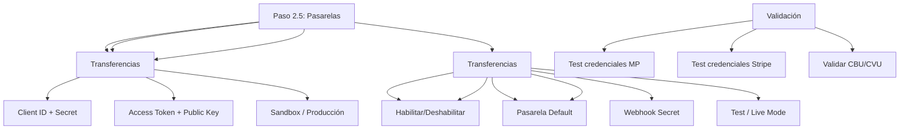

---
tags:
  - "kanban/done"
  - "type/task"
  - "domain/INS"
  - "priority/P0"
parent: "[[desarrollo]]"
children: []
depends_on:
  - "[[INS-007]]"
blocks:
  - "[[INS-008]]"
  - "[[INS-011]]"
  - "[[INS-012]]"
  - "[[CRE-001]]"
  - "[[CRE-009]]"
  - "[[CRE-011]]"
  - "[[CRE-014]]"
  - "[[PUB-018]]"
  - "[[PUB-014]]"
  - "[[PUB-015]]"
status: "done"
assignee: "@dev"
created: "2026-08-04"
updated: "2026-08-05"
---

# [[INS-008]] Paso 2.5: Configuración Pasarelas de Pago (MercadoPago, Stripe, Transferencias, Test Mode)

## Descripción
Implementar paso 2.5 del instalador: configuración de credenciales para pasarelas de pago (MercadoPago, Stripe, transferencias bancarias) y modo test.

## Código de Ejemplo
```blade
{{-- resources/views/install/payment-gateways.blade.php --}}
@extends('install.layout')

@section('content')
<div class="min-h-screen flex items-center justify-center bg-bg-primary px-4 py-12">
    <div class="w-full max-w-3xl">
        {{-- Progress Steps --}}
        <div class="flex items-center justify-center mb-8">
            @foreach(['Requisitos', 'Base de Datos', 'Migraciones', 'Admin', 'Pasarelas', 'Finalizar'] as $index => $step)
            <div class="flex items-center">
                <div class="w-10 h-10 rounded-full flex items-center justify-center text-sm font-medium
                    {{ $index < 4 ? 'bg-accent-primary text-white' : ($index === 4 ? 'bg-accent-primary text-white' : 'bg-bg-tertiary text-text-muted') }
                ">
                    {{ $index + 1 }}
                </div>
                @if($index < 5)
                <div class="w-16 h-1 mx-2 bg-{{ $index < 4 ? 'accent-primary' : 'border-border-primary' }}"></div>
                @endif
            @endforeach
        </div>

        <div class="card card--elevated p-8">
            <div class="text-center mb-8">
                <h1 class="text-2xl font-bold text-text-primary mb-2">Configurar Pasarelas de Pago</h1>
                <p class="text-text-secondary">Configura las credenciales de las pasarelas de pago para tu plataforma</p>
            </div>

            <form action="{{ route('install.payment-gateways.store') }}" method="POST" class="space-y-8">
                @csrf

                {{-- MercadoPago --}}
                <div class="card card--elevated p-6">
                    <h2 class="text-xl font-semibold mb-4 flex items-center gap-2">
                        <x-icon name="credit-card" class="w-5 h-5 text-accent-primary" />
                        MercadoPago
                    </h2>
                    <p class="text-text-secondary mb-4">Configuración para Argentina: pagos en efectivo, cuotas sin interés, webhooks IPN.</p>
                    
                    <div class="grid md:grid-cols-2 gap-4">
                        <div>
                            <label class="label">Client ID</label>
                            <input type="text" name="mp_client_id" class="input" value="{{ old('mp_client_id') }}" placeholder="APP_USR-xxxxx">
                        </div>
                        <div>
                            <label class="label">Client Secret</label>
                            <input type="password" name="mp_client_secret" class="input" value="{{ old('mp_client_secret') }}">
                        </div>
                        <div>
                            <label class="label">Access Token</label>
                            <input type="password" name="mp_access_token" class="input" placeholder="APP_USR-xxxxx">
                        </div>
                        <div>
                            <label class="label">Public Key</label>
                            <input type="text" name="mp_public_key" class="input" value="{{ old('mp_public_key') }}">
                        </div>
                    </div>
                    
                    <div class="mt-4 flex items-center gap-2">
                        <input type="radio" name="mp_mode" value="sandbox" class="radio" checked>
                        <label class="cursor-pointer">Sandbox (Pruebas)</label>
                        <input type="radio" name="mp_mode" value="production" class="radio ml-4">
                        <label class="cursor-pointer ml-4">Producción</label>
                    </div>
                </div>

                {{-- Stripe --}}
                <div class="card card--elevated p-6 mt-6">
                    <h2 class="text-xl font-semibold mb-4 flex items-center gap-2">
                        <x-icon name="credit-card" class="w-5 h-5 text-accent-primary" />
                        Stripe
                    </h2>
                    <p class="text-text-secondary mb-4">Configura para pagos internacionales con tarjeta</p>
                    
                    <div class="grid md:grid-cols-2 gap-4">
                        <div>
                            <label class="label">Publishable Key</label>
                            <input type="text" name="stripe_key" class="input" placeholder="pk_test_xxxxx" value="{{ old('stripe_key') }}">
                        </div>
                        <div>
                            <label class="label">Secret Key</label>
                            <input type="password" name="stripe_secret" class="input" placeholder="sk_test_xxxxx" value="{{ old('stripe_secret') }}">
                        </div>
                        <div>
                            <label class="label">Webhook Secret</label>
                            <input type="password" name="stripe_webhook_secret" class="input" placeholder="whsec_xxxxx" value="{{ old('stripe_webhook_secret') }}">
                        </div>
                    </div>
                    
                    <div class="mt-4 flex items-center gap-2">
                        <input type="radio" name="stripe_mode" value="test" class="radio" checked>
                        <label class="cursor-pointer">Test Mode</label>
                        <input type="radio" name="stripe_mode" value="live" class="radio ml-4">
                        <label class="cursor-pointer ml-4">Live Mode</label>
                    </div>
                </div>

                {{-- Transferencias Bancarias --}}
                <div class="card card--elevated p-6 mt-6">
                    <h2 class="text-xl font-semibold mb-4 flex items-center gap-2">
                        <x-icon name="bank" class="w-5 h-5 text-accent-primary" />
                        Transferencias Bancarias
                    </h2>
                    <p class="text-text-secondary mb-4">Habilita pagos por transferencia bancaria (CBU/CVU)</p>
                    
                    <div class="flex items-center gap-2">
                        <input type="checkbox" name="bank_transfer_enabled" class="checkbox" {{ old('bank_transfer_enabled') ? 'checked' : '' }}>
                        <label class="cursor-pointer">Habilitar transferencias bancarias</label>
                    </div>
                    
                    <div class="mt-4">
                        <label class="label">Pasarela por Defecto</label>
                        <select name="default_gateway" class="select">
                            <option value="mercadopago" {{ old('default_gateway', 'mercadopago') === 'mercadopago' ? 'selected' : '' }}>MercadoPago</option>
                            <option value="stripe" {{ old('default_gateway') === 'stripe' ? 'selected' : '' }}>Stripe</option>
                            <option value="bank_transfer" {{ old('default_gateway') === 'bank_transfer' ? 'selected' : '' }}>Transferencia Bancaria</option>
                        </select>
                    </div>
                </div>

                <div class="flex justify-end gap-4 pt-6 border-t border-border-primary">
                    <a href="{{ route('install.fiscal-config') }}" class="btn btn--ghost">Atrás</button>
                    <button type="submit" class="btn btn--primary">
                        Continuar a Configuración Fiscal
                        <x-icon name="arrow-right" class="w-4 h-4 ml-2" />
                    </button>
                </div>
            </form>
        </div>
    </div>
</div>
@endsection
```

```php
// app/Http/Controllers/InstallController.php - paymentGateways methods
public function paymentGateways()
{
    return view('install.payment-gateways');
}

public function savePaymentGateways(PaymentGatewaysRequest $request)
{
    $validated = $request->validated();
    
    $envContent = file_get_contents(base_path('.env'));
    
    $replacements = [
        'MERCADOPAGO_CLIENT_ID' => $validated['mp_client_id'] ?? '',
        'MERCADOPAGO_CLIENT_SECRET' => $validated['mp_client_secret'] ?? '',
        'MERCADOPAGO_ACCESS_TOKEN' => $validated['mp_access_token'] ?? '',
        'MERCADOPAGO_PUBLIC_KEY' => $validated['mp_public_key'] ?? '',
        'MERCADOPAGO_MODE' => $validated['mp_mode'] ?? 'sandbox',
        
        'STRIPE_KEY' => $validated['stripe_key'] ?? '',
        'STRIPE_SECRET' => $validated['stripe_secret'] ?? '',
        'STRIPE_WEBHOOK_SECRET' => $validated['stripe_webhook_secret'] ?? '',
        'STRIPE_MODE' => $validated['stripe_mode'] ?? 'test',
        
        'BANK_TRANSFER_ENABLED' => $validated['bank_transfer_enabled'] ?? 'false',
        'DEFAULT_PAYMENT_GATEWAY' => $validated['default_gateway'] ?? 'mercadopago',
    ];

    foreach ($replacements as $key => $value) {
        $envContent = preg_replace(
            "/^{$key}=.*/m",
            "{$key}={$value}",
            $envContent
        );
    }

    file_put_contents(base_path('.env'), $envContent);

    return redirect()->route('install.fiscal-config');
}
```

## Diagramas Mermaid


## Criterios de Aceptación
- [ ] Formulario MercadoPago: Client ID, Secret, Access Token, Public Key, modo Sandbox/Producción
- [ ] Formulario Stripe: Publishable Key, Secret Key, Webhook Secret, Test/Live mode
- [ ] Transferencias: Habilitar/Deshabilitar, pasarela por defecto
- [ ] Validación: credenciales requeridas según pasarela habilitada
- [ ] Test credenciales: botón "Probar conexión" (MP: /users/me, Stripe: /account)
- [ ] Escritura en .env con Crypt::encryptString() para secrets
- [ ] Validación: credenciales requeridas según pasarela habilitada
- [ ] Test mode toggle visible y funcional

## Notas Técnicas
- Encriptar secrets con `Crypt::encryptString()` antes de guardar en .env
- Test de credenciales: llamada API de prueba (MP: /users/me, Stripe: /account)
- Validación CBU/CVU en frontend + backend (Módulo 10)
- Pasarela default: usada en checkout si canal no tiene configurada propia
- Middleware EnsureTestEnvironment para pasarela de prueba

## Enlaces
- [[INS-004]] Paso 1: Requisitos
- [[INS-006]] Paso 3: Migraciones
- [[INS-012]] Paso 2.6: Configuración Fiscal
- [[PUB-014]] MercadoPago Argentina
- [[PUB-015]] Transferencias Bancarias