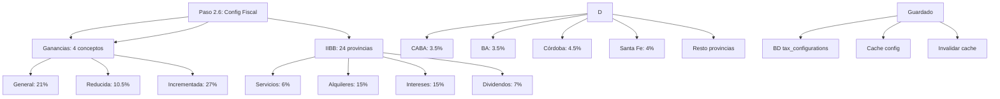

---
tags:
  - kanban/todo
  - type/task
  - domain/INS
  - priority/P0
parent: "[[desarrollo]]"
children: []
depends_on:
  - "[[INS-007]]"
  - "[[INS-010]]"
  - "[[INS-011]]"
blocks: []
status: todo
assignee: "@dev"
created: 2026-08-04
updated: 2026-08-04
---

# [[INS-012]] Paso 2.6: Configuración Fiscal Argentina (IVA, Ganancias, IIBB, AFIP CAE, Factura A/B/C)

## Descripción
Implementar paso 2.6 del instalador: configuración fiscal específica para Argentina (alícuotas IVA, Ganancias, IIBB, factura A/B/C, CAE AFIP).

## Código de Ejemplo
```blade
{{-- resources/views/install/fiscal-config.blade.php --}}
@extends('install.layout')

@section('content')
<div class="min-h-screen flex items-center justify-center bg-bg-primary px-4 py-12">
    <div class="w-full max-w-3xl">
        {{-- Progress Steps --}}
        <div class="flex items-center justify-center mb-8">
            @foreach(['Requisitos', 'Base de Datos', 'Migraciones', 'Admin', 'Pasarelas', 'Fiscal', 'Finalizar'] as $index => $step)
            <div class="flex items-center">
                <div class="w-10 h-10 rounded-full flex items-center justify-center text-sm font-medium
                    {{ $index < 5 ? 'bg-accent-primary text-white' : ($index === 5 ? 'bg-accent-primary text-white' : 'bg-bg-tertiary text-text-muted') }
                ">
                    {{ $index + 1 }}
                </div>
                @if($index < 6)
                <div class="w-16 h-1 mx-2 bg-{{ $index < 5 ? 'accent-primary' : 'border-border-primary' }}"></div>
                @endif
            @endforeach
        </div>

        <div class="card card--elevated p-8">
            <div class="text-center mb-8">
                <h1 class="text-2xl font-bold text-text-primary mb-2">Configuración Fiscal Argentina</h1>
                <p class="text-text-secondary">Alícuotas IVA, Ganancias, IIBB y Facturación AFIP/ARCA</p>
            </div>

            <form action="{{ route('install.fiscal-config.store') }}" method="POST" class="space-y-8">
                @csrf
                @method('PUT')

                {{-- IVA --}}
                <div class="card card--elevated p-6">
                    <h2 class="text-xl font-semibold mb-4">Alícuotas IVA</h2>
                    <div class="grid md:grid-cols-3 gap-4">
                        @foreach(['general' => 'General (21%)', 'reduced' => 'Reducida (10.5%)', 'increased' => 'Incrementada (27%)'] as $key => $label)
                        <div>
                            <label class="label">{{ $label }}</label>
                            <div class="flex items-center gap-2">
                                <input type="number" name="vat_rates[{{ $key }}]" class="input" 
                                       value="{{ config("tax.vat_rates.{$key}", 0.21) * 100 }}" 
                                       step="0.01" min="0" max="100" required>
                                <span class="text-text-muted">%</span>
                            </div>
                        </div>
                        @endforeach
                    </div>
                </div>

                {{-- Retenciones Ganancias --}}
                <div class="card card--elevated p-6">
                    <h2 class="text-xl font-semibold mb-4">Retenciones Ganancias (RG 830/2023)</h2>
                    <p class="text-text-secondary mb-4">Alícuotas aplicables a Responsables Inscriptos. Basado en RG 830/2023.</p>
                    
                    <div class="grid md:grid-cols-2 lg:grid-cols-4 gap-4">
                        @foreach(['services' => 'Servicios (6%)', 'rent' => 'Alquileres (15%)', 'interest' => 'Intereses (15%)', 'dividends' => 'Dividendos (7%)'] as $key => $label)
                        <div>
                            <label class="label">{{ $label }}</label>
                            <div class="flex items-center gap-2">
                                <input type="number" name="ganancias_rates[{{ $key }}]" class="input" 
                                       value="{{ config("tax.ganancias_rates.{$key}", 0.06) * 100 }}" 
                                       step="0.01" min="0" max="100" required>
                                <span class="text-text-muted">%</span>
                            </div>
                        </div>
                        @endforeach
                    </div>
                    <p class="text-sm text-text-muted mt-2">Basado en RG 830/2023. Aplicable a Responsables Inscriptos.</p>
                </div>

                {{-- IIBB por Provincia --}}
                <div class="card card--elevated p-6">
                    <h2 class="text-xl font-semibold mb-4">IIBB por Provincia</h2>
                    <p class="text-text-secondary mb-4">Alícuotas Ingresos Brutos por jurisdicción. CABA/BA: 3.5%, Córdoba: 4.5%, etc.</</p>
                    
                    <div class="overflow-x-auto">
                        <table class="w-full">
                            <thead class="bg-bg-tertiary">
                                <tr>
                                    <th class="p-4 text-left text-sm font-semibold text-text-secondary">Provincia</th>
                                    <th class="p-4 text-right text-sm font-semibold text-text-secondary">Alícuota (%)</th>
                                </tr>
                            </thead>
                            <tbody class="divide-y divide-border-primary">
                                @foreach($provinces as $code => $name)
                                <tr class="hover:bg-bg-tertiary">
                                    <td class="p-4 text-sm text-text-primary">{{ $name }} ({{ $code }})</td>
                                    <td class="p-4 text-right">
                                        <input type="number" name="iibb_rates[{{ $code }}]" class="input w-24 text-right" 
                                               value="{{ config("tax.iibb_rates.{$code}", 0.035) * 100 }}" 
                                               step="0.01" min="0" max="10">
                                    </td>
                                </tr>
                                @endforeach
                            </tbody>
                        </table>
                    </div>
                </div>

                <div class="flex justify-end">
                    <button type="submit" class="btn btn--primary">Guardar Configuración Fiscal</button>
                </div>
            </form>
        </div>
    </div>
</div>
@endsection
```

```php
// app/Http/Controllers/InstallController.php - fiscalConfig
public function fiscalConfig()
{
    return view('install.fiscal-config', [
        'provinces' => \App\Services\ArgentineTaxService::PROVINCES,
    ]);
}

public function saveFiscalConfig(FiscalConfigRequest $request)
{
    $rates = $request->validated();
    foreach ($rates as $key => $value) {
        config(["tax.vat_rates.{$key}" => $value]);
    }
    $this->saveTaxConfig('vat_rates', $rates);
    // Similar for ganancias_rates, iibb_rates
    return back()->with('success', 'Configuración fiscal actualizada');
}

private function saveTaxConfig(string $key, array $value): void
{
    \App\Models\TaxConfiguration::updateOrCreate(
        ['key' => $key],
        ['value' => json_encode($value)]
    );
}
```

```php
// app/Http/Requests/Install/FiscalConfigRequest.php
class FiscalConfigRequest extends FormRequest
{
    public function rules(): array
    {
        return [
            'vat_rates.general' => 'required|numeric|min:0|max:100',
            'vat_rates.reduced' => 'required|numeric|min:0|max:100',
            'vat_rates.increased' => 'required|numeric|min:0|max:100',
            'ganancias_rates.services' => 'required|numeric|min:0|max:100',
            'ganancias_rates.rent' => 'required|numeric|min:0|max:100',
            'ganancias_rates.interest' => 'required|numeric|min:0|max:100',
            'ganancias_rates.dividends' => 'required|numeric|min:0|max:100',
            'iibb_rates.*' => 'nullable|numeric|min:0|max:20',
        ];
    }
}
```

```php
// routes/install.php - POST /install/fiscal-config
Route::post('fiscal-config', [InstallController::class, 'saveFiscalConfig'])
    ->name('fiscal-config.store');
```

## Diagramas Mermaid


## Criterios de Aceptación
- [ ] IVA: 3 alícuotas editables (General 21%, Reducida 10.5%, Incrementada 27%)
- [ ] Ganancias: 4 conceptos editables (Servicios 6%, Alquileres 15%, Intereses 15%, Dividendos 7%)
- [ ] IIBB: 24 provincias editables (CABA 3.5%, BA 3.5%, Córdoba 4.5%, Santa Fe 4%, etc.)
- [ ] Validación: porcentajes 0-100%, step 0.01
- [ ] Guardado en BD (tax_configurations) + cache
- [ ] Ayuda contextual: qué servicios aplican a cada alícuota
- [ ] Documentado en `docu/especificaciones/admin-tax-config.md`

## Notas Técnicas
- Guardar en tabla `tax_configurations` (key, value JSON)
- Cache con `Cache::tags(['tax-config'])->forever()`
- Invalidar cache al actualizar
- Usar en `ArgentineTaxService` vía `config('tax.vat_rates')`
- RG 830/2023 vigente para Ganancias

## Enlaces
- [[INS-007]] Paso 4: Admin Inicial
- [[INS-005]] Paso 2: Base de Datos
- [[PUB-019]] Legislación argentina
- [[PUB-018]] Instalador config pasarelas