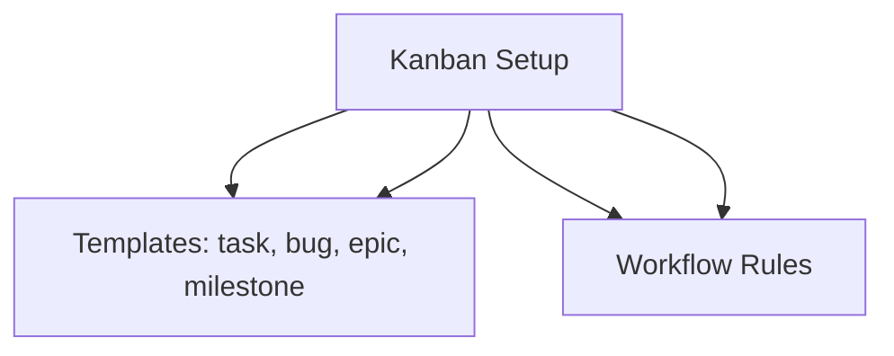

---
tags:
  - kanban/todo
  - type/task
  - domain/KAN
  - priority/P0
parent: "[[desarrollo]]"
children: []
depends_on:
  - "[[FUN-001]]"
blocks:
  - "[[KAN-002]]"
status: todo
assignee: "@dev"
created: 2026-08-04
updated: 2026-08-04
---

# [[KAN-001]] Setup Inicial: Crear 5 Columnas + Templates + Convención Frontmatter

## Descripción
Configurar la estructura base del Kanban: 5 columnas (Backlog, Todo, In Progress, Review, Done), templates para cada tipo de tarea, y convención de frontmatter YAML.

## Código de Ejemplo
```markdown
# Frontmatter estándar para tareas
---
tags:
  - kanban/todo
  - type/task
  - domain/DOMAIN
  - priority/P0
parent: "[[desarrollo]]"
children: []
depends_on: []
blocks: []
status: todo
assignee: "@dev"
created: 2026-08-04
updated: 2026-08-04
---

# [[TASK-ID]] Título de la Tarea

## Descripción
Descripción detallada de la tarea.

## Código de Ejemplo
```php
// Ejemplo de código
```

## Diagramas Mermaid


## Criterios de Aceptación
- [ ] Criterio 1
- [ ] Criterio 2

## Notas Técnicas
Notas técnicas relevantes.

## Enlaces
- [[TASK-ID]] Enlace relacionado
```

## Diagramas Mermaid


## Criterios de Aceptación
- [ ] 5 columnas creadas: Backlog, Todo, In Progress, Review, Done
- [ ] 4 templates creados: task.md, bug.md, epic.md, milestone.md
- [ ] Frontmatter convention documentada
- [ ] Workflow rules documentadas (WIP limits, DoD, etc.)
- [ ] Archivos creados en `docu/kanban/`

## Notas Técnicas
- Usar Obsidian-compatible frontmatter
- Tags jerárquicos: kanban/column, type/type, domain/DOMAIN, priority/P0-P3
- Wikilinks para referencias cruzadas
- Mermaid para diagramas

## Enlaces
- [[KAN-002]] Poblar todo.md