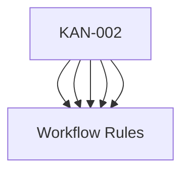

---
tags:
  - kanban/todo
  - type/task
  - domain/KAN
  - priority/P0
parent: "[[desarrollo]]"
children: []
depends_on:
  - "[[KAN-001]]"
blocks:
  - "[[KAN-003]]"
  - "[[KAN-004]]"
  - "[[KAN-005]]"
  - "[[KAN-006]]"
  - "[[KAN-007]]"
  - "[[KAN-008]]"
  - "[[KAN-009]]"
status: todo
assignee: "@dev"
created: 2026-08-04
updated: 2026-08-04
---

# [[KAN-002]] Poblar todo.md con Jerarquía Completa (Esta Planificación)

## Descripción
Poblar el archivo `docu/kanban/todo.md` con la jerarquía completa de la planificación: Versión 1.0 → Beta → Alfa → Desarrollo (16 áreas atómicas).

## Código de Ejemplo
```markdown
# docu/kanban/todo.md

---
tags:
  - kanban/todo
  - type/epic
  - version/1.0
  - milestone/beta
parent: null
children:
  - "[[version-1.0]]"
status: todo
created: 2026-08-04
updated: 2026-08-04
---

# TODO - TG-PayGate v1.0 "Fundación"

## 🎯 [[version-1.0]] Versión 1.0 - Fundación Completa
**Objetivo**: Sitio funcional en producción con 4 subdominios, instalador, auth, roles, framework CSS, docs y deploy automatizado.

### 📦 [[beta]] Beta - Release Candidate
**Criterio**: Todas las features core funcionando, testing E2E pasando, docs completas, deploy verificado.

#### 🔬 [[alfa]] Alfa - Feature Complete
**Criterio**: Todo el código escrito, migraciones, seeders, instalador, 4 dominios navegables, framework CSS funcional.

##### 🛠️ [[desarrollo]] Desarrollo - 16 Áreas Atómicas

###### 1️⃣ FUN - Fundación Laravel + Arquitectura
- [[FUN-001]] Inicializar proyecto Laravel 11 + dependencias core
- [[FUN-002]] Configurar estructura `app/Domains/{Public,Creadores,Staff}`
- [[FUN-003]] Configurar `RouteServiceProvider` para subdominios dinámicos
- [[FUN-004]] Crear middleware `EnsureCorrectSubdomain` (rol ↔ subdominio)
- [[FUN-005]] Instalar y configurar `spatie/laravel-permission`
- [[FUN-006]] Migración `users` + campos: `role` (enum), `telegram_id`, `email_verified_at`, `settings` (JSON)
- [[FUN-007]] Seeders: Roles (user, creador, staff, admin) + Permisos base
- [[FUN-008]] Configurar `.env.example` portable + `config/*` multi-dominio
- [[FUN-009]] BaseService, BaseController, ApiResponse trait, Exception Handler global

###### 2️⃣ UX - Diseño UX (Research + Flows)
- [[UX-001]] User research: proto-personas (creador, usuario, staff, admin)
- [[UX-002]] Journey maps: 4 journeys principales (compra, onboarding creador, ticket CRM, admin config)
- [[UX-003]] User flows: 12+ flows documentados (Mermaid en docu/)
- [[UX-004]] Wireframes low-fi: 20+ pantallas (Figma/Excalidraw exportado a docu/)
- [[UX-005]] Arquitectura de información + card sorting (nav, dashboard, settings)
- [[UX-006]] Accesibilidad: auditoría WCAG 2.1 AA plan + checklists
- [[UX-007]] Microcopy + tone of voice guide (español neutro)
- [[UX-008]] Usability testing plan (5 usuarios por rol)

###### 3️⃣ UI - Diseño UI (Design System + Componentes)
- [[UI-001]] Design tokens: colores, spacing, tipografía, shadows, border-radius, z-index
- [[UI-002]] Component library: Button, Input, Select, Modal, Table, Card, Badge, Avatar, Dropdown, Toast, Tooltip, Tabs, Accordion, Pagination, FormLayout
- [[UI-003]] Layouts base: PublicLayout, AuthLayout, DashboardLayout (Sidebar + Topbar), CRMLayout, AdminLayout
- [[UI-004]] Responsive breakpoints: mobile-first (320, 640, 768, 1024, 1280, 1536)
- [[UI-005]] Dark mode: strategy (class en html), tokens duales, toggle persistido
- [[UI-006]] Iconografía: set consistente (Heroicons/Lucide) + custom SVG
- [[UI-007]] Ilustraciones/Empty states: 8+ estados vacíos ilustrados
- [[UI-008]] Motion/Transitions: easing, duration, reduced-motion support
- [[UI-009]] Storybook/Documentación componentes viva (opcional v1.1)

###### 4️⃣ WEB - Diseño Web General (Branding + Assets)
- [[WEB-001]] Brand guidelines: logo (variantes), paleta, tipografía, voz, do/don't
- [[WEB-002]] Favicon set + PWA manifest + apple-touch-icons + OG image template
- [[WEB-003]] Email templates: base transactional (MJML/Blade), 6+ templates
- [[WEB-004]] Landing page assets: hero, features, testimonials, pricing, FAQ, footer
- [[WEB-005]] Ilustraciones custom: onboarding, empty states, error pages (404, 500, 403)
- [[WEB-006]] Style guide vivo en `/styleguide` (opcional)

###### 5️⃣ CSS - Framework CSS Propio (38 Tareas)
- [[CSS-001]] Arquitectura del Framework: Decisiones técnicas, estructura, build tool (Vite)
...
(continuar con el resto de la jerarquía completa)
```

## Diagramas Mermaid


## Criterios de Aceptación
- [ ] `docu/kanban/todo.md` poblado con jerarquía completa (versión 1.0 → beta → alfa → desarrollo 16 áreas)
- [ ] `docu/kanban/backlog.md` creado con épicas futuras (v1.1, v2.0)
- [ ] 4 templates creados: `task.md`, `bug.md`, `epic.md`, `milestone.md` en `docu/kanban/templates/`
- [ ] Frontmatter convention documentada
- [ ] Workflow rules documentadas (WIP limits, DoD, etc.)

## Notas Técnicas
- Usar wikilinks `[[TASK-ID]]` para referencias cruzadas
- Frontmatter YAML obligatorio en todos los .md
- Tags jerárquicos: kanban/column, type/type, domain/DOMAIN, priority/P0-P3

## Enlaces
- [[KAN-001]] Setup Inicial