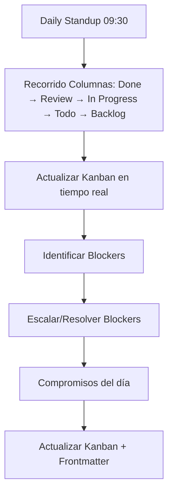

---
tags:
  - kanban/todo
  - type/task
  - domain/KAN
  - priority/P1
parent: "[[desarrollo]]"
children: []
depends_on:
  - "[[KAN-002]]"
blocks: []
status: todo
assignee: "@dev"
created: 2026-08-04
updated: 2026-08-04
---

# [[KAN-003]] Daily Standup Sync: Mover Tareas, Actualizar Status, Blockers

## Descripción
Definir el proceso de daily standup sincronizado con el Kanban: mover tareas entre columnas, actualizar status, identificar blockers.

## Código de Ejemplo
```markdown
# Daily Standup Kanban Process

## Frecuencia y Duración
- **Frecuencia**: Diaria (días laborables)
- **Hora**: 09:30 AM (timezone team)
- **Duración**: Máx 15 minutos
- **Formato**: Stand-up (de pie, timeboxed)

## Estructura
1. **Recorrido por columnas** (Right to Left):
   - Done: ¿Qué se completó ayer?
   - Review: ¿Qué está en review? ¿Blockers?
   - In Progress: ¿En qué estoy? ¿Blockers?
   - Todo: ¿Qué empiezo hoy?
   - Backlog: ¿Nuevas tareas prioritarias?

2. **Actualización Kanban** (en tiempo real):
   - Mover tarjetas entre columnas
   - Actualizar status en frontmatter
   - Asignar/reasignar assignee
   - Actualizar `updated` timestamp

3. **Blockers** (inmediato):
   - Identificar: técnico, dependencia, decisión, recurso
   - Escalar: @mention responsable
   - Acción: unblock o escalar

## Formato Standup (3 preguntas + Kanban)
1. ¿Qué completé ayer? → Mover a Done
2. ¿Qué hago hoy? → Mover a In Progress
3. ¿Blockers? → Tag `blocked`, @mention owner

## Métricas Standup
- **Throughput**: Tarjetas Done/día
- **Cycle Time**: Todo → Done
- **WIP**: Tarjetas en In Progress + Review
- **Blocked Time**: Horas en `blocked` tag
```

## Diagramas Mermaid


## Criterios de Aceptación
- [ ] Daily standup a las 09:30 (timezone team)
- [ ] Duración máx 15 min (timeboxed)
- [ ] Recorrido columnas: Done → Review → In Progress → Todo → Backlog
- [ ] Actualización Kanban en tiempo real (mover tarjetas, actualizar frontmatter)
- [ ] Identificar blockers → tag `blocked` + @mention owner
- [ ] Métricas: Throughput, Cycle Time, WIP, Blocked Time
- [ ] Documentado en `docu/guias/daily-standup.md`

## Notas Técnicas
- Timeboxed: 15 min máx (timer visible)
- Formato: Stand-up (de pie)
- Facilitador rotativo semanal
- Async option: async standup en canal #standup (Slack/Discord) si equipo distribuido
- Async: actualizar Kanban antes de 09:30, leer updates en canal

## Enlaces
- [[KAN-001]] Setup Inicial
- [[KAN-004]] Weekly Refinement