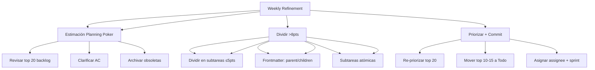

---
tags:
  - kanban/todo
  - type/task
  - domain/KAN
  - priority/P1
parent: "[[desarrollo]]"
children: []
depends_on:
  - "[[KAN-002]]"
blocks: []
status: todo
assignee: "@dev"
created: 2026-08-04
updated: 2026-08-04
---

# [[KAN-004]] Weekly Refinement: Groom Backlog, Estimar, Dividir Tareas >8pts

## Descripción
Definir el proceso semanal de refinamiento del backlog: grooming, estimación, división de tareas grandes (>8pts).

## Código de Ejemplo
```markdown
# Weekly Refinement Process

## Frecuencia y Duración
- **Frecuencia**: Semanal (ej. Martes 10:00)
- **Duración**: 60-90 minutos
- **Participantes**: PO, Tech Lead, Devs (opcional: Designer, QA)

## Agenda Estándar (60-90 min)

### 1. Backlog Grooming (30 min)
- Revisar Backlog (ordenado por prioridad)
- Eliminar/archivar tareas obsoletas
- Añadir detalles a top 10-15 tareas
- Clarificar acceptance criteria

### 2. Estimación (30 min)
- Planning Poker / Fibonacci (1,2,3,5,8,13,21)
- Regla: >8pts = dividir
- Consenso rápido (≤3 min/tarea)
- Documentar estimación en frontmatter: `estimate: 5`

### 3. División de Tareas >8pts (20 min)
- Identificar tareas >8pts
- Dividir en subtareas atómicas (≤5pts c/u)
- Crear subtareas con frontmatter `children: []` y `parent: "[[PARENT]]"`
- Actualizar `parent` y `children` en frontmatter

### 4. Priorización y Commit (15 min)
- Re-priorizar top 20 backlog
- Mover top 10-15 a `Todo` (ready for sprint)
- Asignar `assignee` tentativo
- Definir `sprint` / `milestone` en frontmatter
```

## Diagramas Mermaid


## Criterios de Aceptación
- [ ] Frecuencia semanal (ej. Martes 10:00), 60-90 min
- [ ] Backlog grooming: top 20 revisadas, AC clarificados
- [ ] Estimación: Planning Poker Fibonacci (1,2,3,5,8,13,21)
- [ ] Regla: tareas >8pts se dividen obligatoriamente
- [ ] Subtareas atómicas ≤5pts, frontmatter `parent`/`children`
- [ ] Priorización: mover top 10-15 a `Todo`, asignar assignee
- [ ] Métricas: % tareas >8pts, estimation accuracy, backlog aging
- [ ] Documentado en `docu/guias/weekly-refinement.md`

## Notas Técnicas
- Planning Poker: Fibonacci (1,2,3,5,8,13,21)
- Regla: >8pts = dividir obligatorio
- Subtareas: frontmatter `parent: "[[PARENT]]"`, `children: ["[[CHILD1]]"]`
- Estimation accuracy tracking: estimated vs actual
- Backlog aging: alertar tareas >30 días en backlog

## Enlaces
- [[KAN-001]] Setup Inicial
- [[KAN-005]] Sprint Planning