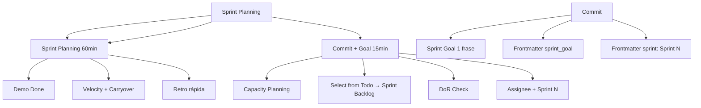

---
tags:
  - kanban/todo
  - type/task
  - domain/KAN
  - priority/P1
parent: "[[desarrollo]]"
children: []
depends_on:
  - "[[KAN-002]]"
blocks: []
status: todo
assignee: "@dev"
created: 2026-08-04
updated: 2026-08-04
---

# [[KAN-005]] Sprint Planning (si aplica): Seleccionar, Commit, Capacity

## Descripción
Definir el proceso de Sprint Planning si el equipo usa sprints (opcional, depende de metodología).

## Código de Ejemplo
```markdown
# Sprint Planning Process

## Frecuencia y Duración
- **Frecuencia**: Cada 2 semanas (Sprint de 2 semanas)
- **Duración**: 60-90 minutos
- **Participantes**: PO, Scrum Master, Dev Team (obligatorio)

## Agenda Estándar (90 min)

### 1. Sprint Review (15 min) - Sprint anterior
- Demo de lo completado
- Métricas: Velocity, Completion Rate, Carryover
- Retro rápida: What went well / What to improve

### 2. Sprint Planning (60 min)
- **Capacity Planning**:
  - Devs disponibles × días × horas/día = Capacity total
  - Restar: meetings, interviews, holidays, buffer 20%
  - Capacity = Devs × Días × Horas × 0.8

- **Sprint Backlog Selection**:
  - Tomar de `Todo` (ready) en orden de prioridad
  - Sumar `estimate` hasta llenar Capacity
  - Mover a `Sprint Backlog` (columna `Sprint` en Kanban)
  - Asignar `assignee` y `sprint: "Sprint N"`

- **Definition of Ready Check**:
  - AC claros y testeables
  - Estimación ≤8pts
  - Dependencias resueltas
  - Diseño/UX listo (si aplica)

### 3. Commit y Sprint Goal (15 min)
- Equipo confirma compromiso
- Definir Sprint Goal (1 frase)
- Documentar en `sprint_goal` en frontmatter de tareas del sprint
- Definir `sprint: "Sprint N"` en frontmatter de tareas
```

## Diagramas Mermaid


## Criterios de Aceptación
- [ ] Frecuencia: Cada 2 semanas, 90 min
- [ ] Sprint Review: Demo + Velocity + Carryover + Retro rápida
- [ ] Capacity Planning: Devs × Días × Horas × 0.8 buffer
- [ ] Sprint Backlog: Seleccionar de `Todo` (ready) por prioridad
- [ ] DoR Check: AC claros, estimate ≤8pts, deps resueltas, diseño listo
- [ ] Sprint Goal: 1 frase, documentado en `sprint_goal` frontmatter
- [ ] Sprint Backlog: Mover a columna `Sprint`, assignee + `sprint: "Sprint N"`
- [ ] Sprint Goal: 1 frase, visible en tablero

## Notas Técnicas
- Opcional: Solo si equipo usa Scrum (no Kanban puro)
- Capacity = Devs × Días × Horas × 0.8 (buffer 20%)
- Definition of Ready (DoR) obligatoria
- Carryover: max 20% velocity anterior
- Sprint Goal: 1 frase, medible, visible en board

## Enlaces
- [[KAN-001]] Setup Inicial
- [[KAN-004]] Weekly Refinement
- [[KAN-006]] Retrospectiva