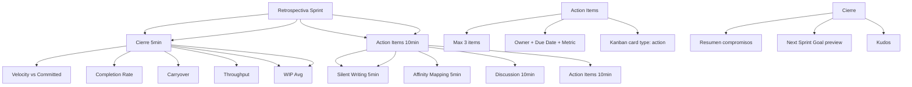

---
tags:
  - kanban/todo
  - type/task
  - domain/KAN
  - priority/P1
parent: "[[desarrollo]]"
children: []
depends_on:
  - "[[KAN-004]]"
blocks: []
status: todo
assignee: "@dev"
created: 2026-08-04
updated: 2026-08-04
---

# [[KAN-006]] Retrospectiva: Métricas (Lead Time, Cycle Time, Throughput, WIP)

## Descripción
Definir el proceso de retrospectiva al final de cada sprint: métricas, análisis, acción de mejora.

## Código de Ejemplo
```markdown
# Retrospectiva Sprint

## Frecuencia y Duración
- **Frecuencia**: Cada 2 semanas (fin de sprint)
- **Duración**: 45-60 minutos
- **Participantes**: Todo el equipo (obligatorio)

## Agenda Estándar (45-60 min)

### 1. Métricas del Sprint (10 min)
- **Velocity**: Story points completados vs comprometidos
- **Completion Rate**: % completado vs comprometido
- **Carryover**: Puntos llevados al siguiente sprint
- **Throughput**: Tarjetas Done/sprint
- **Cycle Time**: Promedio Todo → Done
- **Lead Time**: Promedio Backlog → Done
- **WIP Promedio**: Tarjetas simultáneas en In Progress

### 2. Retrospectiva Estructurada (25 min)
**Formato: Start / Stop / Continue / Improve**
- **Start**: ¿Qué deberíamos empezar a hacer?
- **Stop**: ¿Qué deberíamos dejar de hacer?
- **Continue**: ¿Qué funciona bien y seguir?
- **Improve**: ¿Qué mejorar en proceso/herramientas?

**Formato**: Silent writing (5 min) → Agrupar (5 min) → Discutir (10 min) → Acciones (10 min)

### 3. Action Items (10 min)
- **Máx 3 Action Items** por sprint
- Formato: **Acción** + **Owner** + **Due Date** + **Success Metric**
- Registrar en `docu/kanban/retrospectives/YYYY-MM-DD.md`
- Asignar `owner` y `due_date` en Kanban (tarjeta tipo `action`)

### 3. Cierre (5 min)
- Resumen de compromisos
- Próximo Sprint Goal preview
- Agradecimientos / Kudos
```

## Diagramas Mermaid


## Criterios de Aceptación
- [ ] Frecuencia: Cada 2 semanas (fin de sprint), 45-60 min
- [ ] Métricas: Velocity, Completion Rate, Carryover, Cycle Time, Lead Time, WIP
- [ ] Formato: Start/Stop/Continue/Improve, silent writing + affinity mapping
- [ ] Action Items: Máx 3, Owner + Due Date + Success Metric
- [ ] Kanban card tipo `action` para tracking
- [ ] Documentado en `docu/kanban/retrospectives/YYYY-MM-DD.md`
- [ ] Cierre: Resumen compromisos, Next Sprint Goal preview, Kudos

## Notas Técnicas
- Template estandarizado en `docu/kanban/templates/retrospective.md`
- Métricas calculadas desde Kanban (automatizar con script si posible)
- Action items como tarjetas Kanban tipo `action` con `owner`, `due_date`
- Retrospectivas archivadas en `docu/kanban/retrospectives/`
- Facilitador rotativo semanal
- Psychological safety: Prime Directive leída al inicio

## Enlaces
- [[KAN-001]] Setup Inicial
- [[KAN-004]] Weekly Refinement
- [[KAN-005]] Sprint Planning