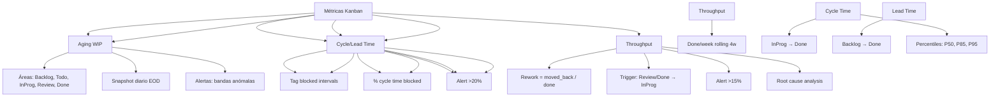

---
tags:
  - kanban/todo
  - type/task
  - domain/KAN
  - priority/P1
parent: "[[desarrollo]]"
children: []
depends_on:
  - "[[KAN-004]]"
blocks: []
status: todo
assignee: "@dev"
created: 2026-08-04
updated: 2026-08-04
---

# [[KAN-007]] Métricas Kanban: CFD, Aging WIP, Blocked Time, Rework Rate

## Descripción
Definir las métricas clave de Kanban para monitoreo continuo: CFD, Aging WIP, Blocked Time, Rework Rate.

## Código de Ejemplo
```markdown
# Métricas Kanban - Definición y Cálculo

## Métricas Principales

### 1. Cumulative Flow Diagram (CFD)
- **Qué**: Áreas apiladas: Backlog, Todo, In Progress, Review, Done
- **Frecuencia**: Diaria (snapshot EOD)
- **Uso**: Visualizar WIP, throughput, bottlenecks, lead/cycle time
- **Alertas**: Bandas que crecen desproporcionadamente

### 2. Aging WIP (Work In Progress Age)
- **Qué**: Tiempo que cada tarjeta lleva en In Progress / Review
- **Cálculo**: `now() - moved_to_in_progress_at`
- **Buckets**: 0-24h, 24-48h, 48-72h, 72h-1w, 1w-2w, 2w+
- **Alerta**: > 48h en In Progress → flag `aging`
- **Visualización**: Histograma / Tabla aging

### 3. Blocked Time
- **Qué**: Tiempo acumulado en estado `blocked`
- **Cálculo**: Suma de intervalos con tag `blocked`
- **Métrica**: % tiempo blocked / total cycle time
- **Alerta**: > 20% cycle time blocked → alerta
- **Resolución**: Tiempo promedio para desbloquear

### 4. Rework Rate
- **Qué**: % tarjetas que vuelven a In Progress desde Review/Done
- **Cálculo**: `tarjetas_rework / total_done * 100`
- **Trigger**: Mover de Review/Done → In Progress/Todo
- **Umbral**: > 15% → alerta proceso
- **Análisis**: Causa raíz (AC incompletos, testing insuficiente, scope creep)

### 5. Throughput & Cycle/Lead Time
- **Throughput**: Tarjetas Done/semana (rolling 4 semanas)
- **Cycle Time**: Promedio In Progress → Done
- **Lead Time**: Promedio Backlog → Done
- **Percentiles**: P50, P85, P95 (no solo promedio)

## Diagramas Mermaid


## Criterios de Aceptación
- [ ] CFD: Snapshot diario EOD, áreas apiladas, alertas visuales
- [ ] Aging WIP: Buckets 0-24h, 24-48h, 48-72h, 1w, 2w+, flag >48h
- [ ] Blocked Time: % cycle time, avg resolve time, alerta >20%
- [ ] Rework Rate: % cards rework, trigger Review/Done→InProg, alerta >15%
- [ ] Throughput: Rolling 4 semanas, trend line
- [ ] Cycle/Lead Time: P50, P85, P95 (no solo promedio)
- [ ] Dashboard: Grafana/Grafana Cloud / Metabase / custom
- [ ] Alertas automáticas: Slack/Telegram para aging, blocked, rework

## Notas Técnicas
- CFD: Snapshot diario EOD, almacenar en tabla `cfd_snapshots`
- Aging: Job diario calcula age = now() - moved_to_in_progress_at
- Blocked: Tag `blocked` + timestamps, calcular intervalos
- Rework: Detectar transitions Review/Done → InProgress/Todo
- Dashboard: Grafana / Metabase / Custom (Laravel + Chart.js)
- Alertas: Slack/Telegram webhooks para aging, blocked, rework

## Enlaces
- [[KAN-001]] Setup Inicial
- [[KAN-003]] Daily Standup
- [[KAN-004]] Weekly Refinement
- [[KAN-006]] Retrospectiva