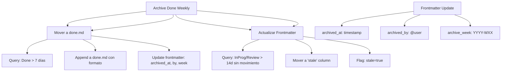

---
tags:
  - kanban/todo
  - type/task
  - domain/KAN
  - priority/P1
parent: "[[desarrollo]]"
children: []
depends_on:
  - "[[KAN-006]]"
blocks: []
status: todo
assignee: "@dev"
created: 2026-08-04
updated: 2026-08-04
---

# [[KAN-008]] Archive Done: Mover a done.md Semanal, Limpiar In-Progress/Review

## Descripción
Definir el proceso de archivado semanal: mover tareas Done a done.md, limpiar columnas In Progress/Review.

## Código de Ejemplo
```markdown
# Archive Done - Proceso Semanal

## Frecuencia y Trigger
- **Frecuencia**: Semanal (ej. Viernes EOD o Lunes AM)
- **Trigger**: Manual (botón "Archive Done") o Job programado (Viernes 18:00)
- **Responsable**: Scrum Master / Kanban Master

## Proceso de Archivado

### 1. Identificar Tarjetas Done
```sql
-- Tarjetas en Done hace > 7 días
SELECT * FROM kanban_cards 
WHERE column = 'done' 
AND updated_at < NOW() - INTERVAL 7 DAY
AND archived_at IS NULL;
```

### 2. Mover a done.md
```markdown
# docu/kanban/done.md

## 2024-01-15 a 2024-01-19 (Semana 3)

### ✅ Completadas
- [[TASK-123]] Feature: Login 2FA - **Done** 2024-01-15 | 3pts | @dev
- [[TASK-124]] Fix: Memory leak queue worker - **Done** 2024-01-16 | 5pts | @devops
- [[TASK-125]] Feature: Dark mode toggle - **Done** 2024-01-17 | 8pts | @frontend

### 📊 Resumen Semana
- **Completadas**: 12 tarjetas
- **Story Points**: 34 pts
- **Throughput**: 12 tarjetas/semana
- **Cycle Time Avg**: 3.2 días
```

### 3. Limpiar Columnas In Progress / Review
```sql
-- Mover a 'Stale' si > 14 días sin movimiento en In Progress/Review
UPDATE kanban_cards 
SET column = 'stale', stale_at = NOW()
WHERE column IN ('in_progress', 'review')
AND updated_at < NOW() - INTERVAL 14 DAY
AND archived_at IS NULL;
```

### 3. Actualizar Frontmatter
```yaml
# En cada tarjeta archivada
archived_at: 2024-01-19T18:00:00Z
archived_by: "@dev"
archive_week: "2024-W03"
```

## Diagramas Mermaid


## Criterios de Aceptación
- [ ] Frecuencia: Semanal (Viernes EOD o Lunes AM)
- [ ] Mover Done > 7 días a `done.md` con formato estándar
- [ ] Formato done.md: Semana + lista + resumen métricas
- [ ] Frontmatter actualizado: `archived_at`, `archived_by`, `archive_week`
- [ ] Limpiar In Progress/Review: mover a `stale` si > 14 días sin movimiento
- [ ] Frontmatter stale: `stale=true`, `stale_at`, `stale_reason`
- [ ] Job automático: Viernes 18:00 o Lunes 09:00 (configurable)
- [ ] Log de archivado en `docu/kanban/archive.log`

## Notas Técnicas
- `done.md`: Acumulativo, no borrar histórico
- `stale` column: Para tarjetas abandonadas, no borrar
- Job programado: Laravel Scheduler (Viernes 18:00 / Lunes 09:00)
- `archived_by`: Usuario que ejecuta el archive
- `archive_week`: Formato `YYYY-WXX` (ISO week)
- Métricas semanales en done.md: throughput, cycle time, SP completados

## Enlaces
- [[KAN-001]] Setup Inicial
- [[KAN-003]] Daily Standup
- [[KAN-006]] Retrospectiva