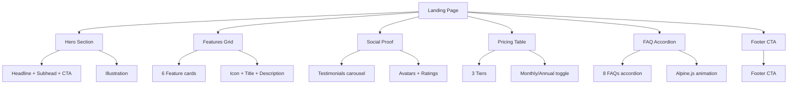

---
tags:
  - "kanban/done"
  - "type/task"
  - "domain/PUB"
  - "priority/P0"
parent: "[[desarrollo]]"
children: []
depends_on:
  - "[[CSS-006]]"
  - "[[CSS-007]]"
  - "[[CSS-009]]"
  - "[[CSS-018]]"
  - "[[CSS-019]]"
  - "[[WEB-001]]"
  - "[[WEB-002]]"
  - "[[WEB-004]]"
blocks:
  - "[[PUB-002]]"
  - "[[PUB-003]]"
  - "[[PUB-004]]"
  - "[[CLI-001]]"
  - "[[CRE-001]]"
status: "done"
assignee: "@dev"
created: "2026-08-04"
updated: "2026-08-06"
---

# [[PUB-001]] Landing Page SSR: Hero, Features, Social Proof, Pricing, CTA, Footer

## Descripción
Implementar landing page pública con SSR (Blade): Hero section, Features grid, Social Proof/Testimonios, Pricing tables, FAQ accordion, Footer. SEO optimizado.

## Código de Ejemplo
```blade
{{-- resources/views/domains/public/landing.blade.php --}}
@extends('layouts.public')

@section('title', 'TG-PayGate - Monetiza tu canal de Telegram')

@section('content')
{{-- Hero Section --}}
<section class="hero relative overflow-hidden bg-gradient-to-b from-accent-50 to-white dark:from-dark-900 dark:to-dark-800">
    <div class="container mx-auto px-4 py-20 lg:py-32">
        <div class="max-w-3xl mx-auto text-center">
            <span class="inline-block px-3 py-1 rounded-full bg-accent-100 text-accent-700 dark:bg-accent-900 dark:text-accent-300 text-sm font-medium mb-6">
                Nuevo: Monetiza tu canal de Telegram en minutos
            </span>
            <h1 class="text-4xl lg:text-6xl font-bold text-text-primary mb-6 leading-tight">
                Vende accesos a tu canal<br><span class="text-accent-primary">sin complicaciones</span>
            </h1>
            <p class="text-lg lg:text-xl text-text-secondary mb-8 max-w-2xl mx-auto">
                Automatiza pagos, genera enlaces de invitación únicos y expulsa usuarios expirados. Todo desde un panel intuitivo.
            </p>
            <div class="flex flex-col sm:flex-row items-center justify-center gap-4">
                <a href="{{ route('creadores.register') }}" class="btn btn--primary btn--lg w-full sm:w-auto">
                    Empezar gratis
                    <x-icon name="arrow-right" class="ml-2" />
                </a>
                <a href="{{ route('channels.index') }}" class="btn btn--ghost btn--lg w-full sm:w-auto">
                    Ver canales
                </a>
            </div>
            <p class="mt-6 text-sm text-text-muted">Sin tarjeta de crédito • Setup en 5 min • Cancelar cuando quieras</p>
        </div>
        
        {{-- Hero Illustration --}}
        <div class="mt-16 relative">
            
        </div>
    </div>
</section>

{{-- Features Section --}}
<section class="features py-20 bg-white dark:bg-dark-900">
    <div class="container mx-auto px-4">
        <header class="text-center mb-16">
            <h2 class="text-3xl lg:text-4xl font-bold text-text-primary mb-4">Todo lo que necesitas</h2>
            <p class="text-text-secondary max-w-2xl mx-auto">Herramientas completas para creadores y plataforma segura para usuarios.</p>
        </header>
        
        <div class="grid grid-cols-1 md:grid-cols-2 lg:grid-cols-3 gap-8">
            @foreach($features as $feature)
            <article class="feature-card p-6 rounded-2xl border border-border-primary bg-bg-secondary hover:border-accent-primary hover:shadow-lg transition-all">
                <div class="w-12 h-12 rounded-lg bg-accent-100 dark:bg-accent-900 flex items-center justify-center mb-4">
                    <x-icon :name="$feature['icon']" class="w-6 h-6 text-accent-700 dark:text-accent-300" />
                </div>
                <h3 class="text-xl font-semibold text-text-primary mb-2">{{ $feature['title'] }}</h3>
                <p class="text-text-secondary">{{ $feature['description'] }}</p>
            </article>
            @endforeach
        </div>
    </div>
</section>

{{-- Social Proof --}}
<section class="social-proof py-20 bg-bg-tertiary">
    <div class="container mx-auto px-4">
        <header class="text-center mb-16">
            <h2 class="text-3xl lg:text-4xl font-bold text-text-primary mb-4">Confiado por creadores</h2>
        </header>
        <div class="grid grid-cols-1 md:grid-cols-3 gap-8">
            @foreach($testimonials as $testimonial)
            <article class="testimonial-card p-6 rounded-2xl border border-border-primary bg-bg-secondary">
                <div class="flex items-center gap-3 mb-4">
                    <x-avatar :name="$testimonial['author']" :src="$testimonial['avatar']" size="sm" />
                    <div>
                        <p class="font-medium text-text-primary">{{ $testimonial['author'] }}</p>
                        <p class="text-sm text-text-muted">{{ $testimonial['role'] }}</p>
                    </div>
                </div>
                <p class="text-text-secondary mb-4">"{{ $testimonial['content'] }}"</p>
                <div class="flex gap-1" aria-label="Rating 5 estrellas">
                    @for($i = 0; $i < 5; $i++)
                        <x-icon name="star" class="w-5 h-5 text-warning" fill="currentColor" />
                    @endfor
                </div>
            </article>
            @endforeach
        </div>
    </div>
</section>

{{-- Pricing --}}
<x-pricing-table />

{{-- FAQ --}}
<section class="faq py-20 bg-white dark:bg-dark-900">
    <div class="container mx-auto px-4 max-w-3xl">
        <header class="text-center mb-16">
            <h2 class="text-3xl lg:text-4xl font-bold text-text-primary mb-4">Preguntas frecuentes</h2>
        </header>
        <div class="space-y-4" x-data="accordion()">
            @foreach($faqs as $index => $faq)
            <details class="group bg-bg-secondary border border-border-primary rounded-lg overflow-hidden">
                <summary class="flex items-center justify-between p-6 cursor-pointer list-none" @click="toggle({{ $index }})">
                    <h3 class="text-lg font-semibold text-text-primary">{{ $faq['question'] }}</h3>
                    <x-icon name="chevron-down" class="w-5 h-5 text-text-muted transition-transform duration-200 group-open:rotate-180" />
                </summary>
                <div class="px-6 pb-6 text-text-secondary" x-show="open === {{ $index }}" x-transition>
                    {{ $faq['answer'] }}
                </div>
            </details>
            @endforeach
        </div>
    </div>
</section>

{{-- Footer CTA --}}
<section class="cta py-20 bg-gradient-to-r from-accent-600 to-accent-700">
    <div class="container mx-auto px-4 text-center">
        <h2 class="text-3xl lg:text-4xl font-bold text-white mb-4">¿Listo para empezar?</h2>
        <p class="text-accent-100 mb-8 max-w-2xl mx-auto">Únete a miles de creadores que ya monetizan su audiencia con TG-PayGate.</p>
        <a href="{{ route('creadores.register') }}" class="btn btn--lg bg-white text-accent-700 hover:bg-accent-50 px-8 py-3">
            Crear mi cuenta gratis
        </a>
    </div>
</section>
@endsection
```

```php
// routes/domains/public.php
Route::get('/', [ChannelController::class, 'index'])->name('home');
Route::get('/canales', [ChannelController::class, 'index'])->name('channels.index');
Route::get('/canal/{slug}', [ChannelController::class, 'show'])->name('channels.show');
Route::get('/checkout/{channel}', [CheckoutController::class, 'create'])->name('checkout.create');
Route::post('/checkout/{channel}', [CheckoutController::class, 'store'])->name('checkout.store');
Route::get('/checkout/success/{subscription}', [CheckoutController::class, 'success'])->name('checkout.success');
```

## Diagramas Mermaid


## Criterios de Aceptación
- [ ] Hero: Headline, subhead, CTA principal, ilustración, trust signals
- [ ] Features: 6 cards con iconos, responsive grid (1/2/3 cols)
- [ ] Social Proof: 3 testimoniales con avatar, rating 5 estrellas
- [ ] Pricing: 3 tiers (Starter/Pro/Enterprise), toggle mensual/anual
- [ ] FAQ: 8 preguntas, accordion Alpine.js con animación
- [ ] Footer: 4 columnas, newsletter signup, links legales
- [ ] SEO: Meta tags, Open Graph, JSON-LD, sitemap
- [ ] Dark mode compatible
- [ ] Responsive: mobile-first, breakpoints UI-004
- [ ] Performance: Critical CSS, lazy images, preconnect

## Notas Técnicas
- Usar layout `layouts.public` (PUB-001 depende de UI-003)
- Pricing toggle: Alpine.js para switch mensual/anual
- FAQ: Alpine.js accordion con animación slide
- Imágenes: lazy loading, WebP + fallback
- JSON-LD para Organization, WebSite, FAQPage

## Enlaces
- [[CSS-009]] Card Component
- [[CSS-018]] Pagination (pricing toggle)
- [[CSS-013]] Tabs/Accordion (FAQ)
- [[WEB-004]] Landing Assets
- [[UI-003]] PublicLayout
- [[PUB-002]] Listado Canales