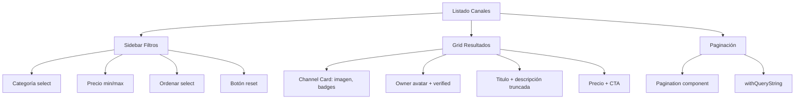

---
tags:
  - kanban/todo
  - type/task
  - domain/PUB
  - priority/P0
parent: "[[desarrollo]]"
children: []
depends_on:
  - "[[PUB-001]]"
  - "[[FUN-005]]"
  - "[[FUN-006]]"
blocks:
  - "[[PUB-003]]"
  - "[[PUB-004]]"
status: todo
assignee: "@dev"
created: 2026-08-04
updated: 2026-08-04
---

# [[PUB-002]] Listado Canales: Filtros, Búsqueda, Paginación, SEO

## Descripción
Implementar listado público de canales con filtros por categoría, precio, rating; búsqueda full-text; paginación; SEO con slugs, meta tags, Open Graph, JSON-LD.

## Código de Ejemplo
```php
// app/Domains/Public/Http/Controllers/ChannelController.php
public function index(Request $request)
{
    $query = CanalPago::with(['category', 'owner'])
        ->where('status', 'active')
        ->where('is_public', true);

    // Filtros
    if ($request->filled('category')) {
        $query->whereHas('category', fn($q) => $q->where('slug', $request->category));
    }
    if ($request->filled('price_min')) {
        $query->where('price', '>=', $request->price_min);
    }
    if ($request->filled('price_max')) {
        $query->where('price', '<=', $request->price_max);
    }
    if ($request->filled('search')) {
        $query->where(function($q) use ($request) {
            $q->where('name', 'LIKE', "%{$request->search}%")
              ->orWhere('description', 'LIKE', "%{$request->search}%");
        });
    }

    // Ordenación
    $sort = $request->get('sort', 'popular');
    match($sort) {
        'newest' => $query->latest(),
        'price_asc' => $query->orderBy('price', 'asc'),
        'price_desc' => $query->orderBy('price', 'desc'),
        'rating' => $query->orderBy('rating', 'desc'),
        default => $query->orderBy('subscribers_count', 'desc'),
    };

    $canales = $query->paginate(12)->withQueryString();

    return view('domains.public.channels.index', [
        'canales' => $canales,
        'categories' => Category::where('is_active', true)->get(),
        'currentFilters' => $request->only(['category', 'price_min', 'price_max', 'search', 'sort']),
    ]);
}
```

```blade
{{-- resources/views/domains/public/channels/index.blade.php --}}
@extends('layouts.public')

@section('title', 'Canales Premium - TG-PayGate')

@section('content')
<div class="container mx-auto px-4 py-8">
    {{-- Header + Filtros --}}
    <div class="mb-8">
        <header class="mb-6">
            <h1 class="text-3xl lg:text-4xl font-bold text-text-primary mb-2">Canales Premium</h1>
            <p class="text-text-secondary">Descubre contenido exclusivo de los mejores creadores</p>
        </header>

        {{-- Filtros Sidebar + Resultados --}}
        <div class="flex flex-col lg:flex-row gap-8">
            {{-- Sidebar Filtros --}}
            <aside class="lg:w-64 flex-shrink-0">
                <div class="bg-bg-secondary border border-border-primary rounded-xl p-6 sticky top-24">
                    <h3 class="font-semibold text-text-primary mb-4">Filtros</h3>
                    
                    {{-- Categoría --}}
                    <div class="mb-6">
                        <label class="block text-sm font-medium text-text-secondary mb-2">Categoría</label>
                        <select wire:model="filters.category" class="select select--sm w-full">
                            <option value="">Todas</option>
                            @foreach($categories as $cat)
                            <option value="{{ $cat->slug }}">{{ $cat->name }}</option>
                            @endforeach
                        </select>
                    </div>

                    {{-- Rango Precio --}}
                    <div class="mb-6">
                        <label class="block text-sm font-medium text-text-secondary mb-2">Precio (mensual)</label>
                        <div class="flex items-center gap-2">
                            <input type="number" wire:model.debounce.300ms="filters.price_min" placeholder="Min" class="input input--sm flex-1" min="0" step="1">
                            <input type="number" wire:model.debounce.300ms="filters.price_max" placeholder="Max" class="input input--sm flex-1" min="0" step="1">
                        </div>
                    </div>

                    {{-- Ordenar --}}
                    <div class="mb-6">
                        <label class="block text-sm font-medium text-text-secondary mb-2">Ordenar por</label>
                        <select wire:model="filters.sort" class="select select--sm w-full">
                            <option value="popular">Más populares</option>
                            <option value="newest">Más recientes</option>
                            <option value="price_asc">Precio: menor a mayor</option>
                            <option value="price_desc">Precio: mayor a menor</option>
                            <option value="rating">Mejor valorados</option>
                        </select>
                    </div>

                    {{-- Reset --}}
                    <button wire:click="resetFilters" class="btn btn--ghost btn--sm btn--full-width">
                        Limpiar filtros
                    </button>
                </div>
            </aside>

            {{-- Resultados --}}
            <div class="flex-1">
                @if($canales->isEmpty())
                    <x-empty-state 
                        illustration="empty-search"
                        title="No se encontraron canales"
                        description="Intenta ajustar tus filtros o buscar con otros términos"
                        ctaText="Limpiar filtros"
                        ctaUrl="{{ route('channels.index') }}"
                    />
                @else
                    <div class="grid grid-cols-1 sm:grid-cols-2 lg:grid-cols-3 gap-6" x-data="{ view: 'grid' }">
                        @foreach($canales as $canal)
                            <x-channel-card :channel="$canal" />
                        @endforeach
                    </div>

                    {{-- Paginación --}}
                    <div class="mt-8">
                        <x-pagination :paginator="$canales" />
                    </div>
                @endif
            </div>
        </div>
    </div>
</div>
@endsection
```

```blade
{{-- resources/views/components/channel-card.blade.php --}}
@props(['channel'])

<article class="channel-card card card--elevated card--interactive overflow-hidden">
    <div class="relative aspect-video overflow-hidden">
        cover_image ?? asset('images/channel-placeholder.svg') }}" 
             alt="{{ $channel->name }}" 
             class="w-full h-full object-cover"
             loading="lazy">
        <div class="absolute top-3 right-3 flex gap-2">
            <span class="badge badge--success badge--sm">{{ $channel->subscribers_count }} suscriptores</span>
            @if($channel->rating >= 4.5)
            <span class="badge badge--warning badge--sm flex items-center gap-1">
                <x-icon name="star" class="w-3 h-3 fill-current" />
                {{ $channel->rating }}
            </span>
            @endif
        </div>
    </div>
    
    <div class="p-5">
        <div class="flex items-center gap-2 mb-2">
            <x-avatar :name="$channel->owner->name" :src="$channel->owner->avatar_url" size="xs" />
            <span class="text-sm text-text-secondary">{{ $channel->owner->name }}</span>
            @if($channel->is_verified)
            <x-icon name="shield-check" class="w-4 h-4 text-accent-primary" title="Canal verificado" />
            @endif
        </div>
        
        <h3 class="text-lg font-semibold text-text-primary mb-1 line-clamp-1">
            <a href="{{ route('channels.show', $channel->slug) }}" class="hover:text-accent-primary transition-colors">
                {{ $channel->name }}
            </a>
        </h3>
        
        <p class="text-text-secondary text-sm mb-3 line-clamp-2">{{ $channel->short_description }}</p>
        
        <div class="flex items-center justify-between pt-3 border-t border-border-primary">
            <div class="text-text-primary font-semibold">{{ $channel->price }} {{ $channel->currency }}/mes</div>
            <a href="{{ route('channels.show', $channel->slug) }}" class="btn btn--primary btn--sm">
                Ver detalles
            </a>
        </div>
    </div>
</article>
```

## Diagramas Mermaid


## Criterios de Aceptación
- [ ] Filtros: Categoría (select), Precio min/max (number inputs), Ordenar (select)
- [ ] Búsqueda: full-text en nombre + descripción (Livewire debounce 300ms)
- [ ] Paginación: 12 por página, withQueryString para preservar filtros
- [ ] SEO: Slugs limpios, meta tags dinámicos, Open Graph, JSON-LD ItemList
- [ ] Channel Card: Imagen lazy, badges (suscriptores, rating), owner avatar, precio, CTA
- [ ] Empty state: ilustración + copy + CTA limpiar filtros
- [ ] Responsive: sidebar colapsable en móvil, grid 1/2/3 cols
- [ ] Wirewire/Livewire para filtros reactivos sin recarga completa

## Notas Técnicas
- Livewire component para filtros reactivos
- `withQueryString()` preserva filtros en paginación
- JSON-LD `ItemList` + `Product` para cada canal
- Imágenes: `loading="lazy"` + `aspect-video` container
- Truncate descripción: `line-clamp-2` CSS

## Enlaces
- [[PUB-001]] Landing Page
- [[PUB-003]] Detalle Canal
- [[PUB-004]] Checkout Flow
- [[CSS-009]] Card Component
- [[CSS-018]] Pagination
- [[CSS-008]] Form (Select, Input)
- [[FUN-005]] Spatie Permission (canales públicos)