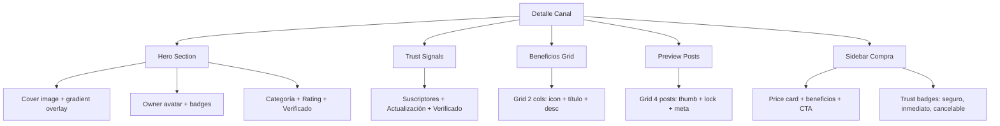

---
tags:
  - kanban/todo
  - type/task
  - domain/PUB
  - priority/P0
parent: "[[desarrollo]]"
children: []
depends_on:
  - "[[PUB-002]]"
  - "[[FUN-005]]"
  - "[[FUN-006]]"
  - "[[FUN-009]]"
blocks:
  - "[[PUB-004]]"
status: todo
assignee: "@dev"
created: 2026-08-04
updated: 2026-08-04
---

# [[PUB-003]] Detalle Canal: Preview, Beneficios, Precio, Botón Compra, Trust Signals

## Descripción
Implementar página de detalle de canal: preview de contenido, beneficios, precio, botón compra, trust signals (suscriptores, rating, verificado), JSON-LD Product.

## Código de Ejemplo
```blade
{{-- resources/views/domains/public/channels/show.blade.php --}}
@extends('layouts.public')

@section('title', $channel->name . ' - Canal Premium')

@section('head')
    {{-- JSON-LD Product --}}
    <script type="application/ld+json">
    {
        "@context": "https://schema.org/",
        "@type": "Product",
        "name": "{{ $channel->name }}",
        "description": "{{ $channel->description }}",
        "image": "{{ $channel->cover_image ?? asset('images/og-default.png') }}",
        "brand": {
            "@type": "Brand",
            "name": "{{ $channel->owner->name }}"
        },
        "offers": {
            "@type": "Offer",
            "url": "{{ request()->url() }}",
            "priceCurrency": "{{ $channel->currency }}",
            "price": "{{ $channel->price }}",
            "availability": "https://schema.org/InStock",
            "seller": {
                "@type": "Organization",
                "name": "TG-PayGate"
            }
        },
        "aggregateRating": {
            "@type": "AggregateRating",
            "ratingValue": "{{ $channel->rating }}",
            "reviewCount": "{{ $channel->reviews_count }}"
        }
    }
    </script>
@endsection

@section('content')
<div class="container mx-auto px-4 py-8">
    {{-- Breadcrumb --}}
    <x-breadcrumb :items="[
        ['label' => 'Inicio', 'url' => route('home')],
        ['label' => 'Canales', 'url' => route('channels.index')],
        ['label' => $channel->category->name, 'url' => route('channels.category', $channel->category->slug)],
        ['label' => $channel->name, 'url' => ''],
    ]" />
    
    <div class="grid lg:grid-cols-3 gap-8">
        {{-- Columna Principal --}}
        <div class="lg:col-span-2 space-y-8">
            {{-- Hero Canal --}}
            <article class="channel-hero">
                <div class="relative aspect-video rounded-2xl overflow-hidden mb-6">
                    cover_image ?? asset('images/channel-placeholder.svg') }}" 
                         alt="{{ $channel->name }}" 
                         class="w-full h-full object-cover">
                    <div class="absolute inset-0 bg-gradient-to-t from-black/60 to-transparent"></div>
                    <div class="absolute bottom-0 left-0 right-0 p-6 text-white">
                        <div class="flex items-center gap-3 mb-2">
                            <x-avatar :name="$channel->owner->name" :src="$channel->owner->avatar_url" size="sm" />
                            <div>
                                <p class="text-sm text-accent-100">{{ $channel->owner->name }}</p>
                                <div class="flex items-center gap-1">
                                    @if($channel->is_verified)
                                    <x-icon name="shield-check" class="w-4 h-4 text-warning" title="Canal verificado" />
                                    @endif
                                    <span class="text-sm text-white/90">{{ $channel->subscribers_count }} suscriptores</span>
                                </div>
                            </div>
                        </div>
                    </div>
                </div>
                
                <div class="flex items-center gap-4 mb-4">
                    <span class="badge badge--primary badge--lg">{{ $channel->category->name }}</span>
                    <div class="flex items-center gap-1 text-warning">
                        @for($i = 0; $i < 5; $i++)
                            <x-icon name="star" class="w-5 h-5 {{ $loop->index < $channel->rating ? 'fill-current text-warning' : 'text-text-muted' }}" />
                        @endfor
                        <span class="font-semibold">{{ $channel->rating }}</span>
                        <span class="text-text-muted">({{ $channel->reviews_count }} reseñas)</span>
                    </div>
                    @if($channel->is_verified)
                    <span class="badge badge--success flex items-center gap-1">
                        <x-icon name="shield-check" class="w-4 h-4" />
                        Verificado
                    </span>
                    @endif
                </div>
                
                <h1 class="text-3xl lg:text-4xl font-bold text-text-primary mb-4">{{ $channel->name }}</h1>
                <p class="text-lg text-text-secondary mb-6">{{ $channel->description }}</p>
                
                {{-- Trust Signals --}}
                <div class="flex flex-wrap items-center gap-6 text-sm text-text-secondary border-t border-border-primary pt-6">
                    <div class="flex items-center gap-2">
                        <x-icon name="users" class="w-5 h-5" />
                        <span>{{ number_format($channel->subscribers_count) }} suscriptores activos</span>
                    </div>
                    <div class="flex items-center gap-2">
                        <x-icon name="calendar" class="w-5 h-5" />
                        <span>Última actualización: {{ $channel->updated_at->format('d/m/Y') }}</span>
                    </div>
                    <div class="flex items-center gap-2">
                        <x-icon name="shield-check" class="w-5 h-5" />
                        <span>Contenido verificado</span>
                    </div>
                </div>
            </article>

            {{-- Beneficios --}}
            <section class="benefits">
                <h2 class="text-2xl font-bold text-text-primary mb-6">¿Qué incluye tu suscripción?</h2>
                <div class="grid md:grid-cols-2 gap-4">
                    @foreach($channel->benefits as $benefit)
                    <div class="flex items-start gap-3 p-4 bg-bg-secondary rounded-xl border border-border-primary">
                        <div class="w-10 h-10 rounded-lg bg-accent-100 dark:bg-accent-900 flex items-center justify-center flex-shrink-0">
                            <x-icon :name="$benefit['icon']" class="w-5 h-5 text-accent-700 dark:text-accent-300" />
                        </div>
                        <div>
                            <h4 class="font-semibold text-text-primary">{{ $benefit['title'] }}</h4>
                            <p class="text-sm text-text-secondary mt-1">{{ $benefit['description'] }}</p>
                        </div>
                    </div>
                    @endforeach
                </div>
            </section>

            {{-- Preview Contenido --}}
            <section class="preview">
                <div class="flex items-center justify-between mb-6">
                    <h2 class="text-2xl font-bold text-text-primary">Vista previa del contenido</h2>
                    <a href="{{ route('channels.show', $channel->slug) }}#posts" class="btn btn--ghost btn--sm">Ver todo</a>
                </div>
                <div class="grid md:grid-cols-2 gap-4">
                    @foreach($channel->latestPosts->take(4) as $post)
                    <article class="preview-card p-4 bg-bg-secondary rounded-xl border border-border-primary hover:border-accent-primary transition-colors">
                        <div class="aspect-video rounded-lg bg-bg-tertiary overflow-hidden mb-3 relative">
                            @if($post->thumbnail)
                            thumbnail }}" alt="" class="w-full h-full object-cover">
                            @else
                            <div class="w-full h-full flex items-center justify-center text-text-muted">
                                <x-icon name="video" class="w-8 h-8" />
                            </div>
                            @endif
                            @if($post->is_locked)
                            <div class="absolute inset-0 bg-black/50 flex items-center justify-center">
                                <x-icon name="lock-closed" class="w-8 h-8 text-white" />
                            </div>
                            @endif
                        </div>
                        <h4 class="font-semibold text-text-primary mb-1 line-clamp-1">{{ $post->title }}</h4>
                        <p class="text-sm text-text-secondary">{{ $post->published_at->format('d/m/Y') }} • {{ $post->duration }}</p>
                    </article>
                    @endforeach
                </div>
            </section>
        </div>

        {{-- Sidebar Compra --}}
        <div class="lg:col-span-1">
            <aside class="sticky top-24 space-y-6">
                {{-- Purchase Card --}}
                <article class="card card--elevated p-6">
                    <div class="text-center mb-6">
                        <span class="text-4xl font-bold text-text-primary">{{ $channel->price }}</span>
                        <span class="text-text-secondary">/ {{ $channel->currency }}/mes</span>
                    </div>
                    
                    <ul class="space-y-3 mb-6 text-sm">
                        <li class="flex items-center gap-2 text-text-secondary">
                            <x-icon name="check-circle" class="w-5 h-5 text-success" />
                            Acceso completo al canal
                        </li>
                        <li class="flex items-center gap-2 text-text-secondary">
                            <x-icon name="check-circle" class="w-5 h-5 text-success" />
                            Contenido exclusivo semanal
                        </li>
                        <li class="flex items-center gap-2 text-text-secondary">
                            <x-icon name="check-circle" class="w-5 h-5 text-success" />
                            Soporte prioritario
                        </li>
                        <li class="flex items-center gap-2 text-text-secondary">
                            <x-icon name="check-circle" class="w-5 h-5 text-success" />
                            Cancelar en cualquier momento
                        </li>
                    </ul>
                    
                    <form action="{{ route('checkout.create', $channel) }}" method="POST">
                        @csrf
                        <button type="submit" class="btn btn--primary btn--lg btn--full-width">
                            <x-icon name="lock-open" class="w-5 h-5 mr-2" />
                            Comprar acceso - {{ $channel->price }} {{ $channel->currency }}
                        </button>
                    </form>
                    
                    <p class="text-center text-sm text-text-muted mt-4">
                        Pago seguro • Acceso inmediato • Cancelar cuando quieras
                    </p>
                </article>

                {{-- Trust Badges --}}
                <div class="grid grid-cols-3 gap-4 text-center">
                    <div class="p-3 rounded-lg bg-bg-secondary border border-border-primary">
                        <x-icon name="shield-check" class="w-8 h-8 text-success mx-auto mb-1" />
                        <p class="text-xs text-text-secondary">Pago seguro</p>
                    </div>
                    <div class="p-3 rounded-lg bg-bg-secondary border border-border-primary">
                        <x-icon name="bolt" class="w-8 h-8 text-warning mx-auto mb-1" />
                        <p class="text-xs text-text-secondary">Acceso inmediato</p>
                    </div>
                    <div class="p-3 rounded-lg bg-bg-secondary border border-border-primary">
                        <x-icon name="arrow-uturn-left" class="w-8 h-8 text-info mx-auto mb-1" />
                        <p class="text-xs text-text-secondary">Cancelar 언제</p>
                    </div>
                </div>
            </aside>
        </div>
    </div>
</div>
@endsection
```

## Diagramas Mermaid


## Criterios de Aceptación
- [ ] Hero: Cover image, gradient overlay, owner avatar, badges (categoría, rating, verificado)
- [ ] Trust Signals: Suscriptores, última actualización, contenido verificado
- [ ] Beneficios: Grid 2 cols, icon + título + descripción
- [ ] Preview Posts: Grid 4 posts, thumbnail, lock overlay si premium, duración
- [ ] Sidebar: Price card, lista beneficios, botón compra, trust badges (seguro, inmediato, cancelable)
- [ ] JSON-LD Product + AggregateRating para SEO
- [ ] Meta tags Open Graph dinámicos (imagen cover, precio, rating)
- [ ] Responsive: sidebar sticky top-24, stack en móvil
- [ ] Botón compra → redirige a checkout (PUB-004)

## Notas Técnicas
- JSON-LD Product + AggregateRating + Offer
- Meta tags OG dinámicos: og:image=cover, og:price, og:rating
- Trust signals hardcoded + dinámicos (suscriptores, updated_at)
- Beneficios desde array en modelo CanalPago
- Preview posts: relación hasMany, solo 4 últimos, lock overlay CSS

## Enlaces
- [[PUB-002]] Listado Canales
- [[PUB-004]] Checkout Flow
- [[CSS-009]] Card Component
- [[CSS-007]] Button
- [[CSS-016]] Avatar
- [[CSS-017]] Badge
- [[WEB-002]] OG Image Template