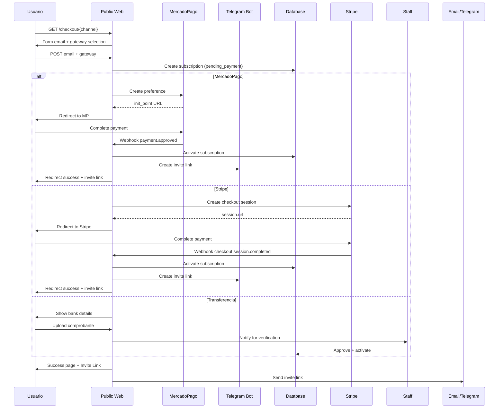

---
tags:
  - kanban/todo
  - type/task
  - domain/PUB
  - priority/P0
parent: "[[desarrollo]]"
children: []
depends_on:
  - "[[PUB-003]]"
  - "[[FUN-006]]"
  - "[[FUN-005]]"
  - "[[CRE-014]]"
  - "[[PUB-015]]"
  - "[[PUB-016]]"
blocks:
  - "[[PUB-005]]"
  - "[[CLI-001]]"
  - "[[CRE-001]]"
status: todo
assignee: "@dev"
created: 2026-08-04
updated: 2026-08-04
---

# [[PUB-004]] Checkout Flow: Step 1 Email → Step 2 Pago → Step 3 Éxito + Invite Link

## Descripción
Implementar flujo de checkout completo en 3 pasos: captura de email, procesamiento de pago (MercadoPago/Stripe/Transferencia), generación de invite link Telegram y confirmación.

## Código de Ejemplo
```php
// app/Domains/Public/Http/Controllers/CheckoutController.php
namespace App\Domains\Public\Http\Controllers;

use App\Models\{ChannelPago, Subscription, Payment, User};
use App\Services\{MercadoPagoArgentinaService, StripeService, TelegramService};

class CheckoutController extends Controller
{
    public function __construct(
        protected MercadoPagoArgentinaService $mpService,
        protected StripeService $stripeService,
        protected TelegramService $telegramService
    ) {}

    public function create(ChannelPago $channel)
    {
        $gatewayMethods = $this->getAvailableGateways($channel);
        
        return view('domains.public.checkout.create', compact('channel', 'gatewayMethods'));
    }

    public function store(ChannelPago $channel, CheckoutRequest $request)
    {
        $user = $this->getOrCreateUser($request->email);
        
        // Verificar si ya tiene suscripción activa
        $existing = Subscription::where('user_id', $user->id)
            ->where('channel_pago_id', $channel->id)
            ->whereIn('status', ['active', 'pending_payment'])
            ->first();

        if ($existing) {
            return redirect()->route('checkout.show', $existing)
                ->with('info', 'Ya tienes una suscripción activa o pendiente para este canal');
        }

        $subscription = Subscription::create([
            'user_id' => $user->id,
            'channel_pago_id' => $channel->id,
            'status' => 'pending_payment',
            'price' => $channel->price,
            'currency' => $channel->currency,
            'billing_cycle' => 'monthly',
            'external_reference' => "sub_{$user->id}_{$channel->id}_" . time(),
        ]);

        // Redirigir según pasarela seleccionada
        $gateway = $request->gateway;
        
        return match($gateway) {
            'mercadopago' => $this->redirectToMercadoPago($subscription),
            'stripe' => $this->redirectToStripe($subscription),
            'bank_transfer' => redirect()->route('checkout.bank-transfer', $subscription),
            default => back()->withErrors(['gateway' => 'Pasarela no válida']),
        };
    }

    private function redirectToMercadoPago(Subscription $subscription): RedirectResponse
    {
        $channel = $subscription->channel;
        $mpService = $this->mpService->setCredentials($channel);
        
        $preference = $mpService->createCheckoutPreference([
            'item_id' => $subscription->id,
            'title' => "Acceso a {$subscription->channel->name}",
            'description' => "Suscripción mensual a {$subscription->channel->name}",
            'price' => $subscription->price,
            'payer_email' => $subscription->user->email,
            'payer_name' => $subscription->user->name,
            'payer_phone' => $subscription->user->phone ?? '',
            'payer_dni' => $subscription->user->dni ?? '',
            'channel_id' => $channel->id,
            'channel_slug' => $channel->slug,
            'external_reference' => $subscription->external_reference,
        ]);

        $subscription->update([
            'mercadopago_preference_id' => $preference['id'],
            'status' => 'pending_payment',
        ]);

        return redirect($preference['init_point']);
    }

    private function redirectToStripe(Subscription $subscription): RedirectResponse
    {
        $stripe = new \Stripe\StripeClient(config('services.stripe.secret'));
        
        $session = $stripe->checkout->sessions->create([
            'payment_method_types' => ['card'],
            'line_items' => [[
                'price_data' => [
                    'currency' => strtolower($subscription->currency),
                    'product_data' => [
                        'name' => "Acceso a {$subscription->channel->name}",
                    ],
                    'unit_amount' => $subscription->price * 100, // centavos
                ],
                'quantity' => 1,
            ]],
            'mode' => 'subscription',
            'success_url' => route('checkout.success', $subscription) . '?session_id={CHECKOUT_SESSION_ID}',
            'cancel_url' => route('checkout.cancel', $subscription),
            'customer_email' => $subscription->user->email,
            'metadata' => [
                'subscription_id' => $subscription->id,
                'channel_id' => $subscription->channel_id,
            ],
        ]);

        $subscription->update(['stripe_session_id' => $session->id]);
        
        return redirect($session->url);
    }

    public function success(Subscription $subscription, Request $request)
    {
        $this->verifyPayment($subscription);
        
        if ($subscription->status === 'active') {
            $inviteLink = $this->generateTelegramInviteLink($subscription);
            
            // Enviar notificaciones
            $this->sendSuccessNotifications($subscription, $inviteLink);
            
            return view('domains.public.checkout.success', compact('subscription', 'inviteLink'));
        }
        
        return view('domains.public.checkout.pending', compact('subscription'));
    }

    private function verifyPayment(Subscription $subscription): void
    {
        if ($subscription->mercadopago_preference_id) {
            $channel = $subscription->channel;
            $mpService = $this->mpService->setCredentials($channel);
            $payment = $this->mpService->getPaymentByExternalReference($subscription->external_reference);
            
            if ($payment && $payment['status'] === 'approved') {
                $this->activateSubscription($subscription, $payment);
            }
        }
        
        if ($subscription->stripe_session_id) {
            $session = (new \Stripe\StripeClient(config('services.stripe.secret')))
                ->checkout->sessions->retrieve($subscription->stripe_session_id);
            
            if ($session->payment_status === 'paid') {
                $this->activateSubscription($subscription, $session);
            }
        }
    }

    private function activateSubscription(Subscription $subscription, $payment): void
    {
        $subscription->update([
            'status' => 'active',
            'activated_at' => now(),
            'renews_at' => now()->addMonth(),
            'mercadopago_payment_id' => $payment['id'] ?? null,
            'stripe_payment_intent_id' => $payment->payment_intent ?? null,
        ]);
    }

    private function generateTelegramInviteLink(Subscription $subscription): string
    {
        $telegramService = app(TelegramService::class);
        $channel = $subscription->channel;
        
        $inviteLink = $telegramService->createInviteLink(
            $channel->telegram_chat_id,
            $channel->telegram_bot_token,
            [
                'member_limit' => 1,
                'expire_date' => now()->addHours(24)->timestamp,
                'creates_join_request' => false,
            ]
        );

        $subscription->update([
            'telegram_invite_link' => $inviteLink,
            'invite_expires_at' => now()->addHours(24),
        ]);

        return $inviteLink;
    }

    private function sendSuccessNotifications(Subscription $subscription, string $inviteLink): void
    {
        // Email
        Mail::to($subscription->user->email)->send(
            new \App\Mail\SubscriptionActivatedMail($subscription, $inviteLink)
        );

        // Telegram (si usuario tiene telegram_id)
        if ($subscription->user->telegram_id) {
            app(\App\Services\TelegramService::class)->sendMessage(
                $subscription->user->telegram_id,
                "🎉 ¡Tu suscripción a {$subscription->channel->name} está activa!\n\n"
                . "Accede al canal: {$inviteLink}\n\n"
                . "El enlace expira en 24 horas y es de un solo uso."
            );
        }

        // Notificar creador
        $creator = $subscription->channel->owner;
        if ($creator->telegram_id && $creator->settings['notifications']['telegram_new_sub'] ?? true) {
            app(\App\Services\TelegramService::class)->sendMessage(
                $creator->telegram_id,
                "🎉 ¡Nueva suscripción en {$subscription->channel->name}!\n"
                . "Usuario: {$subscription->user->name}\n"
                . "Monto: {$subscription->price} {$subscription->currency}"
            );
        }
    }
}
```

```blade
{{-- resources/views/domains/public/checkout/create.blade.php --}}
@extends('layouts.public')

@section('content')
<div class="container mx-auto px-4 py-8 max-w-2xl">
    <div class="mb-8">
        <h1 class="text-2xl font-bold text-text-primary">Completar Compra</h1>
        <p class="text-text-secondary">Paso 1 de 3: Ingresa tu email para continuar</p>
    </div>

    <form action="{{ route('checkout.store', $channel) }}" method="POST" class="space-y-6">
        @csrf

        <div class="card card--elevated p-6">
            <div class="flex items-center gap-4 mb-6">
                cover_image ?? asset('images/channel-placeholder.svg') }}" 
                     alt="" class="w-16 h-16 rounded-lg object-cover">
                <div>
                    <h2 class="text-xl font-semibold text-text-primary">{{ $channel->name }}</h2>
                    <p class="text-text-secondary">{{ $channel->owner->name }}</p>
                </div>
            </div>

            <div class="mb-4">
                <label class="label">Email</label>
                <input type="email" name="email" class="input" placeholder="tu@email.com" required autocomplete="email">
            </div>

            <div>
                <label class="label">Método de Pago</label>
                <div class="space-y-3 mt-2">
                    @foreach($gatewayMethods as $method)
                    <label class="flex items-center gap-3 p-4 border border-border-primary rounded-lg cursor-pointer hover:bg-bg-tertiary transition-colors">
                        <input type="radio" name="gateway" value="{{ $method['key'] }}" class="radio" required>
                        <div class="flex-1">
                            <div class="flex items-center gap-2">
                                <x-icon :name="$method['icon']" class="w-5 h-5 text-accent-primary" />
                                <span class="font-medium text-text-primary">{{ $method['label'] }}</span>
                            </div>
                            <p class="text-sm text-text-secondary ml-7">{{ $method['description'] }}</p>
                        </div>
                    </label>
                    @endforeach
                </div>
            </div>
        </div>

        <button type="submit" class="btn btn--primary btn--lg btn--full-width">
            Continuar al Pago
            <x-icon name="arrow-right" class="w-4 h-4 ml-2" />
        </button>
    </form>
</div>
@endsection
```

```blade
{{-- resources/views/domains/public/checkout/success.blade.php --}}
@extends('layouts.public')

@section('content')
<div class="container mx-auto px-4 py-16 max-w-2xl text-center">
    <div class="w-20 h-20 mx-auto mb-6 bg-success-100 dark:bg-success-900/30 rounded-full flex items-center justify-center">
        <x-icon name="check-circle" class="w-10 h-10 text-success-600" />
    </div>
    
    <h1 class="text-3xl font-bold text-text-primary mb-4">¡Compra Confirmada!</h1>
    <p class="text-lg text-text-secondary mb-8">
        Tu suscripción a <strong>{{ $subscription->channel->name }}</strong> está activa.
    </p>

    <div class="card card--elevated p-6 mb-8 text-left">
        <h3 class="font-semibold text-text-primary mb-4">Tu Enlace de Acceso</h3>
        <p class="text-text-secondary mb-4">Haz clic en el botón para unirte al canal de Telegram:</p>
        
        <a href="{{ $inviteLink }}" target="_blank" class="btn btn--primary btn--lg btn--full-width">
            <x-icon name="send" class="w-5 h-5 mr-2" />
            Unirme al Canal en Telegram
        </a>
        
        <div class="mt-4 p-3 bg-warning-50 dark:bg-warning-900/30 rounded-lg text-sm text-warning-700 dark:text-warning-300">
            <x-icon name="alert-triangle" class="w-4 h-4 inline mr-1" />
            <strong>Importante:</strong> Este enlace expira en 24 horas y es de un solo uso. 
            Haz clic ahora para unirte al canal.
        </div>
    </div>

    <div class="space-y-4 text-sm text-text-secondary">
        <p>Se ha enviado el enlace a tu email: <strong>{{ $subscription->user->email }}</strong></p>
        @if($subscription->user->telegram_id)
        <p>También te lo enviamos por Telegram.</p>
        @endif
    </div>

    <div class="mt-8 pt-8 border-t border-border-primary">
        <p class="text-text-secondary">¿Necesitas ayuda? <a href="{{ route('client.support.create') }}" class="text-accent-primary hover:underline">Contactar soporte</a></p>
    </div>
</div>
@endsection
```

## Diagramas Mermaid


## Criterios de Aceptación
- [ ] Paso 1: Formulario email + selección gateway (MP, Stripe, Transferencia)
- [ ] Paso 2: Redirección a pasarela (MP init_point / Stripe Checkout URL / Datos banco)
- [ ] Paso 3: Webhook procesa pago → activa suscripción → genera invite link Telegram
- [ ] Invite link: único, temporal (24h), member_limit=1, vía Bot API `createChatInviteLink`
- [ ] Página éxito: muestra invite link prominente, aviso expiración 24h, un solo uso
- [ ] Notificaciones: Email + Telegram (si configurado) con invite link
- [ ] Notificar creador: nuevo suscriptor (Telegram/Email)
- [ ] Manejo errores: pago rechazado, expirado, duplicado
- [ ] Idempotencia: external_reference único por suscripción

## Notas Técnicas
- MercadoPago: `createPreference` → `init_point` → webhook `payment.approved`
- Stripe: `checkout.sessions.create` → webhook `checkout.session.completed`
- Telegram: `createChatInviteLink` con `member_limit=1`, `expire_date=now+24h`
- Idempotencia: `external_reference` único por suscripción
- Job: `ProcessPendingPayments` cada 5 min para pagos pendientes

## Enlaces
- [[PUB-003]] Detalle canal (botón compra)
- [[PUB-005]] Registro usuario (si no existe)
- [[PUB-006]] Pasarela integración
- [[PUB-007]] Webhook handler
- [[PUB-008]] Telegram Bot API
- [[CRE-014]] MercadoPago config creador
- [[INS-011]] Instalador config pasarelas