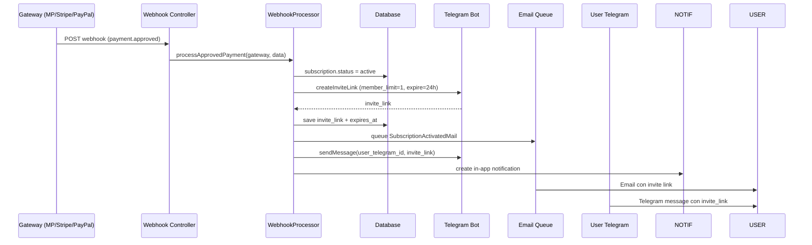

---
tags:
  - kanban/todo
  - type/task
  - domain/PUB
  - priority/P0
parent: "[[desarrollo]]"
children: []
depends_on:
  - "[[PUB-006]]"
  - "[[FUN-005]]"
  - "[[FUN-006]]"
blocks:
  - "[[PUB-005]]"
  - "[[CRE-013]]"
  - "[[PUB-008]]"
status: todo
assignee: "@dev"
created: 2026-08-04
updated: 2026-08-04
---

# [[PUB-007]] Webhook Handler: Verified → Crear Suscripción → Generate Invite Link → Email + Telegram Notify

## Descripción
Implementar handler unificado de webhooks para procesar pagos aprobados: actualizar suscripción, generar invite link Telegram, enviar notificaciones email/Telegram.

## Código de Ejemplo
```php
// app/Domains/Public/Services/WebhookProcessor.php
namespace App\Domains\Public\Services;

use App\Models\{Subscription, ChannelPago, User};
use App\Services\{TelegramService, MercadoPagoArgentinaService, StripeService};

class WebhookProcessor
{
    public function processApprovedPayment(string $gateway, array $paymentData): void
    {
        $externalRef = $this->extractExternalReference($gateway, $paymentData);
        $subscription = Subscription::where('external_reference', $externalRef)->first();
        
        if (!$subscription || $subscription->status === 'active') {
            \Log::info("Webhook duplicate/ignored", ['ref' => $externalRef]);
            return;
        }

        // Activar suscripción
        $subscription->update([
            'status' => 'active',
            'activated_at' => now(),
            'renews_at' => now()->addMonth(),
            "{$gateway}_payment_id" => $this->extractPaymentId($gateway, $paymentData),
        ]);

        // Generar invite link Telegram
        $inviteLink = $this->generateTelegramInviteLink($subscription);
        
        // Notificaciones
        $this->sendNotifications($subscription, $inviteLink);
    }

    private function extractExternalReference(string $gateway, array $paymentData): string
    {
        return match($gateway) {
            'mercadopago' => $paymentData['external_reference'] ?? '',
            'stripe' => $paymentData['metadata']['external_reference'] ?? $paymentData['subscription'] ?? '',
            'paypal' => $paymentData['custom_id'] ?? '',
            default => '',
        };
    }

    private function extractPaymentId(string $gateway, array $paymentData): string
    {
        return match($gateway) {
            'mercadopago' => $paymentData['data']['id'] ?? '',
            'stripe' => $paymentData['id'] ?? '',
            'paypal' => $paymentData['id'] ?? '',
            default => '',
        };
    }

    private function generateTelegramInviteLink(Subscription $subscription): string
    {
        $channel = $subscription->channel;
        $telegramService = app(\App\Services\TelegramService::class);
        
        $inviteLink = $telegramService->createInviteLink(
            $channel->telegram_chat_id,
            $channel->telegram_bot_token,
            [
                'member_limit' => 1,
                'expire_date' => now()->addHours(24)->timestamp,
                'creates_join_request' => false,
            ]
        );

        $subscription->update([
            'telegram_invite_link' => $inviteLink,
            'invite_expires_at' => now()->addHours(24),
        ]);

        return $inviteLink;
    }

    private function sendNotifications(Subscription $subscription, string $inviteLink): void
    {
        $user = $subscription->user;
        $channel = $subscription->channel;

        // Email
        \Mail::to($subscription->user->email)->send(
            new \App\Mail\SubscriptionActivatedMail($subscription, $inviteLink)
        );

        // Telegram (si usuario tiene telegram_id)
        if ($user->telegram_id && $user->settings['notifications']['telegram_new_sub'] ?? true) {
            app(\App\Services\TelegramService::class)->sendMessage(
                $user->telegram_id,
                "🎉 ¡Tu suscripción a {$subscription->channel->name} está activa!\n\n" .
                "Accede al canal: {$inviteLink}\n\n" .
                "El enlace expira en 24 horas y es de un solo uso."
            );
        }

        // Notificar creador
        $creator = $subscription->channel->owner;
        if ($creator->telegram_id && $creator->settings['notifications']['telegram_new_sub'] ?? true) {
            app(\App\Services\TelegramService::class)->sendMessage(
                $creator->telegram_id,
                "🎉 ¡Nueva suscripción en {$subscription->channel->name}!\n" .
                "Usuario: {$subscription->user->name}\n" .
                "Monto: {$subscription->price} {$subscription->currency}"
            );
        }

        // In-app notification
        $subscription->user->notify(new \App\Notifications\SubscriptionActivated($subscription));
    }
}
```

```php
// app/Domains/Public/Http/Controllers/WebhookController.php
class WebhookController extends Controller
{
    public function mercadopago(Request $request, ChannelPago $channel)
    {
        $this->validateMpSignature($request, $channel);
        
        $payload = $request->all();
        if (($payload['topic'] ?? '') === 'payment') {
            app(\App\Domains\Public\Services\WebhookProcessor::class)
                ->processApprovedPayment('mercadopago', $request->all());
        }
        return response()->json(['status' => 'ok']);
    }

    public function stripe(Request $request)
    {
        $payload = $request->all();
        $sigHeader = $request->header('stripe-signature');
        
        try {
            $event = \Stripe\Webhook::constructEvent(
                request()->getContent(),
                $sigHeader,
                config('services.stripe.webhook_secret')
            );
        } catch (\Exception $e) {
            return response()->json(['error' => 'Invalid signature'], 400);
        }

        if ($event->type === 'checkout.session.completed') {
            $session = $event->data->object;
            app(\App\Domains\Public\Services\WebhookProcessor::class)
                ->processApprovedPayment('stripe', $session->toArray());
        }

        return response()->json(['status' => 'ok']);
    }

    public function paypal(Request $request)
    {
        // Verificar firma PayPal
        $verified = $this->verifyPaypalSignature($request);
        
        if ($verified && ($request->input('payment_status') ?? '') === 'Completed') {
            app(\App\Domains\Public\Services\WebhookProcessor::class)
                ->processApprovedPayment('paypal', $request->all());
        }

        return response()->json(['status' => 'ok']);
    }
}
```

```php
// app/Mail/SubscriptionActivatedMail.php
class SubscriptionActivatedMail extends Mailable
{
    use Queueable, SerializesModels;

    public function __construct(
        public Subscription $subscription,
        public string $inviteLink
    ) {}

    public function build()
    {
        return $this->subject("¡Tu suscripción a {$this->subscription->channel->name} está activa!")
                    ->markdown('emails.subscription-activated', [
                        'subscription' => $this->subscription,
                        'inviteLink' => $this->inviteLink,
                    ]);
    }
}
```

```blade
{{-- resources/views/emails/subscription-activated.blade.php --}}
@component('mail::layout')
# ¡Suscripción Activada! 🎉

Hola **{{ $subscription->user->name }}**,

¡Tu suscripción a **{{ $subscription->channel->name }}** está **activa**!

**Detalles:**
- Canal: {{ $subscription->channel->name }}
- Creador: {{ $subscription->channel->owner->name }}
- Precio: {{ $subscription->price }} {{ $subscription->currency }}/mes
- Renovación: {{ $subscription->renews_at->format('d/m/Y') }}

**Accede a tu canal:**
@component('mail::button', ['url' => $inviteLink, 'color' => '#82B7C3'])
Unirme al Canal en Telegram
@endcomponent

> ⚠️ **Importante:** Este enlace expira en **24 horas** y es de **un solo uso**. Haz clic ahora para unirte.

---

Gracias por confiar en TG-PayGate.
@endcomponent
```

## Diagramas Mermaid


## Criterios de Aceptación
- [ ] Handler único `WebhookProcessor::processApprovedPayment(gateway, data)`
- [ ] Extracción `external_reference` por gateway (MP: external_reference, Stripe: metadata.external_reference, PayPal: custom_id)
- [ ] Actualización suscripción: status=active, activated_at, renews_at, gateway_payment_id
- [ ] Generación invite link Telegram: member_limit=1, expire_date=+24h
- [ ] Notificaciones: Email (queue), Telegram (opt-in), In-app notification
- [ ] Notificación a creador: nuevo suscriptor (Telegram/Email)
- [ ] Idempotencia: ignorar si subscription ya active o webhook duplicado
- [ ] Manejo errores: log completo, reintento 3x, alerta admin si falla crítico
- [ ] Testing: mock webhooks MP/Stripe/PayPal, verificar flujo completo

## Notas Técnicas
- Idempotencia crítica: `external_reference` único por suscripción
- Queue jobs para notificaciones (email, telegram) para no bloquear webhook
- Transacción DB para atomicidad: subscription + invite_link + notifications
- Rate limiting webhook: 100 req/min por IP
- Logging completo: request/response webhook, errores, tiempos

## Enlaces
- [[PUB-006]] Pasarela abstracción (usa factory)
- [[PUB-004]] Checkout Flow (genera external_reference)
- [[PUB-008]] Telegram Bot API (invite link)
- [[CRE-013]] Facturación creador (trigger en webhook)
- [[CRE-016]] Ciclos cobro (trigger primer pago)
- [[PUB-014]] MercadoPago webhook validation