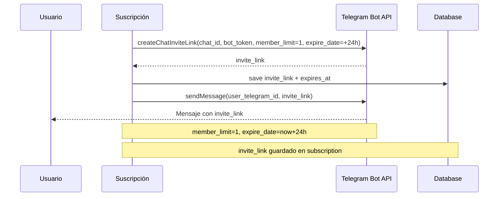

---
tags:
  - kanban/todo
  - type/task
  - domain/PUB
  - priority/P0
parent: "[[desarrollo]]"
children: []
depends_on:
  - "[[PUB-007]]"
  - "[[FUN-005]]"
  - "[[FUN-006]]"
blocks:
  - "[[CRE-011]]"
  - "[[CRM-011]]"
  - "[[CRE-006]]"
  - "[[CRE-007]]"
  - "[[CRE-009]]"
status: todo
assignee: "@dev"
created: 2026-08-04
updated: 2026-08-04
---

# [[PUB-008]] Telegram Bot API: `createChatInviteLink` (Único, Temporal, member_limit=1)

## Descripción
Implementar integración con Telegram Bot API para generar enlaces de invitación únicos y temporales al activar suscripciones.

## Código de Ejemplo
```php
// app/Services/TelegramService.php
namespace App\Services;

use Illuminate\Support\Facades\Http;
use Illuminate\Support\Facades\Log;

class TelegramService
{
    public function __construct(
        protected string $defaultBotToken = null
    ) {}

    public function createInviteLink(string $chatId, string $botToken, array $options = []): string
    {
        $defaults = [
            'member_limit' => 1,
            'expire_date' => now()->addHours(24)->timestamp,
            'creates_join_request' => false,
        ];

        $params = array_merge($defaults, $options);

        $response = Http::post("https://api.telegram.org/bot{$botToken}/createChatInviteLink", $params);

        if (!$response->successful()) {
            Log::error('Telegram createChatInviteLink failed', [
                'chat_id' => $chatId,
                'response' => $response->json(),
            ]);
            throw new \Exception('Error generando enlace de invitación: ' . $response->json()['description'] ?? 'Unknown error');
        }

        return $response->json()['result']['invite_link'];
    }

    public function sendMessage(string $chatId, string $text, array $options = []): bool
    {
        $botToken = $options['bot_token'] ?? config('telegram.bot_token');
        
        $response = Http::post("https://api.telegram.org/bot{$botToken}/sendMessage", array_merge([
            'chat_id' => $chatId,
            'text' => $text,
            'parse_mode' => 'HTML',
            'disable_web_page_preview' => true,
        ], $options));

        if (!$response->successful()) {
            Log::warning('Telegram sendMessage failed', [
                'chat_id' => $chatId,
                'response' => $response->json(),
            ]);
            return false;
        }

        return true;
    }

    public function sendInviteLink(Subscription $subscription): void
    {
        $channel = $subscription->channel;
        $user = $subscription->user;

        if (!$channel->telegram_bot_token || !$channel->telegram_chat_id) {
            Log::warning('Canal sin configuración Telegram', ['channel_id' => $subscription->channel_id]);
            return;
        }

        $inviteLink = $this->createInviteLink(
            $channel->telegram_chat_id,
            $channel->telegram_bot_token,
            [
                'member_limit' => 1,
                'expire_date' => now()->addHours(24)->timestamp,
            ]
        );

        $subscription->update([
            'telegram_invite_link' => $inviteLink,
            'invite_expires_at' => now()->addHours(24),
        ]);

        // Enviar a usuario
        if ($subscription->user->telegram_id) {
            $this->sendMessage($subscription->user->telegram_id, 
                "🎉 ¡Tu suscripción a <b>{$subscription->channel->name}</b> está activa!\n\n" .
                "Accede al canal: {$inviteLink}\n\n" .
                "El enlace expira en 24 horas y es de un solo uso.",
                ['bot_token' => $channel->telegram_bot_token]
            );
        }
    }

    public function notifyCreatorNewSubscription(ChannelPago $channel, Subscription $subscription): void
    {
        $creator = $channel->owner;
        if ($creator->telegram_id && ($creator->settings['notifications']['telegram_new_sub'] ?? true)) {
            $this->sendMessage($creator->telegram_id,
                "🎉 ¡Nueva suscripción en <b>{$channel->name}</b>!\n" .
                "Usuario: {$subscription->user->name}\n" .
                "Monto: {$subscription->price} {$subscription->currency}",
                ['bot_token' => config('telegram.admin_bot_token')]
            );
        }
    }

    public function notifyStaffNewSubscription(Subscription $subscription): void
    {
        $staffUsers = User::whereIn('role', ['staff', 'admin'])
            ->whereNotNull('telegram_id')
            ->get();

        foreach ($staffUsers as $staff) {
            $this->sendMessage($staff->telegram_id,
                "📊 Nueva suscripción procesada:\n" .
                "Canal: {$subscription->channel->name}\n" .
                "Usuario: {$subscription->user->name}\n" .
                "Monto: {$subscription->price} {$subscription->currency}",
                ['bot_token' => config('telegram.admin_bot_token')]
            );
        }
    }

    public function notifyStaffNewReceipt(BankTransferOrder $order): void
    {
        $staffUsers = User::whereIn('role', ['staff', 'admin'])
            ->whereNotNull('telegram_id')
            ->get();

        foreach ($staffUsers as $staff) {
            $this->sendMessage($staff->telegram_id,
                "📄 Nuevo comprobante de transferencia:\n" .
                "Canal: {$order->channel->name}\n" .
                "Usuario: {$order->subscription->user->name}\n" .
                "Monto: {$order->amount} {$order->currency}",
                ['bot_token' => config('telegram.admin_bot_token')]
            );
        }
    }
}
```

## Diagramas Mermaid


## Criterios de Aceptación
- [ ] Método `createInviteLink` con parámetros: member_limit=1, expire_date=+24h
- [ ] Guardar invite_link y expires_at en suscripción
- [ ] Enviar mensaje a usuario por Telegram (si tiene telegram_id)
- [ ] Notificar creador de nueva suscripción
- [ ] Notificar staff de nueva suscripción
- [ ] Manejo de errores: log + exception si API falla
- [ ] Testing: mock Telegram API, verificar invite_link generado

## Notas Técnicas
- API: `https://api.telegram.org/bot{token}/createChatInviteLink`
- Parámetros: `chat_id`, `member_limit=1`, `expire_date` (unix timestamp), `creates_join_request=false`
- Respuesta: `{ok: true, result: {invite_link: "https://t.me/...", expire_date: ...}}`
- Bot token por canal (configurado por creador) + bot admin para notificaciones staff
- Rate limiting: 30 req/s por bot

## Enlaces
- [[PUB-007]] Webhook handler (usa este servicio)
- [[CRE-013]] Facturación creador (notifica creador)
- [[CRE-016]] Ciclos de cobro (notifica creador)
- [[PUB-004]] Checkout flow (usa invite link)
- [[CRE-013]] Facturación creador (notifica creador)