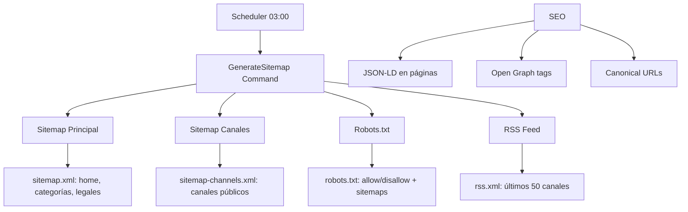

---
tags:
  - kanban/todo
  - type/task
  - domain/PUB
  - priority/P0
parent: "[[desarrollo]]"
children: []
depends_on:
  - "[[PUB-009]]"
  - "[[FUN-005]]"
  - "[[FUN-006]]"
blocks: []
status: todo
assignee: "@dev"
created: 2026-08-04
updated: 2026-08-04
---

# [[PUB-010]] Sitemap Dinámico Diario + `robots.txt` + RSS Feed Canales Nuevos

## Descripción
Implementar generación automática diaria de sitemap.xml, robots.txt y RSS feed para canales nuevos usando spatie/laravel-sitemap.

## Código de Ejemplo
```php
// app/Console/Commands/GenerateSitemap.php
namespace App\Console\Commands;

use Illuminate\Console\Command;
use Spatie\Sitemap\SitemapGenerator;
use Spatie\Sitemap\Tags\Url;

class GenerateSitemap extends Command
{
    protected $signature = 'sitemap:generate';
    protected $description = 'Generar sitemap.xml, robots.txt y RSS feed';

    public function handle()
    {
        $this->info('Generando sitemap...');
        
        // Sitemap principal
        SitemapGenerator::create(config('app.url'))
            ->hasCrawled(function (Url $url) {
                return $url->setChangeFrequency(Url::CHANGE_FREQUENCY_DAILY)
                           ->setPriority(0.8);
            })
            ->writeToFile(public_path('sitemap.xml'));

        // Sitemap canales
        $this->generateChannelsSitemap();

        // Robots.txt
        $this->generateRobotsTxt();

        // RSS Feed
        $this->generateRssFeed();

        $this->info('Sitemap, robots.txt y RSS generados exitosamente.');
    }

    private function generateChannelsSitemap()
    {
        $channels = \App\Models\ChannelPago::where('status', 'active')
            ->where('is_public', true)
            ->with('category')
            ->get();

        $sitemap = new \Spatie\Sitemap\Sitemap();
        
        foreach ($channels as $channel) {
            $sitemap->add(Url::create(route('channels.show', $channel->slug))
                ->setLastModificationDate($channel->updated_at)
                ->setChangeFrequency(Url::CHANGE_FREQUENCY_DAILY)
                ->setPriority(0.9)
                ->addTag('image', [
                    'url' => $channel->cover_image ?? asset('images/og-default.png'),
                    'title' => $channel->name,
                ])
            );
        }

        $sitemap->writeToFile(public_path('sitemap-channels.xml'));
    }

    private function generateRobotsTxt()
    {
        $content = "User-agent: *\n";
        $content .= "Allow: /\n\n";
        $content .= "Sitemap: " . config('app.url') . "/sitemap.xml\n";
        $content .= "Sitemap: " . config('app.url') . "/sitemap-channels.xml\n";
        $content .= "\n# Disallow admin areas\n";
        $content .= "Disallow: /admin/\n";
        $content .= "Disallow: /creadores/\n";
        $content .= "Disallow: /crm/\n";
        $content .= "Disallow: /install/\n";

        file_put_contents(public_path('robots.txt'), $content);
    }

    private function generateRssFeed()
    {
        $channels = \App\Models\ChannelPago::where('status', 'active')
            ->where('is_public', true)
            ->latest()
            ->take(50)
            ->get();

        $rss = new \Spatie\Feed\Feed();
        $rss->title = 'TG-PayGate - Nuevos Canales';
        $rss->description = 'Descubre los últimos canales premium disponibles';
        $rss->link = config('app.url');
        $rss->language = 'es';
        $rss->copyright = 'TG-PayGate ' . now()->year;

        foreach ($channels as $channel) {
            $rss->addItem([
                'title' => $channel->name,
                'description' => $channel->short_description,
                'link' => route('channels.show', $channel->slug),
                'pubDate' => $channel->created_at,
                'guid' => $channel->slug,
                'author' => $channel->owner->name,
                'categories' => [$channel->category->name ?? 'General'],
            ]);
        }

        $rss->writeToFile(public_path('rss.xml'));
    }
}
```

```php
// app/Console/Kernel.php
protected function schedule(Schedule $schedule): void
{
    // Sitemap diario a las 03:00
    $schedule->command('sitemap:generate')
        ->dailyAt('03:00')
        ->withoutOverlapping()
        ->runInBackground();
}
```

```php
// routes/web.php - Rutas para sitemap y robots
Route::get('/sitemap.xml', function () {
    return response()->file(public_path('sitemap.xml'))
        ->header('Content-Type', 'application/xml');
})->name('sitemap');

Route::get('/sitemap-channels.xml', function () {
    return response()->file(public_path('sitemap-channels.xml'))
        ->header('Content-Type', 'application/xml');
})->name('sitemap.channels');

Route::get('/robots.txt', function () {
    return response()->file(public_path('robots.txt'))
        ->header('Content-Type', 'text/plain');
})->name('robots');

Route::get('/rss.xml', function () {
    return response()->file(public_path('rss.xml'))
        ->header('Content-Type', 'application/xml');
})->name('rss');
```

## Diagramas Mermaid


## Criterios de Aceptación
- [ ] Comando `sitemap:generate` ejecuta todo el proceso
- [ ] Sitemap principal: home, categorías, páginas legales
- [ ] Sitemap canales: solo canales activos y públicos, con imagen, prioridad 0.9
- [ ] robots.txt: allow/disallow correcto, referencias a ambos sitemaps
- [ ] RSS feed: últimos 50 canales, título, descripción, link, pubDate, GUID
- [ ] Cron: diario a las 03:00, sin overlap, background
- [ ] Rutas accesibles: /sitemap.xml, /sitemap-channels.xml, /robots.txt, /rss.xml
- [ ] Content-Type headers correctos (application/xml, text/plain)

## Notas Técnicas
- spatie/laravel-sitemap para generación
- spatie/laravel-feed para RSS
- Programado en Kernel::schedule()
- Imágenes en sitemap: cover_image del canal
- Prioridad: canales 0.9, páginas estáticas 0.8, legales 0.5
- Change frequency: daily para canales, weekly para estáticas

## Enlaces
- [[PUB-001]] Landing (incluida en sitemap)
- [[PUB-002]] Listado canales (sitemap canales)
- [[PUB-003]] Detalle canal (incluido en sitemap canales)
- [[WEB-002]] Favicon/PWA (assets para sitemap)
- [[WEB-004]] Landing Assets (imágenes sitemap)