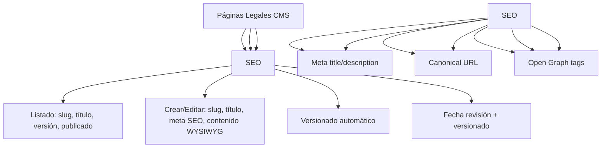

---
tags:
  - kanban/todo
  - type/task
  - domain/PUB
  - priority/P1
parent: "[[desarrollo]]"
children: []
depends_on:
  - "[[FUN-001]]"
  - "[[FUN-005]]"
  - "[[FUN-008]]"
blocks: []
status: todo
assignee: "@dev"
created: 2026-08-04
updated: 2026-08-04
---

# [[PUB-011]] Páginas Legales: Términos, Privacidad, Cookies, Aviso Legal (CMS Simple)

## Descripción
Implementar páginas legales gestionables desde Admin: Términos y Condiciones, Política de Privacidad, Política de Cookies, Aviso Legal. CMS simple con editor WYSIWYG.

## Código de Ejemplo
```php
// app/Models/LegalPage.php
class LegalPage extends Model
{
    protected $fillable = [
        'slug', 'title', 'content', 'meta_title', 'meta_description', 
        'is_published', 'last_reviewed_at', 'version',
    ];

    protected $casts = [
        'is_published' => 'boolean',
        'last_reviewed_at' => 'datetime',
    ];

    public function getRouteKeyName(): string
    {
        return 'slug';
    }
}
```

```php
// app/Domains/Staff/Http/Controllers/Admin/LegalPageController.php
namespace App\Domains\Staff\Http\Controllers\Admin;

class LegalPageController extends Controller
{
    public function index()
    {
        $pages = \App\Models\LegalPage::latest()->paginate(20);
        return view('domains.staff.admin.legal-pages.index', compact('pages'));
    }

    public function create()
    {
        return view('domains.staff.admin.legal-pages.create');
    }

    public function store(LegalPageRequest $request)
    {
        $page = \App\Models\LegalPage::create($request->validated() + [
            'version' => 1,
            'last_reviewed_at' => now(),
        ]);
        return redirect()->route('admin.legal-pages.index')
            ->with('success', 'Página legal creada');
    }

    public function edit(\App\Models\LegalPage $page)
    {
        return view('domains.staff.admin.legal-pages.edit', compact('page'));
    }

    public function update(LegalPageRequest $request, \App\Models\LegalPage $page)
    {
        $page->update($request->validated() + [
            'version' => $page->version + 1,
            'last_reviewed_at' => now(),
        ]);
        return back()->with('success', 'Página actualizada');
    }

    public function destroy(\App\Models\LegalPage $page)
    {
        $page->delete();
        return back()->with('success', 'Página eliminada');
    }
}
```

```blade
{{-- resources/views/domains/public/legal/show.blade.php --}}
@extends('layouts.public')

@section('content')
<div class="container mx-auto px-4 py-12 max-w-3xl">
    <article class="prose prose-lg max-w-none dark:prose-invert">
        <header class="mb-8">
            <h1 class="text-3xl font-bold text-text-primary mb-4">{{ $page->title }}</h1>
            <p class="text-text-secondary">
                Última actualización: {{ $page->last_reviewed_at->format('d/m/Y') }} 
                | Versión {{ $page->version }}
            </p>
        </header>

        <div class="prose-content">
            {!! $page->content !!}
        </div>

        <hr class="my-8 border-border-primary">

        <footer class="text-sm text-text-muted">
            <p>Última revisión: {{ $page->last_reviewed_at->format('d/m/Y') }} | 
               Versión {{ $page->version }}</p>
            <p>¿Dudas? <a href="{{ route('client.support.create') }}" class="text-accent-primary hover:underline">Contactar soporte</a></p>
        </footer>
    </article>
</div>
@endsection
```

```blade
{{-- resources/views/domains/staff/admin/legal-pages/edit.blade.php --}}
@extends('layouts.admin')

@section('content')
<div class="container mx-auto px-4 py-8 max-w-4xl">
    <div class="mb-8">
        <h1 class="text-2xl font-bold text-text-primary">Editar: {{ $page->title }}</h1>
    </div>

    <form action="{{ route('admin.legal-pages.update', $page) }}" method="POST" class="space-y-6">
        @csrf @method('PUT')

        <div>
            <label class="label">Slug (URL)</label>
            <div class="flex items-center gap-2">
                <span class="text-text-muted">/legal/</span>
                <input type="text" name="slug" class="input flex-1" value="{{ $page->slug }}" required>
            </div>
        </div>

        <div>
            <label class="label">Título</label>
            <input type="text" name="title" class="input" value="{{ $page->title }}" required>
        </div>

        <div>
            <label class="label">Meta Title (SEO)</label>
            <input type="text" name="meta_title" class="input" value="{{ $page->meta_title }}" maxlength="60">
        </div>

        <div>
            <label class="label">Meta Description (SEO)</label>
            <textarea name="meta_description" class="input" rows="2" maxlength="160">{{ $page->meta_description }}</textarea>
        </div>

        <div>
            <label class="label">Contenido</label>
            <textarea name="content" id="editor" class="input" rows="20" required>{{ $page->content }}</textarea>
        </div>

        <div class="flex items-center gap-4">
            <label class="flex items-center gap-2 cursor-pointer">
                <input type="checkbox" name="is_published" class="checkbox" {{ $page->is_published ? 'checked' : '' }}>
                <span>Publicada</span>
            </label>
        </div>

        <div class="flex justify-end gap-4 pt-6 border-t border-border-primary">
            <a href="{{ route('admin.legal-pages.index') }}" class="btn btn--ghost">Cancelar</a>
            <button type="submit" class="btn btn--primary">Guardar Cambios</button>
        </div>
    </form>
</div>
@endsection

@push('scripts')
<script>
    // Simple WYSIWYG editor (TinyMCE, Quill, o Trix)
    // Ejemplo con Trix (Rails default)
    document.addEventListener('trix-initialize', function(e) {
        e.target.editor.element.dataset.trixId = 'content';
    });
</script>
@endpush
```

## Diagramas Mermaid


## Criterios de Aceptación
- [ ] Admin CRUD: listado, crear, editar, eliminar
- [ ] Editor WYSIWYG (TinyMCE, Trix, o Quill)
- [ ] Campos: slug, título, contenido, meta_title, meta_description, is_published
- [ ] Versionado automático: incrementa versión al editar
- [ ] Fecha última revisión + versión visible en público
- [ ] SEO: meta_title, meta_description, canonical, Open Graph
- [ ] Sanitización HTML: purifier (purify HTML)
- [ ] Slug único, URL: /legal/{slug}
- [ ] Páginas por defecto: términos, privacidad, cookies, aviso-legal

## Notas Técnicas
- Spatie Laravel-MediaLibrary para imágenes en contenido
- HTML Purifier para sanitizar HTML
- Slug único, auto-generado desde título
- Versionado: incrementa en cada save
- Cache: 1 hora para páginas publicadas
- Sitemap: incluir en sitemap.xml

## Enlaces
- [[PUB-001]] Landing (links a legales en footer)
- [[PUB-010]] Sitemap (incluye legales)
- [[WEB-003]] Email Templates (mismo editor)