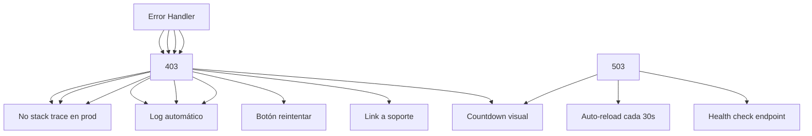

---
tags:
  - kanban/todo
  - type/task
  - domain/PUB
  - priority/P1
parent: "[[desarrollo]]"
children: []
depends_on:
  - "[[FUN-001]]"
  - "[[FUN-005]]"
blocks: []
status: todo
assignee: "@dev"
created: 2026-08-04
updated: 2026-08-04
---

# [[PUB-012]] Error Pages: 404, 500, 403, 503 (Branded, Friendly, Search Link)

## Descripción
Implementar páginas de error personalizadas y amigables: 404 (Not Found), 500 (Server Error), 403 (Forbidden), 503 (Maintenance). Diseño branded, mensajes amigables, link de búsqueda.

## Código de Ejemplo
```php
// app/Exceptions/Handler.php - Override render
public function render($request, Throwable $exception): Response
{
    if ($exception instanceof NotFoundHttpException) {
        return $this->renderErrorPage(404, 'Página no encontrada', 
            'Lo sentimos, no encontramos la página que buscas. Puede que haya sido movida o eliminada.',
            'Buscar en el sitio');
    }

    if ($exception instanceof AccessDeniedHttpException) {
        return $this->renderErrorPage(403, 'Acceso denegado',
            'No tienes permiso para acceder a esta página. Si crees que es un error, contacta soporte.',
            'Volver al inicio');
    }

    if ($this->isMaintenanceMode()) {
        return $this->renderErrorPage(503, 'Mantenimiento programado',
            'Estamos mejorando la plataforma. Volvemos pronto.',
            null, 503);
    }

    // 500 y otros
    if (config('app.debug')) {
        return parent::render($request, $exception);
    }

    return $this->renderErrorPage(500, 'Error del servidor',
        'Algo salió mal de nuestro lado. Nuestro equipo ya está trabajando en solucionarlo.',
        'Volver al inicio', 500);
}

private function renderErrorPage(int $code, string $title, string $message, string $ctaText = null, int $status = null): Response
{
    return response()->view("errors.{$code}", [
        'title' => $title,
        'message' => $message,
        'ctaText' => $ctaText,
        'ctaUrl' => $ctaText ? url('/') : null,
    ], $status ?? $code);
}

private function isMaintenanceMode(): bool
{
    return config('platform.maintenance_mode', false);
}
```

```blade
{{-- resources/views/errors/404.blade.php --}}
@extends('layouts.error')

@section('content')
<div class="min-h-screen flex items-center justify-center bg-bg-primary px-4">
    <div class="text-center max-w-md">
        <div class="w-24 h-24 mx-auto mb-8 bg-warning-100 dark:bg-warning-900/30 rounded-full flex items-center justify-center">
            <x-icon name="search" class="w-12 h-12 text-warning-600" />
        </div>
        
        <h1 class="text-4xl font-bold text-text-primary mb-4">404</h1>
        <h2 class="text-xl text-text-primary mb-4">Página no encontrada</h1>
        
        <p class="text-text-secondary mb-8 max-w-md mx-auto">
            Lo sentimos, no encontramos la página que buscas. 
            Puede que haya sido movida, eliminada o que la URL sea incorrecta.
        </p>

        <div class="space-y-4">
            <a href="{{ route('channels.index') }}" class="btn btn--primary btn--lg btn--full-width">
                <x-icon name="tv" class="w-4 h-4 mr-2" />
                Explorar Canales
            </a>
            <a href="/" class="btn btn--ghost btn--lg btn--full-width">
                <x-icon name="home" class="w-4 h-4 mr-2" />
                Volver al Inicio
            </a>
        </div>

        <div class="mt-10">
            <p class="text-text-muted text-sm mb-4">¿Buscas algo específico?</p>
            <form action="{{ route('channels.index') }}" method="GET" class="max-w-md mx-auto">
                <div class="flex gap-2">
                    <input type="text" name="search" class="input flex-1" placeholder="Buscar canales...">
                    <button type="submit" class="btn btn--primary">
                        <x-icon name="search" class="w-4 h-4" />
                    </button>
                </div>
            </form>
        </div>
    </div>
@endsection
```

```blade
{{-- resources/views/errors/500.blade.php --}}
@extends('layouts.error')

@section('content')
<div class="min-h-screen flex items-center justify-center bg-bg-primary px-4">
    <div class="text-center max-w-md">
        <div class="w-24 h-24 mx-auto mb-8 bg-error-100 dark:bg-error-900/30 rounded-full flex items-center justify-center">
            <x-icon name="alert-triangle" class="w-12 h-12 text-error-600" />
        </div>
        
        <h1 class="text-4xl font-bold text-text-primary mb-4">500</h1>
        <h2 class="text-xl text-text-primary mb-4">Error del servidor</h2>
        
        <p class="text-text-secondary mb-8 max-w-md mx-auto">
            Algo salió mal de nuestro lado. Nuestro equipo ya está trabajando en solucionarlo. 
            Por favor, inténtalo de nuevo en unos minutos.
        </p>

        <a href="/" class="btn btn--primary btn--lg">
            <x-icon name="refresh-cw" class="w-4 h-4 mr-2" />
            Reintentar
        </a>
    </div>
@endsection
```

```blade
{{-- resources/views/errors/403.blade.php --}}
@extends('layouts.error')

@section('content')
<div class="min-h-screen flex items-center justify-center bg-bg-primary px-4">
    <div class="text-center max-w-md">
        <div class="w-24 h-24 mx-auto mb-8 bg-warning-100 dark:bg-warning-900/30 rounded-full flex items-center justify-center">
            <x-icon name="lock" class="w-12 h-12 text-warning-600" />
        </div>
        
        <h1 class="text-4xl font-bold text-text-primary mb-4">403</h1>
        <h2 class="text-xl text-text-primary mb-4">Acceso denegado</h2>
        
        <p class="text-text-secondary mb-8 max-w-md mx-auto">
            No tienes permiso para acceder a esta página. 
            Si crees que es un error, <a href="{{ route('client.support.create') }}" class="text-accent-primary hover:underline">contacta soporte</a>.
        </p>

        <a href="/" class="btn btn--primary">
            <x-icon name="home" class="w-4 h-4 mr-2" />
            Volver al inicio
        </a>
    </div>
@endsection
```

```blade
{{-- resources/views/errors/503.blade.php --}}
@extends('layouts.error')

@section('content')
<div class="min-h-screen flex items-center justify-center bg-bg-primary px-4">
    <div class="text-center max-w-md">
        <div class="w-24 h-24 mx-auto mb-8 bg-info-100 dark:bg-info-900/30 rounded-full flex items-center justify-center animate-pulse">
            <x-icon name="tool" class="w-12 h-12 text-info-600" />
        </div>
        
        <h1 class="text-4xl font-bold text-text-primary mb-4">503</h1>
        <h2 class="text-xl text-text-primary mb-4">Mantenimiento programado</h2>
        
        <p class="text-text-secondary mb-8 max-w-md mx-auto">
            Estamos mejorando la plataforma para ti. Volvemos muy pronto.
        </p>

        <div class="text-sm text-text-muted">
            <p>Estado: <span class="font-mono" id="maintenance-status">Verificando...</span></p>
            <p class="mt-2">Reintento automático en <span id="countdown">30</span>s</p>
        </div>
    </div>
@endsection

@push('scripts')
<script>
    let countdown = 30;
    const interval = setInterval(() => {
        countdown--;
        document.getElementById('countdown').textContent = countdown;
        if (countdown <= 0) {
            clearInterval(interval);
            location.reload();
        }
    }, 1000);

    // Check if maintenance is over
    setInterval(async () => {
        try {
            const response = await fetch('/health', { method: 'HEAD' });
            if (response.ok) {
                clearInterval(interval);
                location.reload();
            }
        } catch (e) {}
    }, 10000);
</script>
@endpush
```

```blade
{{-- resources/views/layouts/error.blade.php --}}
<!DOCTYPE html>
<html lang="{{ str_replace('_', '-', app()->getLocale()) }}" data-theme="{{ session('theme', 'system') }}">
<head>
    <meta charset="utf-8">
    <meta name="viewport" content="width=device-width, initial-scale=1">
    <meta name="robots" content="noindex, nofollow">
    <title>{{ $title ?? 'Error' }} - {{ config('app.name') }}</title>
    @vite(['resources/css/app.css', 'resources/js/app.js'])
</head>
<body class="font-sans antialiased">
    @yield('content')
</body>
</html>
```

## Diagramas Mermaid


## Criterios de Aceptación
- [ ] 404: ilustración, mensaje amigable, botones (Explorar, Inicio), buscador
- [ ] 500: sin stack trace en prod, log automático, botón reintentar
- [ ] 403: mensaje claro, link a soporte, volver al inicio
- [ ] 503: auto-reload cada 30s, countdown visual, health check
- [ ] Layout base: branded, responsive, dark mode, noindex/nofollow
- [ ] Log automático de errores 500 (Laravel Telescope/Sentry)
- [ ] Health check endpoint: /health (para 503 auto-recovery)

## Notas Técnicas
- Handler en app/Exceptions/Handler.php
- Vistas en resources/views/errors/{404,500,403,503}.blade.php
- Layout base: resources/views/layouts/error.blade.php
- Health check: route /health para 503 auto-recovery
- 503: endpoint /health responde 200 cuando termina mantenimiento
- Middleware CheckMaintenanceMode para 503 automático

## Enlaces
- [[PUB-001]] Landing (links en 404)
- [[PUB-018]] Configuración instalador (maintenance mode)
- [[ADM-002]] Config global (maintenance mode toggle)
- [[ADM-007]] Logs Seguridad (log errores 500)