---
tags:
  - kanban/todo
  - type/task
  - domain/PUB
  - priority/P1
parent: "[[desarrollo]]"
children: []
depends_on:
  - "[[FUN-001]]"
  - "[[FUN-005]]"
  - "[[CSS-034]]"
  - "[[CSS-035]]"
blocks: []
status: todo
assignee: "@dev"
created: 2026-08-04
updated: 2026-08-04
---

# [[PUB-013]] Performance: Critical CSS, Lazy Images, Preconnect, Font-Display: Swap

## Descripción
Optimizaciones de performance frontend: Critical CSS inline, lazy loading imágenes nativo, preconnect/prefetch, font-display: swap, resource hints.

## Código de Ejemplo
```php
// resources/views/layouts/public.blade.php - Head optimizado
<head>
    <meta charset="utf-8">
    <meta name="viewport" content="width=device-width, initial-scale=1">
    
    {{-- Preconnect crítico --}}
    <link rel="preconnect" href="https://fonts.googleapis.com" crossorigin>
    <link rel="preconnect" href="https://fonts.gstatic.com" crossorigin>
    <link rel="preconnect" href="https://api.telegram.org" crossorigin>
    @if(config('services.mercadopago.url'))
    <link rel="preconnect" href="{{ config('services.mercadopago.url') }}" crossorigin>
    @endif
    
    {{-- DNS Prefetch para dominios externos --}}
    <link rel="dns-prefetch" href="https://www.google-analytics.com">
    <link rel="dns-prefetch" href="https://www.googletagmanager.com">
    
    {{-- Preload recursos críticos --}}
    <link rel="preload" as="style" href="{{ Vite::asset('resources/css/app.css') }}">
    <link rel="preload" as="font" href="{{ asset('fonts/Inter-Variable.woff2') }}" type="font/woff2" crossorigin>
    <link rel="preload" as="font" href="{{ asset('fonts/JetBrainsMono-Variable.woff2') }}" type="font/woff2" crossorigin>
    
    {{-- Critical CSS Inline (above-the-fold) --}}
    @if(file_exists(public_path('css/critical.css')))
    <style>
        {{ file_get_contents(public_path('css/critical.css')) }}
    </style>
    @endif
    
    {{-- CSS asíncrono --}}
    <link rel="preload" as="style" href="{{ Vite::asset('resources/css/app.css') }}" onload="this.rel='stylesheet'">
    <noscript><link rel="stylesheet" href="{{ Vite::asset('resources/css/app.css') }}"></noscript>
    
    {{-- JS asíncrono --}}
    <script type="module" src="{{ Vite::asset('resources/js/app.js') }}" defer></script>
    
    {{-- Font Display Swap en CSS --}}
    <style>
        @font-face {
            font-family: 'Inter';
            src: url('{{ asset('fonts/Inter-Variable.woff2') }}') format('woff2-variations');
            font-weight: 100 900;
            font-stretch: 75% 125%;
            font-display: swap;
        }
        @font-face {
            font-family: 'JetBrains Mono';
            src: url('{{ asset('fonts/JetBrainsMono-Variable.woff2') }}') format('woff2-variations');
            font-weight: 400 700;
            font-display: swap;
        }
    </style>
</head>
```

```blade
{{-- Lazy loading imágenes nativo --}}
url }}" 
     alt="{{ $image->alt }}" 
     loading="lazy" 
     decoding="async"
     width="{{ $image->width }}" 
     height="{{ $image->height }}"
     class="w-full h-auto object-cover"
     sizes="(max-width: 640px) 100vw, (max-width: 1024px) 50vw, 33vw"
     srcset="{{ $image->url }}?w=400 400w,
             {{ $image->url }}?w=800 800w,
             {{ $image->url }}?w=1200 1200w">

{{-- Picture para formatos modernos --}}
<picture>
    <source srcset="{{ $image->url }}?format=webp&w=800" type="image/webp">
    <source srcset="{{ $image->url }}?format=avif&w=800" type="image/avif">
    url }}?w=800" 
         alt="{{ $image->alt }}" 
         loading="lazy" 
         decoding="async"
         width="800" height="600">
</picture>
```

```javascript
// resources/js/app.js - Service Worker para cache
if ('serviceWorker' in navigator) {
    window.addEventListener('load', () => {
        navigator.serviceWorker.register('/sw.js')
            .then(reg => console.log('SW registered', reg))
            .catch(err => console.log('SW failed', err));
    });
}

// resources/js/sw.js - Service Worker básico
const CACHE_NAME = 'tg-paygate-v1';
const urlsToCache = [
    '/',
    '/offline.html',
];

self.addEventListener('install', event => {
    event.waitUntil(
        caches.open(CACHE_NAME).then(cache => cache.addAll(urlsToCache))
    );
});

self.addEventListener('fetch', event => {
    event.respondWith(
        caches.match(event.request).then(response => {
            return response || fetch(event.request).then(response => {
                if (response.ok) {
                    const responseClone = response.clone();
                    caches.open(CACHE_NAME).then(cache => cache.put(event.request, responseClone));
                }
                return response;
            });
        })
    );
});
```

```php
// app/Providers/AppServiceProvider.php - Critical CSS generation
public function boot(): void
{
    if (app()->environment('production')) {
        // Generar critical CSS en build
        // Usar: penthouse, critical, o criticalcss
    }
}
```

```javascript
// vite.config.js - Configuración performance
export default defineConfig({
    build: {
        cssCodeSplit: true,
        rollupOptions: {
            output: {
                entryFileNames: 'assets/[name]-[hash].js',
                chunkFileNames: 'assets/[name]-[hash].js',
                assetFileNames: 'assets/[name]-[hash].[ext]',
            },
        },
        cssMinify: 'cssnano',
        minify: 'terser',
        terserOptions: {
            compress: {
                drop_console: true,
                drop_debugger: true,
            },
        },
    },
    css: {
        postcss: {
            plugins: [
                require('autoprefixer'),
                require('cssnano')({ preset: 'default' }),
            ],
        },
    },
});
```

## Diagramas Mermaid

```mermaid
graph TD
    A[Performance Optimizations] --> B[Critical CSS]
    A --> B[Lazy Images]
    A --> C[Preconnect/Preload]
    A --> D[Font Display Swap]
    A --> E[Service Worker]
    A --> E[Build Optimizations]
    
    B --> B1[Critical CSS inline head]
    B --> B2[CSS async load]
    B --> B3[Above-the-fold only]
    
    C[Lazy Images] --> C1[loading=lazy]
    C --> C2[decoding=async]
    C --> C3[srcset + sizes]
    C --> C4[WebP/AVIF via picture]
    
    C[Preconnect] --> C1[fonts.googleapis.com]
    C --> C2[fonts.gstatic.com]
    C --> C3[api.telegram.org]
    C --> C4[MercadoPago/Stripe APIs]
    
    D[Font Display Swap] --> D1[Inter Variable]
    D --> D2[JetBrains Mono Variable]
    D --> D3[fallback fonts]
    
    E[Service Worker] --> E1[Cache static assets]
    E --> E2[Offline fallback]
    E --> E3[Stale-while-revalidate]
    
    F[Build] --> F1[CSS code split]
    F --> F2[CSS minify cssnano]
    F --> F3[JS minify terser]
    F --> F3[Hash filenames]
```


## Criterios de Aceptación
- [ ] Critical CSS inline en `<head>` (above-the-fold)
- [ ] CSS asíncrono: `rel=preload as=style` + `onload=rel=stylesheet`
- [ ] Imágenes: `loading=lazy`, `decoding=async`, `srcset`, `sizes`
- [ ] Picture: WebP/AVIF fallback, `picture` + `source`
- [ ] Preconnect: fonts.googleapis.com, fonts.gstatic.com, api.telegram.org, MP/Stripe
- [ ] DNS-prefetch: analytics, tagmanager
- [ ] Preload: fonts (woff2), critical CSS, hero image
- [ ] Font-display: swap para Inter y JetBrains Mono (variable fonts)
- [ ] Service Worker: cache static, offline fallback, stale-while-revalidate
- [ ] Build: CSS code split, cssnano, terser, hash filenames
- [ ] Lighthouse CI: Performance >90, Accessibility >95

## Notas Técnicas
- Critical CSS: generar con penthouse/criticalcss en build
- Variable fonts: Inter + JetBrains Mono (woff2-variations)
- Imágenes: responsive con `sizes` + `srcset`, WebP/AVIF via image optimization service
- Service Workbox o custom SW para cache strategies
- Lighthouse CI en PR checks

## Enlaces
- [[CSS-034]] Build System
- [[CSS-035]] Tree Shaking
- [[CSS-037]] Testing Visual (Lighthouse CI)
- [[WEB-002]] Favicon/PWA (manifest, icons)
- [[WEB-004]] Landing Assets (imágenes optimizadas)